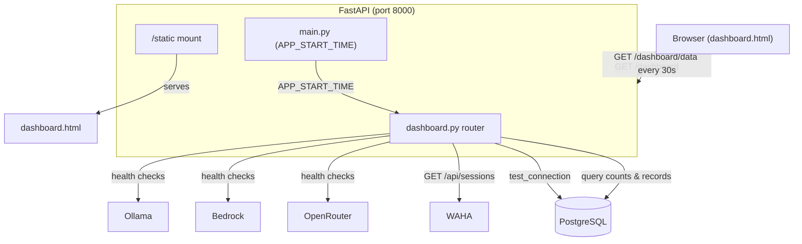

# Design Document: Admin Dashboard

## Overview

The admin dashboard adds a browser-based monitoring UI to the Fortress system. It consists of three parts:

1. A new FastAPI router (`src/routers/dashboard.py`) that exposes a JSON data endpoint and serves the HTML page
2. A single self-contained HTML file (`src/static/dashboard.html`) with embedded CSS/JS — dark theme, RTL Hebrew, auto-refresh
3. Shell scripts for auto-opening the dashboard on system startup

The dashboard reuses existing health-check patterns (instantiate clients, call `is_available()`) and adds a WAHA connectivity check via `httpx`. All database queries use the existing `get_db()` dependency and SQLAlchemy ORM models. An `APP_START_TIME` variable in `main.py` tracks uptime.

No new database tables or migrations are needed — the dashboard reads from existing tables (Conversation, Task, BugReport, FamilyMember).

## Architecture



### Request Flow

1. Browser hits `GET /dashboard` → FastAPI returns `dashboard.html` via `FileResponse`
2. On load (and every 30s), JS fetches `GET /dashboard/data`
3. Dashboard router runs health checks in parallel for all 5 services
4. Dashboard router queries DB for today's counts, open items, recent conversations, open bugs, family members
5. Dashboard router calculates uptime from `APP_START_TIME`
6. JSON response is returned; JS renders the 6 dashboard sections

## Components and Interfaces

### 1. Dashboard Router (`src/routers/dashboard.py`)

New router with two endpoints:

```python
router = APIRouter(tags=["dashboard"])

@router.get("/dashboard")
async def dashboard_page() -> FileResponse:
    """Serve the dashboard HTML page."""

@router.get("/dashboard/data")
async def dashboard_data(db: Session = Depends(get_db)) -> dict:
    """Return all dashboard data as JSON."""
```

**`GET /dashboard`** — Returns `FileResponse` pointing to `src/static/dashboard.html`.

**`GET /dashboard/data`** — Aggregates:
- Health status for 5 services (DB, Ollama, Bedrock, OpenRouter, WAHA)
- Today's counts (conversations, tasks_created, bugs_reported, errors)
- Open items (open_tasks, open_bugs counts)
- Recent conversations (last 20, joined with family_member for name)
- Open bugs (all open, ordered by created_at desc)
- Active family members
- System info (version, uptime_seconds, app_start_time)

### 2. WAHA Health Check (inside dashboard router)

```python
async def check_waha_health() -> str:
    """Check WAHA connectivity. Returns Health_Status string."""
    try:
        async with httpx.AsyncClient(timeout=5.0) as client:
            resp = await client.get(f"{WAHA_API_URL}/api/sessions")
            if resp.status_code == 200:
                return "connected"
            return "disconnected"
    except Exception:
        return "disconnected"
```

Uses the same `httpx` pattern as `whatsapp_client.py`. Short 5s timeout to avoid blocking the dashboard response.

### 3. Static File Serving

In `main.py`:
```python
from fastapi.staticfiles import StaticFiles

app.mount("/static", StaticFiles(directory="src/static"), name="static")
```

The `GET /dashboard` endpoint uses `FileResponse` directly rather than relying on the static mount, giving a clean URL.

### 4. APP_START_TIME (in `main.py`)

```python
import time

APP_START_TIME = time.time()
```

Set at module level (when the app process starts). The dashboard router imports it to calculate uptime.

### 5. Dashboard HTML (`src/static/dashboard.html`)

Single file, no external dependencies. Sections:
- **System Health** — 5 service status indicators (🟢/🟡/🔴)
- **Today** — conversation count, tasks created, bugs reported, errors
- **Open Items** — open tasks count, open bugs count
- **Open Bugs** — table of open bug reports
- **Recent Activity** — last 20 conversations with member name, intent, message preview
- **Family Members** — active members with role

Design tokens:
| Token | Value |
|-------|-------|
| Background | `#1a1a2e` |
| Card BG | `#16213e` |
| Accent | `#0f3460` |
| Success | `#4ecca3` |
| Warning | `#f0a500` |
| Error | `#e74c3c` |

RTL support via `dir="rtl"` on Hebrew text containers. Responsive grid using CSS Grid with `auto-fit` / `minmax`.

### 6. Startup Scripts

**`scripts/open_dashboard.sh`** — Opens `http://localhost:8000/dashboard` in the default browser using `open` (macOS).

**`scripts/setup_mac_mini.sh`** — Updated to call `open_dashboard.sh` after `docker compose up -d`.

### 7. Registration in `main.py`

```python
from src.routers import dashboard

app.include_router(dashboard.router)
```

## Data Models

No new database models. The dashboard reads from existing tables:

### Queried Tables

| Table | Fields Used | Query |
|-------|-------------|-------|
| `Conversation` | `created_at`, `message_out`, `intent`, `message_in`, `family_member_id` | Today count, error count (HEBREW_FALLBACK in message_out), last 20 records |
| `Task` | `status`, `created_at` | Today created count, open count |
| `BugReport` | `status`, `created_at`, `description`, `priority`, `reported_by` | Today count, open count, open bugs list |
| `FamilyMember` | `name`, `role`, `is_active`, `phone` | Active members list, join for conversation member names |

### Dashboard API Response Schema

```json
{
  "health": {
    "database": "connected|disconnected",
    "ollama": "connected|disconnected",
    "ollama_model": "llama3.1:8b|not loaded",
    "bedrock": "connected|disconnected",
    "bedrock_model": "haiku|not available",
    "openrouter": "connected|disconnected|no_key",
    "openrouter_model": "model-name|not configured|not available",
    "waha": "connected|disconnected"
  },
  "today": {
    "conversations": 0,
    "tasks_created": 0,
    "bugs_reported": 0,
    "errors": 0
  },
  "open_items": {
    "open_tasks": 0,
    "open_bugs": 0
  },
  "recent_conversations": [
    {
      "id": "uuid",
      "member_name": "string|null",
      "message_in": "string|null",
      "message_out": "string|null",
      "intent": "string|null",
      "created_at": "ISO 8601"
    }
  ],
  "open_bugs": [
    {
      "id": "uuid",
      "description": "string",
      "priority": "string",
      "status": "open",
      "created_at": "ISO 8601",
      "reporter_name": "string|null"
    }
  ],
  "family_members": [
    {
      "id": "uuid",
      "name": "string",
      "role": "string",
      "phone": "string",
      "is_active": true
    }
  ],
  "system": {
    "version": "2.0.0",
    "uptime_seconds": 3600,
    "app_start_time": "ISO 8601"
  }
}
```


## Error Handling

### Health Check Failures

Each health check is independent — one service being down does not affect the others. All health checks use short timeouts (5s) to avoid blocking the dashboard response.

| Failure | Behavior |
|---------|----------|
| DB unreachable | `database: "disconnected"`, other checks proceed |
| Ollama unreachable | `ollama: "disconnected"`, `ollama_model: "not loaded"` |
| Bedrock unreachable | `bedrock: "disconnected"`, `bedrock_model: "not available"` |
| OpenRouter no API key | `openrouter: "no_key"`, `openrouter_model: "not configured"` |
| OpenRouter unreachable | `openrouter: "disconnected"`, `openrouter_model: "not available"` |
| WAHA unreachable | `waha: "disconnected"` |
| WAHA non-200 response | `waha: "disconnected"` |

### Database Query Failures

If the DB is unreachable, the `get_db()` dependency will fail and FastAPI will return a 500 error. This is acceptable — the dashboard JS will show the previous data and retry in 30 seconds. No special error handling is needed beyond what FastAPI provides.

### Dashboard Page Serving

If `dashboard.html` is missing, `FileResponse` will raise a 404. This is a deployment error, not a runtime concern.

### Frontend Error Handling

The JS `fetch()` call catches network errors and displays a "Connection lost" indicator. On successful reconnection, the indicator clears automatically.

## Testing Strategy

All tests use the existing `conftest.py` patterns: `mock_db` (MagicMock(spec=Session)), `client` (TestClient with DB override). Tests go in `fortress/tests/test_dashboard.py`.

### Unit Tests

Tests follow the same mocking approach as `test_health.py` — patch service clients at the router import level.

| Test | Validates | Approach |
|------|-----------|----------|
| `test_dashboard_data_returns_200` | Req 1.1 | Mock all health checks + DB queries, verify 200 status |
| `test_dashboard_data_json_structure` | Req 1.2, 1.3, 1.5, 1.9 | Verify response contains all top-level keys: `health`, `today`, `open_items`, `recent_conversations`, `open_bugs`, `family_members`, `system` |
| `test_dashboard_health_all_services` | Req 1.2 | Mock all 5 services as connected, verify health object has all 5 status fields |
| `test_dashboard_today_counts` | Req 1.3, 7.3 | Mock DB query results with specific dates, verify today counts only include today's records |
| `test_dashboard_error_count_hebrew_fallback` | Req 1.4, 7.4 | Create mock conversations with/without HEBREW_FALLBACK in message_out, verify error count |
| `test_dashboard_open_items` | Req 1.5 | Mock tasks with mixed statuses, verify open_tasks/open_bugs counts |
| `test_dashboard_recent_conversations_limit` | Req 1.6, 7.5 | Verify query uses limit(20) and order_by desc |
| `test_dashboard_open_bugs_filter` | Req 1.7, 7.6 | Mock bugs with mixed statuses, verify only "open" bugs returned |
| `test_dashboard_family_members_active` | Req 1.8 | Mock members with mixed is_active, verify only active returned |
| `test_dashboard_system_info` | Req 1.9, 6.2, 6.3, 7.7 | Verify system object has version, uptime_seconds (non-negative int), app_start_time (ISO 8601) |
| `test_waha_health_connected` | Req 2.2 | Mock httpx response with status 200, verify returns "connected" |
| `test_waha_health_disconnected_non_200` | Req 2.3 | Mock httpx response with status 500, verify returns "disconnected" |
| `test_waha_health_disconnected_error` | Req 2.3 | Mock httpx raising ConnectError, verify returns "disconnected" |
| `test_dashboard_page_endpoint` | Req 4.2 | GET /dashboard returns 200 (requires dashboard.html to exist) |
| `test_uptime_non_negative` | Req 6.2 | Mock APP_START_TIME to a past value, verify uptime_seconds >= 0 |

### Mocking Strategy

- Health checks: Patch at `src.routers.dashboard.*` level (same pattern as `test_health.py`)
- DB queries: Use `mock_db.query().filter().count()` chain mocking
- WAHA check: Patch `httpx.AsyncClient` for the WAHA GET request
- APP_START_TIME: Patch `src.routers.dashboard.APP_START_TIME` or `src.main.APP_START_TIME`

### Test File Location

`fortress/tests/test_dashboard.py` — follows existing naming convention.
