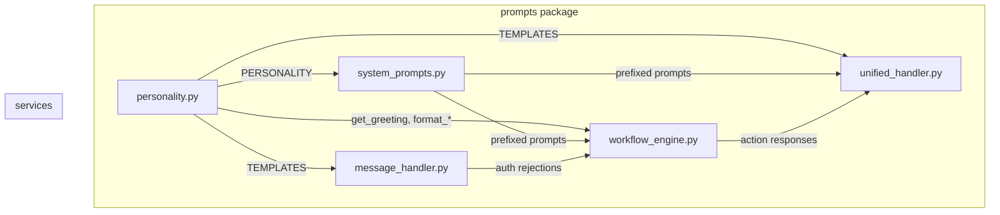

# Design Document — Agent Personality

## Overview

The Agent Personality feature centralises all user-facing Hebrew text into a single personality module (`fortress/src/prompts/personality.py`). This module defines the agent's tone, time-of-day greetings, and response templates. Every service that currently hardcodes Hebrew strings — `workflow_engine.py`, `unified_handler.py`, `message_handler.py` — will be refactored to import from the personality module. All LLM system prompts in `system_prompts.py` will be prefixed with the `PERSONALITY` constant so the AI model generates responses consistent with the agent's character.

The design is intentionally minimal: one new file, surgical edits to four existing files, and a new test file. No database changes, no new dependencies, no API changes.

## Architecture



The personality module sits in the `prompts` package alongside `system_prompts.py`. It exports constants and pure functions — no I/O, no state, no async. Services import what they need and call formatting functions to build responses.

## Components and Interfaces

### 1. `fortress/src/prompts/personality.py` (NEW)

The single source of truth for all user-facing Hebrew text.

```python
# Constants
PERSONALITY: str          # Hebrew string defining agent character traits
GREETINGS: dict[str, str] # Keys: "morning", "afternoon", "evening", "night"
TEMPLATES: dict[str, str] # 10 required keys (see below)

# Pure functions
def get_greeting(name: str, hour: int) -> str: ...
def format_task_created(title: str, due_date: str | None) -> str: ...
def format_task_list(tasks: list) -> str: ...
```

**PERSONALITY constant**: A Hebrew paragraph instructing the LLM on tone — warm, family-oriented, WhatsApp-concise, emoji-light. Prepended to every system prompt.

**GREETINGS dict**: Maps time-of-day keys to Hebrew greeting templates with a `{name}` placeholder.

| Key | Hour range | Example |
|-----|-----------|---------|
| `morning` | 5–11 | `"בוקר טוב, {name}! ☀️"` |
| `afternoon` | 12–16 | `"צהריים טובים, {name}! 🌤️"` |
| `evening` | 17–20 | `"ערב טוב, {name}! 🌆"` |
| `night` | 21–4 | `"לילה טוב, {name}! 🌙"` |

**TEMPLATES dict**: 10 required keys:

| Key | Purpose | Placeholders |
|-----|---------|-------------|
| `task_created` | Task creation confirmation | `{title}`, `{due_date}` (optional section) |
| `task_completed` | Task completion confirmation | `{title}` |
| `task_list_empty` | No open tasks | — |
| `task_list_header` | Header for task list | — |
| `document_saved` | Document upload confirmation | — |
| `permission_denied` | Permission denial | — |
| `unknown_member` | Unknown phone number | — |
| `inactive_member` | Inactive account | — |
| `error_fallback` | Generic error | — |
| `cant_understand` | Unknown intent help text | — |

**`get_greeting(name, hour)`**: Maps hour (0–23) to the correct GREETINGS key, formats with `name`, returns the greeting string. The returned string always contains `name`.

**`format_task_created(title, due_date)`**: Returns a Hebrew confirmation string. When `due_date` is not None, appends the date to the message. When `due_date` is None, omits the date section entirely (no placeholder text).

**`format_task_list(tasks)`**: When `tasks` is empty, returns `TEMPLATES["task_list_empty"]`. Otherwise, builds a numbered list with priority emojis:
- 🔴 = `urgent`
- 🟡 = `high`
- 🟢 = `normal`
- ⚪ = `low`

Each task line includes the emoji, title, and optional due date.

### 2. `fortress/src/prompts/system_prompts.py` (MODIFIED)

Changes:
- Import `PERSONALITY` from `personality.py`
- Prepend `PERSONALITY + "\n\n"` to `FORTRESS_BASE`, `UNIFIED_CLASSIFY_AND_RESPOND`, and `TASK_RESPONDER`
- Other prompts (`INTENT_CLASSIFIER`, `TASK_EXTRACTOR`, `TASK_EXTRACTOR_BEDROCK`, `MEMORY_EXTRACTOR`) remain unchanged — they are machine-facing, not user-facing

### 3. `fortress/src/prompts/__init__.py` (MODIFIED)

Add re-exports for the new personality module's public API:
- `PERSONALITY`, `GREETINGS`, `TEMPLATES`
- `get_greeting`, `format_task_created`, `format_task_list`

### 4. `fortress/src/services/workflow_engine.py` (MODIFIED)

Changes to `action_node` handlers:

| Handler | Before | After |
|---------|--------|-------|
| `_handle_greeting` | Hardcoded `f"שלום, {member.name}! 👋"` | `get_greeting(member.name, current_hour)` |
| `_handle_create_task` | Hardcoded Hebrew prompt to dispatcher | `format_task_created(title, due_date)` — returns directly, no LLM call needed for confirmation |
| `_handle_list_tasks` | Builds task lines manually, sends to LLM | `format_task_list(tasks)` — returns directly, no LLM call needed |
| `_handle_unknown` | Hardcoded multi-line Hebrew help text | `TEMPLATES["cant_understand"]` |
| `permission_node` | Hardcoded `"אין לך הרשאה לביצוע פעולה זו 🔒"` | `TEMPLATES["permission_denied"]` |
| `run_workflow` except block | Returns `HEBREW_FALLBACK` from bedrock_client | `TEMPLATES["error_fallback"]` |

The `_handle_list_tasks` and `_handle_create_task` handlers will no longer need a dispatcher call for formatting — the personality module handles it. The dispatcher is still used for task extraction in `_handle_create_task`.

Import additions: `from src.prompts.personality import get_greeting, format_task_created, format_task_list, TEMPLATES as PERSONALITY_TEMPLATES`

We alias `TEMPLATES` to `PERSONALITY_TEMPLATES` to avoid collision with any local names.

### 5. `fortress/src/services/unified_handler.py` (MODIFIED)

Changes:
- Replace `HEBREW_FALLBACK_MSG` hardcoded string with import from personality: `PERSONALITY_TEMPLATES["error_fallback"]`
- Keep `HEBREW_FALLBACK_MSG` as a module-level alias for backward compatibility (existing tests reference it)
- The system prompt (`UNIFIED_CLASSIFY_AND_RESPOND`) already gets the personality prefix via `system_prompts.py` changes

### 6. `fortress/src/services/message_handler.py` (MODIFIED)

Changes:
- Import `TEMPLATES` from personality module
- Replace `"מספר לא מזוהה. פנה למנהל המשפחה."` with `TEMPLATES["unknown_member"]`
- Replace `"החשבון שלך לא פעיל."` with `TEMPLATES["inactive_member"]`

### 7. `README.md` (MODIFIED)

Add a new row to the roadmap table:
```
| STABLE-2 — Agent Personality | ✅ Complete | Centralised Hebrew personality, templates, greeting system | 190+ |
```

Update the status line and test count.

## Data Models

No database schema changes. The personality module uses only in-memory constants and pure functions.

The `tasks` list passed to `format_task_list` expects objects with these attributes (already present on the `Task` ORM model):
- `title: str`
- `priority: str` (one of `"urgent"`, `"high"`, `"normal"`, `"low"`)
- `due_date: date | None`

## Correctness Properties

*A property is a characteristic or behavior that should hold true across all valid executions of a system — essentially, a formal statement about what the system should do. Properties serve as the bridge between human-readable specifications and machine-verifiable correctness guarantees.*

> **Note**: Per user request, all properties below will be validated via unit tests with representative examples rather than property-based testing libraries.

### Property 1: Greeting name inclusion

*For any* valid member name and any valid hour (0–23), calling `get_greeting(name, hour)` should return a string that contains `name`.

**Validates: Requirements 1.4, 6.1, 6.11**

### Property 2: Greeting time-of-day variation

*For any* two hours that fall in different time-of-day ranges (e.g., morning vs evening), `get_greeting(name, h1)` and `get_greeting(name, h2)` should return different greeting strings.

**Validates: Requirements 1.4, 6.2**

### Property 3: Task creation title inclusion

*For any* task title string, `format_task_created(title, due_date)` should return a string that contains `title`.

**Validates: Requirements 1.5, 6.3**

### Property 4: Task creation due date conditional inclusion

*For any* task title and non-null due date, `format_task_created(title, due_date)` should return a string containing the due date. When due_date is None, the returned string should not contain a date placeholder.

**Validates: Requirements 1.5, 6.4, 6.5**

### Property 5: Task list completeness

*For any* non-empty list of tasks, `format_task_list(tasks)` should return a string containing every task's title.

**Validates: Requirements 1.6, 6.7**

### Property 6: Task list priority emoji mapping

*For any* task in a task list, the formatted output should include the correct priority emoji (🔴 for urgent, 🟡 for high, 🟢 for normal, ⚪ for low) adjacent to that task's entry.

**Validates: Requirements 1.6, 6.8**

### Property 7: Empty task list returns template

*For any* call to `format_task_list([])`, the result should equal `TEMPLATES["task_list_empty"]` exactly.

**Validates: Requirements 1.7, 6.6**

### Property 8: System prompts contain personality prefix

*For each* of `FORTRESS_BASE`, `UNIFIED_CLASSIFY_AND_RESPOND`, and `TASK_RESPONDER`, the prompt string should start with the `PERSONALITY` constant.

**Validates: Requirements 2.2, 2.3, 2.4**

### Property 9: No hardcoded Hebrew in services

*For each* of `workflow_engine.py` and `message_handler.py`, the source code should contain zero hardcoded Hebrew response strings outside of personality module imports.

**Validates: Requirements 3.7, 5.3**

### Property 10: Templates dictionary completeness

The `TEMPLATES` dictionary should contain exactly the ten required keys: `task_created`, `task_completed`, `task_list_empty`, `task_list_header`, `document_saved`, `permission_denied`, `unknown_member`, `inactive_member`, `error_fallback`, `cant_understand`.

**Validates: Requirements 1.3, 6.9**

## Error Handling

The personality module is pure functions and constants — no I/O, no exceptions expected. Error handling strategy:

1. **`get_greeting` with out-of-range hour**: The function uses modular arithmetic (`hour % 24`) internally, so any integer is valid. Negative hours or hours > 23 wrap around.

2. **`format_task_list` with malformed task objects**: If a task is missing `priority`, default to `"normal"` (🟢). If missing `title`, use an empty string. If missing `due_date`, omit the date.

3. **Backward compatibility**: `HEBREW_FALLBACK_MSG` in `unified_handler.py` becomes an alias for `TEMPLATES["error_fallback"]`. Existing tests that import `HEBREW_FALLBACK_MSG` continue to work.

4. **Import failures**: If the personality module fails to import (syntax error, etc.), the application fails fast at startup — this is intentional and correct.

## Testing Strategy

All tests are unit tests. No property-based testing libraries. The user requires all 175 existing tests to continue passing.

### New test file: `fortress/tests/test_personality.py`

Tests are organised into groups:

**Group 1: Module exports (Requirements 1.1–1.3, 6.9)**
- Verify `PERSONALITY` is a non-empty string
- Verify `GREETINGS` has keys: `morning`, `afternoon`, `evening`, `night`
- Verify `TEMPLATES` has all 10 required keys
- Verify all template values are non-empty strings

**Group 2: `get_greeting` function (Requirements 1.4, 6.1, 6.2, 6.11)**
- Test hours 0, 6, 12, 18 — each returns a string containing the provided name
- Test morning (hour=8) vs evening (hour=20) returns different strings
- Test boundary hours (5, 11, 12, 16, 17, 20, 21, 4) map to correct time-of-day

**Group 3: `format_task_created` function (Requirements 1.5, 6.3, 6.4, 6.5)**
- Test that title appears in output
- Test that non-null due_date appears in output
- Test that null due_date produces no date placeholder

**Group 4: `format_task_list` function (Requirements 1.6, 1.7, 6.6, 6.7, 6.8)**
- Test empty list returns `TEMPLATES["task_list_empty"]`
- Test multiple tasks — each title appears in output
- Test priority emojis: urgent→🔴, high→🟡, normal→🟢, low→⚪

**Group 5: Integration — system prompts (Requirements 2.1–2.4)**
- Verify `FORTRESS_BASE` starts with `PERSONALITY`
- Verify `UNIFIED_CLASSIFY_AND_RESPOND` starts with `PERSONALITY`
- Verify `TASK_RESPONDER` starts with `PERSONALITY`

**Group 6: Integration — workflow engine (Requirements 3.1–3.6)**
- Mock personality functions, verify `_handle_greeting` calls `get_greeting`
- Mock personality functions, verify `_handle_create_task` uses `format_task_created`
- Mock personality functions, verify `_handle_list_tasks` uses `format_task_list`
- Verify `permission_node` denial uses `PERSONALITY_TEMPLATES["permission_denied"]`

**Group 7: Integration — message handler (Requirements 5.1–5.2)**
- Verify unknown phone response matches `TEMPLATES["unknown_member"]`
- Verify inactive member response matches `TEMPLATES["inactive_member"]`

### Existing test compatibility (Requirement 6.10)

The key risk is that existing tests assert on specific Hebrew strings (e.g., `"מספר לא מזוהה"` in `test_message_handler.py`). Strategy:

1. Keep `HEBREW_FALLBACK_MSG` as an alias in `unified_handler.py` — tests importing it still work
2. Update assertions in `test_message_handler.py` to use personality TEMPLATES instead of hardcoded substrings
3. Update assertions in `test_workflow_engine.py` if any assert on hardcoded Hebrew strings
4. Run full suite to confirm 175 tests pass before adding new tests

Estimated new tests: ~15 tests in `test_personality.py`, bringing total to ~190.
