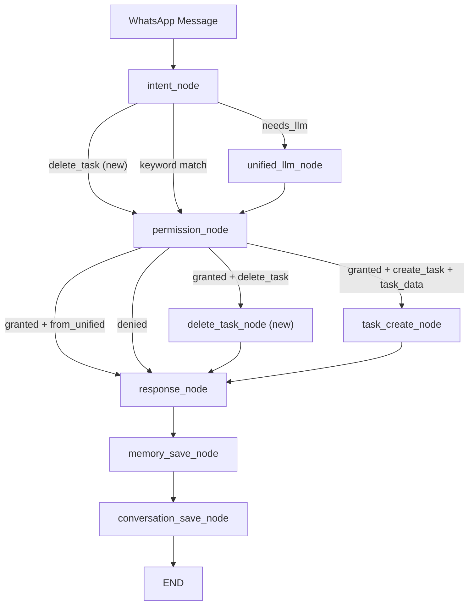

# Design Document: Core Flows Hardening

## Overview

This design addresses six production gaps discovered in the Fortress family WhatsApp bot after the STABLE-2 (Agent Personality) milestone:

1. **No delete_task capability** — Hebrew "מחק משימה" currently falls through to `needs_llm` and the LLM creates a task instead of deleting one.
2. **No duplicate task prevention** — double-tapping a message creates two identical tasks.
3. **LLM hallucinated actions** — the LLM sometimes claims it deleted/completed a task when it only classified intent.
4. **Corrupt Ollama-era data** — tasks with empty titles, null `created_by`, or garbled content.
5. **Missing task owner assignment** — `assigned_to` and `created_by` are not extracted from messages like "תזכיר לשגב לקנות חלב".
6. **English duplication in prompts** — system prompts contain redundant English alongside Hebrew.

All deletions use soft-delete (`status = 'archived'`). All 201 existing tests must continue to pass. Testing is unit-test only (no property-based testing).

## Architecture

The changes touch five layers of the existing LangGraph workflow pipeline:



Key architectural decisions:

- **Delete follows the same pattern as create**: keyword detection → permission check → dedicated node → response. No new graph topology concepts.
- **Duplicate check lives in `task_create_node`**, not in the task service layer, because the 5-minute window check requires DB queries that are workflow-specific.
- **Name-to-member resolution lives in `workflow_engine.py`** as a helper function, called by both `task_create_node` and the new `delete_task_node`.
- **Migration 005 is idempotent** — safe to run multiple times.

## Components and Interfaces

### 1. Intent Detector (`intent_detector.py`)

**Changes:**
- Add `"delete_task": {"model_tier": "local"}` to `INTENTS` dict.
- Add keyword matching in `_match_keywords()` for five triggers:
  - `"מחק משימה"` (substring match)
  - `"מחק"` (standalone — `stripped == "מחק"`)
  - `"הסר משימה"` (substring match)
  - `"בטל משימה"` (substring match)
  - `"delete task"` (case-insensitive, substring match on `lower`)

**Interface (unchanged):**
```python
def detect_intent(text: str, has_media: bool) -> str: ...
```

### 2. Routing Policy (`routing_policy.py`)

**Changes:**
- Add `"delete_task": "medium"` to `SENSITIVITY_MAP`.

### 3. Workflow Engine (`workflow_engine.py`)

**Changes:**

a) **New `delete_task_node` async function:**
```python
async def delete_task_node(state: WorkflowState) -> dict:
    """Identify and soft-delete (archive) a task."""
```
- Parses the message to find a task number or title.
- Number detection: regex `\d+` at end of message → index into member's open task list.
- Title detection: strip delete keywords, use remainder as case-insensitive title search.
- If match found → `archive_task(db, task.id)` → respond with `task_deleted` template.
- If ambiguous (no number/title) → respond with `task_delete_which` template + numbered list.
- If not found → respond with `task_not_found` template.

b) **Updated `_permission_router`:**
- Add routing: `granted + intent == "delete_task"` → `"delete_task_node"`.

c) **Updated `_PERMISSION_MAP`:**
- Add `"delete_task": ("tasks", "write")`.

d) **Updated `task_create_node`:**
- Before creating, check for duplicate: same title (case-insensitive), same `assigned_to`, status `open`, `created_at` within last 5 minutes.
- If duplicate found → return `task_duplicate` template, skip creation.
- Resolve `assigned_to` name from `task_data` using `_resolve_member_by_name()`.
- Always set `created_by` to `state["member"].id`.

e) **New `_resolve_member_by_name` helper:**
```python
def _resolve_member_by_name(db: Session, name: str) -> UUID | None:
    """Case-insensitive partial match on family_members.name. Returns member ID or None."""
```
- Query `FamilyMember` where `lower(name)` contains `lower(input)`.
- Return first match's ID, or None if no match.

f) **Updated `_intent_router`:**
- `delete_task` routes to `permission_node` (keyword path), same as other keyword intents.

g) **Updated graph construction (`_build_graph`):**
- Add `"delete_task_node"` node.
- Add conditional edge from `permission_node` to `delete_task_node`.
- Add edge from `delete_task_node` to `response_node`.

### 4. Unified Handler & System Prompts

**Changes to `system_prompts.py`:**

a) **`UNIFIED_CLASSIFY_AND_RESPOND`:**
- Add `delete_task` to intent list with Hebrew description: "המשתמש רוצה למחוק או לבטל משימה".
- Add `delete_target` field to JSON response format (task number, title string, or null).
- Add `assigned_to` field to `task_data` section.
- Add anti-hallucination instruction in Hebrew: "אל תמציא פעולות שלא ביצעת. אם לא מחקת/השלמת/יצרת משימה בפועל — אל תגיד שעשית את זה. תאר רק מה שאתה באמת עושה: מסווג כוונה ומייצר תשובה."

b) **`TASK_EXTRACTOR_BEDROCK`:**
- Add `assigned_to` field to JSON extraction schema with Hebrew instructions.
- Convert English instructions to Hebrew only (keep JSON field names in English).

c) **`FORTRESS_BASE`:**
- Remove English duplication, keep Hebrew only.

d) **`INTENT_CLASSIFIER`:**
- Add `delete_task` to the intent list.

### 5. Personality Module (`personality.py`)

**Changes to `TEMPLATES` dict:**
- Add `"task_deleted": "משימה נמחקה: {title} ✅"`
- Add `"task_delete_which": "איזו משימה למחוק? 🤔\n{task_list}"`
- Add `"task_not_found": "לא מצאתי את המשימה הזו 🤷"`
- Add `"task_duplicate": "המשימה הזו כבר קיימת ✅"`

### 6. Database Migration (`005_cleanup_corrupt_data.sql`)

**Operations (all use soft-delete):**
1. Archive tasks with empty or null titles.
2. Archive tasks with null `created_by`.
3. Deduplicate open tasks: for groups sharing same `lower(title)` + `assigned_to`, keep the most recent, archive the rest.

### 7. Unified Handler (`unified_handler.py`)

**Changes:**
- Extract `delete_target` from parsed JSON when intent is `delete_task`.
- Return it as part of the tuple (or embed in task_data).

## Data Models

### Existing Models (no schema changes)

The `Task` model already supports all needed statuses (`open`, `in_progress`, `done`, `archived`) and has `assigned_to`, `created_by` fields. No schema migration is needed for the application tables.

### State Changes

**`WorkflowState` TypedDict** — add optional field:
```python
class WorkflowState(TypedDict):
    # ... existing fields ...
    delete_target: str | None  # task number or title from message/LLM
```

### Duplicate Detection Query

```sql
SELECT id FROM tasks
WHERE lower(title) = lower(:title)
  AND assigned_to = :assigned_to
  AND status = 'open'
  AND created_at > now() - interval '5 minutes'
LIMIT 1;
```

### Migration 005 — Cleanup Corrupt Data

```sql
-- Archive tasks with empty/null titles
UPDATE tasks SET status = 'archived' WHERE title IS NULL OR trim(title) = '';

-- Archive tasks with null created_by
UPDATE tasks SET status = 'archived' WHERE created_by IS NULL AND status = 'open';

-- Deduplicate: keep newest per (lower(title), assigned_to) group, archive rest
WITH ranked AS (
  SELECT id, ROW_NUMBER() OVER (
    PARTITION BY lower(title), assigned_to
    ORDER BY created_at DESC
  ) AS rn
  FROM tasks
  WHERE status = 'open'
)
UPDATE tasks SET status = 'archived'
WHERE id IN (SELECT id FROM ranked WHERE rn > 1);
```


## Correctness Properties

*A property is a characteristic or behavior that should hold true across all valid executions of a system — essentially, a formal statement about what the system should do. Properties serve as the bridge between human-readable specifications and machine-verifiable correctness guarantees.*

After analyzing all 12 requirements and their acceptance criteria, every criterion in this spec is testable as a concrete example rather than a universally quantified property. This is because:

- **Intent detection** criteria are specific keyword → intent mappings (deterministic, finite set).
- **Routing policy** criteria are dictionary entry checks.
- **Workflow handler** criteria are specific scenarios (delete by number, delete by title, ambiguous, not found).
- **Prompt content** criteria are string containment checks on constants.
- **Personality templates** criteria are dictionary key/value checks.
- **Migration** criteria are SQL content verification.
- **Owner assignment** criteria are specific mock-based scenarios.
- **Duplicate prevention** criteria are specific time-window scenarios.

Per the spec constraint, this feature uses **unit tests only** (no property-based testing). All acceptance criteria map to concrete example-based tests.

### Property 1: Delete keywords produce delete_task intent

*For any* message containing one of the five delete keywords ("מחק משימה", "מחק", "הסר משימה", "בטל משימה", "delete task"), the intent detector shall return `delete_task`.

**Validates: Requirements 1.1, 1.2, 1.3, 1.4, 1.5**

### Property 2: Soft-delete invariant — archive_task never hard-deletes

*For any* delete_task workflow execution that successfully identifies a task, the system shall call `archive_task()` (setting status to `archived`) and never issue a SQL DELETE.

**Validates: Requirements 3.6, 10.4**

### Property 3: Duplicate detection within time window

*For any* task creation attempt where an open task with the same title (case-insensitive) and same `assigned_to` exists with `created_at` within the last 5 minutes, the system shall skip creation and return the `task_duplicate` template.

**Validates: Requirements 7.1, 7.2**

### Property 4: created_by always set to sender

*For any* task creation through the workflow engine, the `created_by` field shall be set to the sender's `FamilyMember.id`, regardless of the `assigned_to` value.

**Validates: Requirements 6.6**

### Property 5: Anti-hallucination instruction present in unified prompt

*For any* version of the `UNIFIED_CLASSIFY_AND_RESPOND` prompt, it shall contain the Hebrew anti-hallucination instruction preventing the LLM from claiming actions it did not perform.

**Validates: Requirements 8.1, 8.2**

### Property 6: All new personality templates exist with correct values

*For any* access to the `TEMPLATES` dict, the keys `task_deleted`, `task_delete_which`, `task_not_found`, and `task_duplicate` shall be present with their specified Hebrew values.

**Validates: Requirements 5.1, 5.2, 5.3, 7.3**

### Property 7: Name-to-member resolution falls back to sender

*For any* task creation with an `assigned_to` name that does not match any family member, the system shall assign the task to the sender's ID.

**Validates: Requirements 6.4, 6.5**

## Error Handling

### Intent Detection
- Unknown keywords fall through to `needs_llm` (existing behavior, unchanged).
- `delete_task` added to `VALID_INTENTS` so the unified handler accepts it.

### Delete Task Workflow
- **Task number out of range**: respond with `task_not_found` template.
- **No matching title**: respond with `task_not_found` template.
- **Ambiguous message** (no number or title extractable): respond with `task_delete_which` template listing open tasks.
- **No open tasks at all**: respond with `task_not_found` template.
- **`archive_task` returns None** (task disappeared between lookup and archive): respond with `task_not_found` template.
- **DB error during archive**: caught by workflow's top-level exception handler → `error_fallback` template.

### Duplicate Prevention
- **DB error during duplicate check**: log warning, proceed with task creation (fail-open to avoid blocking legitimate tasks).
- **Race condition** (two identical messages arrive simultaneously): the 5-minute window check is best-effort; the migration's deduplication handles any that slip through.

### Name Resolution
- **Multiple partial matches**: use the first match (ordered by name). Log a warning.
- **No match**: fall back to sender's ID. Log a warning.
- **DB error during name lookup**: fall back to sender's ID. Log error.

### Migration 005
- **Idempotent**: running multiple times produces the same result (already-archived tasks are not affected by the WHERE clauses).
- **No data loss**: all operations use `SET status = 'archived'`, never DELETE.

## Testing Strategy

### Approach: Unit Tests Only

Per the spec constraint, all testing uses **pytest unit tests with mocks**. No property-based testing library is used. All 201 existing tests must continue to pass without modification.

### New Test Files

#### `tests/test_delete_task.py` (~15 tests)
- Keyword detection for all 5 delete keywords (Hebrew + English).
- Delete by task number (happy path): mock `list_tasks` returning 3 tasks, send "מחק משימה 2", verify `archive_task` called with correct task ID.
- Delete by title match: mock task list, send "מחק לקנות חלב", verify case-insensitive match and archive.
- Ambiguous delete (no number/title): verify response contains `task_delete_which` template with numbered list.
- Task not found: verify response contains `task_not_found` template.
- Task number out of range: verify `task_not_found` response.
- Verify `archive_task` is used (not `complete_task` or raw DELETE).

#### `tests/test_task_owner.py` (~8 tests)
- Name-to-member resolution: exact match.
- Name-to-member resolution: partial match (e.g., "שגב" matches "שגב כהן").
- Name-to-member resolution: case-insensitive match.
- No-match fallback to sender ID.
- `created_by` always set to sender's member ID.
- `assigned_to` from `task_data` resolved to member UUID.
- Warning logged when name doesn't match.

#### `tests/test_duplicate_prevention.py` (~6 tests)
- Duplicate detected within 5 minutes: verify `create_task` not called, response is `task_duplicate`.
- No duplicate when title differs.
- No duplicate when `assigned_to` differs.
- No duplicate when existing task is older than 5 minutes.
- No duplicate when existing task status is not `open` (e.g., `done` or `archived`).

### Updated Test Files

#### `tests/test_intent_detector.py`
- Add `delete_task` to the required intents set in `test_intents_contains_all_required`.
- Add keyword matching tests for each delete keyword.

#### `tests/test_personality.py`
- Update `REQUIRED_TEMPLATE_KEYS` set to include `task_deleted`, `task_delete_which`, `task_not_found`, `task_duplicate`.

#### `tests/test_routing_policy.py`
- Add `delete_task` to the medium sensitivity parametrized test.

#### `tests/test_unified_handler.py`
- Add test for `delete_task` intent with `delete_target` field in JSON response.

### Test Conventions
- All tests use `unittest.mock.MagicMock` and `AsyncMock` for DB and service mocks.
- Async workflow tests use `@pytest.mark.asyncio`.
- Tests follow existing naming: `test_<scenario>`.
- No real database connections — all DB interactions are mocked.
- Target: ~30 new tests, bringing total from 201 to ~231.
