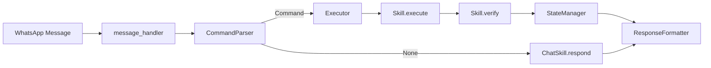
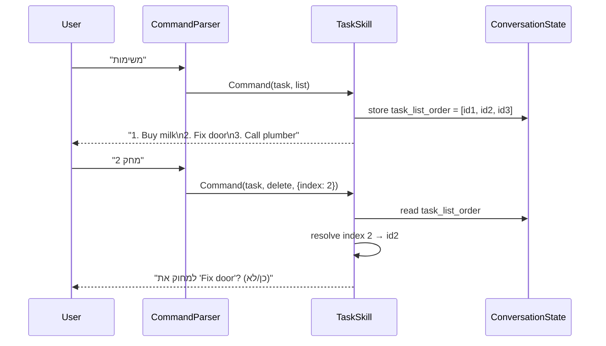

# Design Document: Core Skills Migration (Sprint R2)

## Overview

Sprint R2 migrates all existing Fortress functionality into 7 self-contained Skills that plug into the Skills Engine built in Sprint R1. Each skill implements the `BaseSkill` interface (`name`, `description`, `commands`, `execute`, `verify`, `get_help`) and wraps existing service-layer functions. After R2, every structured operation (tasks, recurring, documents, bugs, memory, morning briefing) routes through the deterministic CommandParser → Executor pipeline with zero LLM calls. Only truly free-form conversation hits the LLM, via `ChatSkill.respond`.

### Design Goals

- Wrap existing services — no rewriting of task/recurring/document/memory/bug logic
- Enforce permission checks uniformly via a shared `_check_perm` helper
- Maintain the confirmation flow for destructive actions through `set_pending_confirmation`
- Use personality templates exclusively for user-facing strings (zero hardcoded Hebrew in skills)
- Keep ChatSkill as the single LLM entry point; all other skills are deterministic

### Scope

| Skill | Actions | LLM? |
|-------|---------|------|
| TaskSkill | create, list, delete, delete_all, complete, update | No |
| RecurringSkill | create, list, delete | No |
| DocumentSkill | save, list | No |
| BugSkill | report, list | No |
| ChatSkill | greet, respond | respond only |
| MemorySkill | store, recall, list | No |
| MorningSkill | briefing, summary | No |

## Architecture

### Pipeline Flow



### Skill Registration

All 7 skills plus the existing SystemSkill are registered in `src/skills/__init__.py` at import time. The `DocumentSkill` instance is registered twice — under `"document"` and `"media"` — so that media commands from CommandParser (`skill="media"`) resolve correctly.

```python
# src/skills/__init__.py
registry.register(TaskSkill())
registry.register(RecurringSkill())
doc_skill = DocumentSkill()
registry.register(doc_skill)
registry._skills["media"] = doc_skill  # dual registration
registry.register(BugSkill())
registry.register(ChatSkill())
registry.register(MemorySkill())
registry.register(MorningSkill())
```

### Permission Check Helper

Every skill that enforces RBAC uses a shared helper pattern:

```python
def _check_perm(db: Session, member: FamilyMember, resource: str, action: str) -> Result | None:
    """Return a denial Result if the member lacks permission, else None."""
    if not check_permission(db, member.phone, resource, action):
        return Result(success=False, message=TEMPLATES["permission_denied"])
    return None
```

This is defined as a module-level function (not a method) so all skills can import it. Skills call it at the top of each action handler and return early if non-None.

### Message Handler Update

The LLM fallback path in `message_handler.handle_incoming_message` changes from:

```python
# OLD
from src.services.workflow_engine import run_workflow
response = await run_workflow(db, member, phone, message_text, ...)
intent = "llm_fallback"
```

to:

```python
# NEW
from src.skills.chat_skill import ChatSkill
chat = registry.get("chat")
response = await chat.respond(db, member, message_text)
intent = "chat.respond"
```

## Components and Interfaces

### BaseSkill Interface (from Sprint R1)

```python
class BaseSkill(ABC):
    name: str                                    # e.g. "task"
    description: str                             # Hebrew one-liner
    commands: list[tuple[re.Pattern, str]]       # (regex, action_name)
    execute(db, member, command) -> Result
    verify(db, result) -> bool
    get_help() -> str
```

### TaskSkill

- **name**: `"task"`
- **description**: `"ניהול משימות — יצירה, רשימה, מחיקה, השלמה, עדכון"`
- **commands**:
  | Pattern | Action |
  |---------|--------|
  | `^(משימה חדשה\|new task)\s+(?P<title>.+)` | `create` |
  | `^(משימות\|tasks)$` | `list` |
  | `^(מחק משימה\|מחק)\s+(?P<index>\d+)` | `delete` |
  | `^(מחק הכל\|נקה הכל\|delete all)$` | `delete_all` |
  | `^(סיים\|סיום\|בוצע\|done)\s*(?P<index>\d+)?$` | `complete` |
  | `^(עדכן\|שנה)\s*(?P<index>\d+)?\s+(?P<changes>.+)` | `update` |

- **execute** dispatches to `_create`, `_list`, `_delete`, `_delete_all`, `_complete`, `_update`
- **_create**: checks perm → checks duplicate (same title, same member, last 5 min) → if dup, sets pending_confirmation → else calls `tasks.create_task` → returns Result with entity_type="task"
- **_list**: checks perm → calls `tasks.list_tasks(status="open")` → stores task IDs as `task_list_order` in conversation state context → formats with `format_task_list`
- **_delete**: checks perm → resolves index from `task_list_order` → sets pending_confirmation → on confirmed re-dispatch, calls `tasks.archive_task`
- **_delete_all**: checks perm → queries open tasks count → sets pending_confirmation with count and list → on confirmed re-dispatch, archives all
- **_complete**: checks perm → resolves task (by index or last_entity_id) → calls `tasks.complete_task`
- **_update**: checks perm → resolves task → parses changes from text → calls service update
- **verify**: checks DB state per action: created→status "open", deleted→status "archived", completed→status "done", updated→task exists

### RecurringSkill

- **name**: `"recurring"`
- **description**: `"ניהול תזכורות חוזרות — יצירה, רשימה, ביטול"`
- **commands**:
  | Pattern | Action |
  |---------|--------|
  | `^(תזכורת חדשה\|recurring)\s+(?P<details>.+)` | `create` |
  | `^(תזכורות\|חוזרות)$` | `list` |
  | `^(מחק תזכורת\|בטל תזכורת)\s+(?P<identifier>.+)` | `delete` |

- **Frequency parsing** from Hebrew text: `יומי`→daily, `שבועי`→weekly, `חודשי`→monthly, `שנתי`→yearly
- **_create**: parses title + frequency → calculates `next_due_date` → calls `recurring.create_pattern`
- **_list**: calls `recurring.list_patterns(is_active=True)` → formats with `format_recurring_list`
- **_delete**: resolves pattern → sets pending_confirmation → on confirm, calls `recurring.deactivate_pattern`
- **verify**: created→is_active=True, deleted→is_active=False

### DocumentSkill

- **name**: `"document"`
- **description**: `"שמירת מסמכים ותמונות"`
- **commands**:
  | Pattern | Action |
  |---------|--------|
  | `^(מסמכים\|documents)$` | `list` |

  Note: The `save` action has no regex pattern — it's triggered by the CommandParser's media detection (`has_media=True` → `Command(skill="media", action="save")`).

- **Dual registration**: The same instance is registered under both `"document"` and `"media"` in the registry.
- **_save**: calls `documents.process_document(file_path, member.id, "whatsapp")` → returns Result with entity_type="document"
- **_list**: queries last 20 documents → formats with `format_document_list`
- **verify**: saved→document exists in DB

### BugSkill

- **name**: `"bug"`
- **description**: `"דיווח ומעקב באגים"`
- **commands**:
  | Pattern | Action |
  |---------|--------|
  | `^(באג\|bug)\s+(?P<description>.+)` | `report` |
  | `^(באגים\|bugs\|רשימת באגים)$` | `list` |

- **_report**: checks perm (tasks/write) → creates BugReport record directly → returns Result with entity_type="bug_report"
- **_list**: checks perm (tasks/read) → queries open BugReports → formats with `format_bug_list`
- **verify**: reported→bug exists with status "open"

### ChatSkill

- **name**: `"chat"`
- **description**: `"שיחה חופשית וברכות"`
- **commands**:
  | Pattern | Action |
  |---------|--------|
  | `^(שלום\|היי\|hello\|בוקר טוב\|ערב טוב\|לילה טוב)$` | `greet` |

- **execute (greet)**: calls `get_greeting(member.name, current_hour)` → returns Result with no entity_id, no LLM
- **respond(db, member, message_text)**: async method, NOT triggered by commands — called directly by message_handler when CommandParser returns None
  - Loads memories via MemorySkill recall
  - Constructs prompt with personality + time context + memories + conversation state
  - Calls LLM (Bedrock primary, OpenRouter fallback)
  - Returns response string
- **verify**: always returns True (no entity mutations)
- ChatSkill is the ONLY skill that makes LLM calls, and only in `respond`

### MemorySkill

- **name**: `"memory"`
- **description**: `"ניהול זיכרונות — שמירה, שליפה, רשימה"`
- **commands**:
  | Pattern | Action |
  |---------|--------|
  | `^(זכרונות\|memories)$` | `list` |

- **store** and **recall** are programmatic interfaces only — no user-facing regex patterns. They are called by other skills (primarily ChatSkill).
- **_list**: calls `memory_service.load_memories(member.id)` → formats as numbered list with category + content
- **_store(db, member, content, category, memory_type)**: checks exclusion → validates category → calls `save_memory` → returns Result with entity_type="memory"
- **_recall(db, member)**: calls `load_memories` → returns memory list in Result.data for ChatSkill consumption
- **verify**: stored→memory exists in DB; recall/list→always True

### MorningSkill

- **name**: `"morning"`
- **description**: `"סיכום בוקר ודוחות"`
- **commands**:
  | Pattern | Action |
  |---------|--------|
  | `^(בוקר\|morning\|סיכום בוקר)$` | `briefing` |
  | `^(דוח\|report\|סיכום)$` | `summary` |

- **_briefing**: queries counts (open tasks, active recurring, recent docs, open bugs) → formats with `morning_briefing` template → hides bugs section for non-parent roles
- **_summary**: checks perm (finance/read) → generates summary report → formats with personality templates
- **verify**: always True (read-only operations)
- No LLM calls

### Personality Templates (New)

New templates to add to `TEMPLATES` dict in `personality.py`:

```python
"morning_briefing": "☀️ בוקר טוב {name}!\n\n{sections}",
"briefing_tasks": "📋 משימות פתוחות: {count}",
"briefing_recurring": "🔄 תזכורות חוזרות: {count}",
"briefing_docs": "📁 מסמכים אחרונים: {count}",
"briefing_bugs": "🐛 באגים פתוחים: {count}",
"no_report_yet": "אין עדיין נתונים לדוח 📊",
"memory_excluded": "המידע הזה לא נשמר בזיכרון 🔒",
"memory_list_empty": "אין זיכרונות שמורים 🧠",
"memory_list_header": "🧠 הזיכרונות שלך:\n",
```

Note: `need_list_first`, `verification_failed`, `task_similar_exists`, `confirm_delete` already exist in TEMPLATES.

## Data Models

All ORM models are already defined in `src/models/schema.py` from Sprint R1 and prior migrations. No new tables or columns are needed for R2.

### Models Used by Skills

| Model | Used By | Key Fields |
|-------|---------|------------|
| `Task` | TaskSkill | id, title, status, created_by, assigned_to, due_date, priority, category |
| `RecurringPattern` | RecurringSkill | id, title, frequency, next_due_date, is_active, assigned_to |
| `Document` | DocumentSkill | id, file_path, original_filename, doc_type, uploaded_by |
| `BugReport` | BugSkill | id, description, status, reported_by, priority |
| `Memory` | MemorySkill | id, content, category, memory_type, family_member_id, is_active |
| `ConversationState` | All skills (via Executor) | last_intent, last_entity_type, last_entity_id, pending_confirmation, pending_action, context |
| `FamilyMember` | All skills | id, name, phone, role, is_active |
| `Permission` | _check_perm | role, resource_type, can_read, can_write |

### State Context Schema

The `ConversationState.context` JSONB field stores skill-specific data:

```json
{
  "task_list_order": ["uuid1", "uuid2", "uuid3"]
}
```

This is written by TaskSkill._list and read by TaskSkill._delete/_complete/_update for index resolution.

### Index Resolution Flow




## Correctness Properties

*A property is a characteristic or behavior that should hold true across all valid executions of a system — essentially, a formal statement about what the system should do. Properties serve as the bridge between human-readable specifications and machine-verifiable correctness guarantees.*

### Property 1: Permission denial prevents mutation

*For any* skill action that requires permission (TaskSkill create/list/delete/delete_all/complete/update, BugSkill report/list, MorningSkill summary), and *for any* member who lacks the required permission, the skill SHALL return `Result(success=False)` with the `permission_denied` template, and no database records SHALL be created, modified, or deleted.

**Validates: Requirements 1.2, 1.3, 2.2, 2.3, 3.7, 4.2, 4.3, 5.5, 6.6, 13.2, 13.3, 14.2, 14.3, 21.2, 21.3, 25.1, 25.2, 25.3, 25.4**

### Property 2: Successful action Result contains correct entity metadata

*For any* successful skill action that produces an entity (TaskSkill create/delete/complete/update, RecurringSkill create/delete, DocumentSkill save, BugSkill report, MemorySkill store), the returned Result SHALL have `success=True`, the correct `entity_type` (e.g. "task", "recurring_pattern", "document", "bug_report", "memory"), a non-None `entity_id` matching the DB record, and the correct `action` string.

**Validates: Requirements 1.7, 3.6, 5.7, 7.3, 9.4, 10.3, 13.4, 18.4**

### Property 3: Verify confirms expected DB state per action type

*For any* successful action with an entity_id, calling `skill.verify(db, result)` SHALL return True only when the database record matches the expected post-condition: created tasks have status "open", deleted tasks have status "archived", completed tasks have status "done", updated tasks exist, created recurring patterns have is_active=True, deleted recurring patterns have is_active=False, saved documents exist, and reported bugs have status "open".

**Validates: Requirements 1.6, 3.5, 5.6, 7.4, 9.3, 10.4, 13.5, 26.1, 26.2, 26.3, 26.4, 26.5, 26.6, 26.7, 26.8**

### Property 4: Index resolution from task_list_order

*For any* index-based TaskSkill action (delete, complete, update) where `task_list_order` exists in conversation state, providing index `i` (1-based) SHALL resolve to `task_list_order[i-1]`. If `task_list_order` does not exist, the skill SHALL return the `need_list_first` template. If the index is out of range, the skill SHALL return the `task_not_found` template.

**Validates: Requirements 3.1, 3.2, 3.3, 5.2, 5.4, 6.3, 6.5, 30.1, 30.2, 30.3**

### Property 5: Fallback to last_entity_id when no index provided

*For any* TaskSkill complete or update action where no index is provided, the skill SHALL resolve the target task from `last_entity_id` in conversation state when `last_entity_type` is "task".

**Validates: Requirements 5.3, 6.4**

### Property 6: Destructive actions require confirmation

*For any* destructive action (TaskSkill delete with valid task, TaskSkill delete_all with open tasks, RecurringSkill delete with valid pattern), the skill SHALL set `pending_confirmation=True` in conversation state and return a confirmation prompt, without performing the destructive operation until confirmation is received.

**Validates: Requirements 3.4, 4.4, 9.2, 29.1, 29.2, 29.3**

### Property 7: Duplicate task detection within time window

*For any* task creation request where an open task with the same title by the same member was created within the last 5 minutes, the TaskSkill SHALL return the `task_similar_exists` template and set `pending_confirmation`, rather than creating the task immediately. If the member confirms, the task SHALL be created normally.

**Validates: Requirements 1.4, 1.5, 31.1, 31.2, 31.3**

### Property 8: Task list stores ordered IDs in state

*For any* successful TaskSkill list action, the conversation state context SHALL contain a `task_list_order` key whose value is a list of task UUIDs in the same order as the displayed list.

**Validates: Requirements 2.4, 27.2**

### Property 9: ChatSkill greet is deterministic and time-appropriate

*For any* hour of the day and *for any* member name, `ChatSkill.execute` with action "greet" SHALL return a greeting from the correct time-of-day bucket (morning/afternoon/evening/night) that includes the member's name, without making any LLM calls.

**Validates: Requirements 15.1, 15.2, 15.3, 24.3**

### Property 10: MemorySkill store respects exclusion patterns

*For any* content string and category, `MemorySkill.store` SHALL check the content against exclusion patterns. If excluded, it SHALL return `Result(success=False)` with the `memory_excluded` template. If not excluded and the category is valid, it SHALL save the memory and return `Result(success=True)` with entity_type="memory".

**Validates: Requirements 18.1, 18.2, 18.3, 18.4**

### Property 11: MemorySkill recall returns memories in Result.data

*For any* member, calling `MemorySkill.recall` SHALL load that member's active, non-expired memories and return them in `Result.data` for consumption by ChatSkill.

**Validates: Requirements 19.1, 19.3**

### Property 12: MorningSkill briefing aggregates correct counts

*For any* database state, the MorningSkill briefing SHALL query and report the correct counts of open tasks, active recurring patterns, recent documents, and open bugs, formatted using the `morning_briefing` and section templates, without making any LLM calls.

**Validates: Requirements 20.1, 20.2, 20.3**

### Property 13: Skill responses use personality templates

*For any* skill action across TaskSkill, RecurringSkill, DocumentSkill, BugSkill, and MorningSkill, the response message SHALL be produced using the corresponding personality template or format helper, never hardcoded Hebrew strings.

**Validates: Requirements 1.8, 2.5, 5.8, 6.8, 7.5, 8.2, 9.5, 10.5, 11.2, 13.6, 14.4, 20.3, 21.4, 24.1, 24.2**

### Property 14: DocumentSkill dual registration routing

*For any* message with `has_media=True`, the CommandParser SHALL produce `Command(skill="media", action="save")`, and the Executor SHALL resolve this to the DocumentSkill instance via the registry's `"media"` key, which is the same object as the `"document"` key.

**Validates: Requirements 10.1, 12.1, 12.2, 12.3**

### Property 15: Message handler LLM fallback delegates to ChatSkill

*For any* message where CommandParser returns None, the message_handler SHALL call `ChatSkill.respond(db, member, message_text)` and record the intent as `"chat.respond"`.

**Validates: Requirements 16.1, 23.1, 23.2, 23.3**

## Error Handling

### Permission Errors

Every skill action that requires authorization calls `_check_perm` as its first operation. On failure, the skill returns `Result(success=False, message=TEMPLATES["permission_denied"])` immediately — no DB mutation occurs.

### Verification Failures

The Executor calls `skill.verify(db, result)` after every successful action that produces an `entity_id`. If verification fails, the Executor returns `Result(success=False, message=TEMPLATES["verification_failed"])` with the original entity metadata preserved for debugging.

### Index Resolution Errors

- **Missing state**: If `task_list_order` is not in conversation state context, the skill returns `TEMPLATES["need_list_first"]`.
- **Out of range**: If the index is < 1 or > len(task_list_order), the skill returns `TEMPLATES["task_not_found"]`.

### Service-Layer Exceptions

The Executor wraps all skill execution in a try/except. On any unhandled exception, it logs the error, rolls back the DB session, and returns `Result(success=False, message=TEMPLATES["error_fallback"])`.

### LLM Failures (ChatSkill only)

`ChatSkill.respond` uses Bedrock as primary and OpenRouter as fallback. If both fail, it returns `TEMPLATES["error_fallback"]`. No other skill makes LLM calls, so LLM outages don't affect CRUD operations.

### Duplicate Detection Edge Cases

If the duplicate query itself fails (DB error), the skill proceeds with creation rather than blocking the user. The duplicate check is a convenience guard, not a hard constraint.

### Memory Exclusion

If `check_exclusion` raises an exception, `MemorySkill.store` logs the error and proceeds with saving (fail-open for memory storage, since exclusion is a soft filter).

## Testing Strategy

### Approach

Unit tests only (no property-based tests per sprint decision). Each skill gets its own test file. Tests mock the DB session and service-layer functions to test skill logic in isolation.

### Test Files

| File | Skill | Actions Covered |
|------|-------|-----------------|
| `test_task_skill.py` | TaskSkill | create, list, delete, delete_all, complete, update |
| `test_recurring_skill.py` | RecurringSkill | create, list, delete |
| `test_document_skill.py` | DocumentSkill | save, list |
| `test_bug_skill.py` | BugSkill | report, list |
| `test_chat_skill.py` | ChatSkill | greet, respond |
| `test_memory_skill.py` | MemorySkill | store, recall, list |
| `test_morning_skill.py` | MorningSkill | briefing, summary |

### Test Categories Per Skill

For each skill, tests cover:

1. **Happy path**: Action succeeds with valid input and permissions
2. **Permission denied**: Action fails for unauthorized member
3. **Verification**: `verify()` returns True for correct DB state, False otherwise
4. **Edge cases**: Empty lists, missing state, out-of-range indices
5. **Confirmation flow**: Destructive actions set pending_confirmation correctly
6. **Template usage**: Response messages match expected personality templates

### Mocking Strategy

- **DB Session**: Use `MagicMock` for `db` with `.query().filter().first()` chains
- **Services**: Patch `src.services.tasks.create_task`, `src.services.auth.check_permission`, etc.
- **Conversation State**: Patch `get_state`, `update_state`, `set_pending_confirmation`
- **LLM clients** (ChatSkill only): Patch Bedrock/OpenRouter clients

### Key Test Scenarios

**TaskSkill**:
- Create with valid title → task created, Result has entity_type="task"
- Create without permission → Result.success=False, no task created
- Create duplicate within 5 min → pending_confirmation set
- List → task_list_order stored in state
- Delete by index → pending_confirmation set, confirmed → task archived
- Delete with missing task_list_order → need_list_first
- Delete with out-of-range index → task_not_found
- Delete_all → pending_confirmation with count
- Complete by index → task status "done"
- Complete without index → uses last_entity_id
- Update by index → task fields updated

**RecurringSkill**:
- Create with Hebrew frequency → correct frequency parsed, next_due_date calculated
- List active patterns → formatted with format_recurring_list
- Delete → pending_confirmation, confirmed → is_active=False

**DocumentSkill**:
- Save via media command → process_document called, Result has entity_type="document"
- List → last 20 documents, formatted
- Dual registration → registry.get("media") is registry.get("document")

**BugSkill**:
- Report with description → BugReport created, status "open"
- Report without permission → denied
- List open bugs → formatted with format_bug_list

**ChatSkill**:
- Greet at different hours → correct time-of-day greeting
- Greet includes member name
- Respond calls LLM with personality + memories context

**MemorySkill**:
- Store valid content → memory saved
- Store excluded content → success=False
- Store invalid category → mapped to valid category
- Recall → returns memories in Result.data
- List → formatted numbered list

**MorningSkill**:
- Briefing with mixed counts → all sections present
- Briefing with zero bugs for non-parent → bugs section hidden
- Summary without finance/read permission → denied
- Summary with permission → formatted report

### Existing Test Compatibility

All Sprint R1 tests (`test_base_skill.py`, `test_registry.py`, `test_command_parser.py`, `test_executor.py`, `test_system_skill.py`) must continue to pass. The new skills are additive — they don't modify any R1 code except:
- `__init__.py` (adds registrations)
- `message_handler.py` (changes LLM fallback path)
- `personality.py` (adds new templates)

These changes are backward-compatible.
