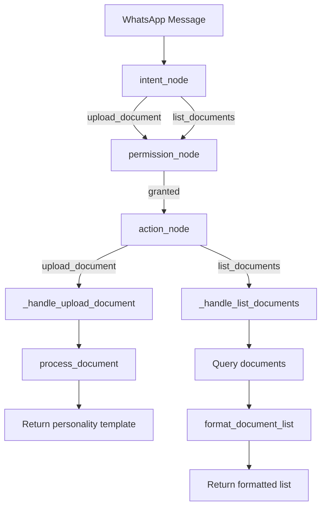

# Design Document: Document Flow

## Overview

This design adds structured document storage, personality-template-based handlers for upload and list operations, and improved intent classification to the Fortress family assistant. The goal is to replace the current LLM-dispatched document handlers with deterministic personality templates (matching the pattern established for tasks), and to enhance `process_document()` with proper metadata extraction and organized file storage.

No OCR or AI enrichment is included — this is purely about reliable storage, metadata, and consistent Hebrew responses.

## Architecture

The document flow integrates into the existing LangGraph workflow engine. No new nodes or graph edges are needed — only the handler functions behind `_handle_upload_document` and `_handle_list_documents` change behavior.



Key change: both handlers stop using `dispatcher.dispatch()` (LLM calls) and instead return deterministic personality templates. This matches how `_handle_list_tasks` and `_handle_greeting` already work.

## Components and Interfaces

### 1. Document Service (`src/services/documents.py`)

Current `process_document()` is minimal — it only saves `file_path`, `uploaded_by`, and `source`. The enhanced version will:

```python
async def process_document(
    db: Session,
    file_path: str,
    uploaded_by: UUID,
    source: str,
) -> Document:
```

New behavior:
- Extract `original_filename` from `file_path` using `os.path.basename()`
- Infer `doc_type` from file extension via `_infer_doc_type(filename)`
- Generate storage path: `{STORAGE_PATH}/{year}/{month}/{uuid}_{original_filename}`
- Create year/month directories with `os.makedirs(exist_ok=True)`
- Copy/move file to storage path
- Save Document record with all metadata populated
- Return the Document object

New helper:

```python
def _infer_doc_type(filename: str) -> str:
```

Extension mapping:
| Extensions | doc_type |
|---|---|
| `.pdf`, `.doc`, `.docx` | `"document"` |
| `.jpg`, `.jpeg`, `.png`, `.heic` | `"image"` |
| `.xls`, `.xlsx` | `"spreadsheet"` |
| everything else | `"other"` |

### 2. Personality Module (`src/prompts/personality.py`)

New templates added to `TEMPLATES` dict:

```python
"document_list_header": "📁 המסמכים שלך:\n",
"document_list_empty": "אין מסמכים שמורים 📂",
```

Note: `document_saved` already exists in TEMPLATES.

New formatting function:

```python
def format_document_list(documents: list) -> str:
```

Follows the same pattern as `format_task_list()`:
- Empty list → return `TEMPLATES["document_list_empty"]`
- Non-empty → header + numbered lines with doc_type emoji and filename

Doc type emoji mapping:

```python
_DOC_TYPE_EMOJI: dict[str, str] = {
    "document": "📄",
    "image": "🖼️",
    "spreadsheet": "📊",
    "other": "📎",
}
```

### 3. Workflow Engine (`src/services/workflow_engine.py`)

Two handler changes:

`_handle_upload_document`: Replace LLM dispatch with personality template.
- On success: return `TEMPLATES["document_saved"].format(filename=original_filename)`
- On failure: return `TEMPLATES["error_fallback"]` and log the exception

`_handle_list_documents`: Replace LLM dispatch with `format_document_list()`.
- Query up to 20 most recent documents for the member
- Pass results to `format_document_list()`
- Return the formatted string directly

### 4. System Prompts (`src/prompts/system_prompts.py`)

Add `list_documents` description to `UNIFIED_CLASSIFY_AND_RESPOND`:
- Add `"list_documents"` to the intent list with Hebrew description: `"המשתמש רוצה לראות מסמכים ששמורים"`

### 5. Intent Detector (`src/services/intent_detector.py`)

Already handles `"מסמכים"` keyword → `list_documents`. Additional Hebrew phrases like `"מה המסמכים שלי?"` and `"תראה מסמכים"` contain the substring `"מסמכים"` and are already matched by the existing `if "מסמכים" in stripped` check. No changes needed.

### 6. Test Updates

- `test_personality.py`: Update `REQUIRED_TEMPLATE_KEYS` to include `"document_list_header"` and `"document_list_empty"`
- New `test_document_flow.py`: Tests for `process_document`, `format_document_list`, and handler behavior

## Data Models

No schema changes needed. The existing `Document` model already has all required fields:

```python
class Document(Base):
    __tablename__ = "documents"
    id: UUID
    uploaded_by: UUID (FK → family_members.id)
    file_path: str
    original_filename: Optional[str]
    doc_type: Optional[str]
    source: str
    created_at: Optional[datetime]
    # ... other fields (vendor, amount, ai_summary, etc.) left as None
```

The `STORAGE_PATH` config already exists in `src/config.py`:

```python
STORAGE_PATH: str = os.getenv("STORAGE_PATH", "/data/documents")
```

## Error Handling

| Scenario | Handling |
|---|---|
| `process_document` file copy fails | Raise exception; caller catches and returns `error_fallback` template |
| `process_document` DB commit fails | Exception propagates; workflow engine catches and returns `error_fallback` |
| `_handle_upload_document` no media file | Return "לא התקבל קובץ. נסה לשלוח שוב." (existing behavior, kept) |
| `_handle_upload_document` process_document fails | Log exception, return `TEMPLATES["error_fallback"]` |
| `_handle_list_documents` DB query fails | Exception propagates to workflow engine top-level catch → `error_fallback` |
| `format_document_list` receives malformed data | Graceful fallback — use `getattr` with defaults (same pattern as `format_task_list`) |

## Testing Strategy

All tests are unit tests. No property-based testing. The user explicitly requested unit tests only.

### Existing Test Updates

`fortress/tests/test_personality.py`:
- Update `REQUIRED_TEMPLATE_KEYS` set to include `"document_list_header"` and `"document_list_empty"`
- The existing `test_templates_has_all_required_keys` test uses exact set comparison, so this update is required to keep all 228 existing tests passing

### New Test File: `fortress/tests/test_document_flow.py`

Tests organized by component:

**process_document tests:**
1. Creates Document record with correct `original_filename` extracted from path
2. Creates Document record with correct `doc_type` inferred from extension
3. Extension mapping: `.pdf` → `"document"`, `.jpg` → `"image"`, `.xlsx` → `"spreadsheet"`, `.zip` → `"other"`
4. Creates year/month storage directories when they don't exist
5. Generated storage path matches `{STORAGE_PATH}/{year}/{month}/{uuid}_{filename}` format

**format_document_list tests:**
6. Empty list returns `TEMPLATES["document_list_empty"]`
7. Multiple documents returns string containing all filenames
8. Correct emoji per doc_type: 📄 document, 🖼️ image, 📊 spreadsheet, 📎 other

**_handle_list_documents tests:**
9. Returns formatted list using personality templates (no LLM dispatch)
10. Returns empty template when no documents exist

**_handle_upload_document tests:**
11. Successful upload returns personality template confirmation with filename
12. Failed upload returns `error_fallback` template

**Intent tests (verify existing coverage):**
13. `"מה המסמכים שלי?"` → `list_documents`
14. `"תראה מסמכים"` → `list_documents`

### Test Constraints

- All new tests must be synchronous or use `@pytest.mark.asyncio`
- Mock DB using `MagicMock(spec=Session)` (existing pattern from conftest)
- Mock filesystem operations (`os.makedirs`, `shutil.copy2`) — no real file I/O in tests
- All 228 existing tests must continue to pass
