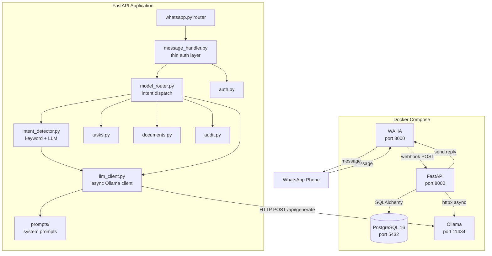
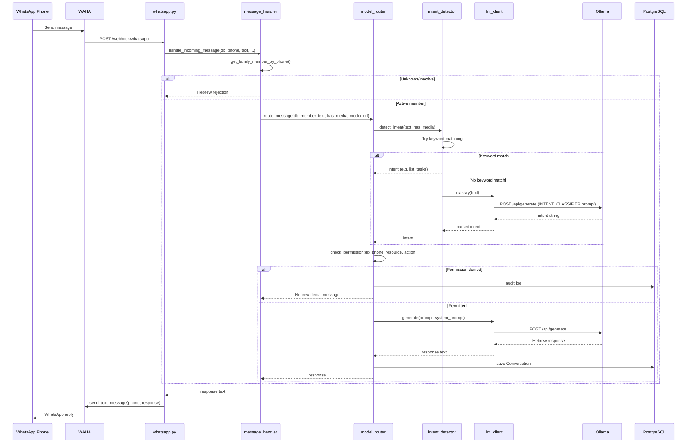

# Design Document: Local AI + Intent Router

## Overview

Phase 4A transforms Fortress from a keyword-matching message handler into an AI-powered intent detection and routing system. The core change is introducing Ollama as a fourth Docker Compose service, adding an intent detector that uses keyword matching with LLM fallback, a model router that dispatches intents to handlers, and a dedicated async LLM client.

The existing `message_handler.py` (currently ~150 lines of keyword matching + handler logic) is refactored into a thin auth/routing layer that delegates to a new `ModelRouter`. The `ModelRouter` uses an `IntentDetector` to classify messages, checks permissions, dispatches to the appropriate handler, and uses an `LLMClient` to generate natural Hebrew responses via Ollama.

All LLM communication is async via `httpx.AsyncClient` with a 30-second timeout. Every failure path returns a Hebrew fallback message — the system never surfaces English errors or raw exceptions to family members.

## Architecture

### Component Diagram



### Data Flow



### File Structure

```
fortress/
├── src/
│   ├── config.py                    # MODIFIED — add OLLAMA_API_URL, OLLAMA_MODEL
│   ├── prompts/
│   │   ├── __init__.py              # NEW — exports all prompt constants
│   │   └── system_prompts.py        # NEW — FORTRESS_BASE, INTENT_CLASSIFIER, TASK_EXTRACTOR, TASK_RESPONDER
│   ├── services/
│   │   ├── intent_detector.py       # NEW — keyword matching + LLM fallback
│   │   ├── llm_client.py            # NEW — async Ollama HTTP client
│   │   ├── model_router.py          # NEW — intent-based routing + permission checks
│   │   └── message_handler.py       # MODIFIED — thin auth layer, delegates to model_router
│   └── routers/
│       └── health.py                # MODIFIED — add ollama status fields
├── scripts/
│   └── setup_ollama.sh              # NEW — pull model after container starts
├── docker-compose.yml               # MODIFIED — add ollama service + volume
├── .env.example                     # MODIFIED — add OLLAMA_API_URL, OLLAMA_MODEL
├── requirements.txt                 # UNCHANGED — httpx already present
└── tests/
    ├── test_intent_detector.py      # NEW
    ├── test_llm_client.py           # NEW
    ├── test_model_router.py         # NEW
    ├── test_message_handler.py      # MODIFIED — update mocks for new delegation pattern
    └── test_health.py               # MODIFIED — add ollama field assertions
```

## Components and Interfaces

### 1. Configuration Changes (`src/config.py`)

Add two new environment variables:

```python
OLLAMA_API_URL: str = os.getenv("OLLAMA_API_URL", "http://localhost:11434")
OLLAMA_MODEL: str = os.getenv("OLLAMA_MODEL", "llama3.1:8b")
```

### 2. System Prompts Module (`src/prompts/`)

**`src/prompts/__init__.py`** — Re-exports all prompt constants from `system_prompts.py`.

**`src/prompts/system_prompts.py`** — Contains four prompt constants:

| Constant | Purpose |
|----------|---------|
| `FORTRESS_BASE` | Base system identity: Hebrew-speaking family assistant for WhatsApp. Sets tone, language, and response length constraints. |
| `INTENT_CLASSIFIER` | Instructs LLM to classify a message into one of the defined intent categories. Returns only the intent name string. |
| `TASK_EXTRACTOR` | Instructs LLM to extract structured task details (title, due_date, category) from a Hebrew natural language message. Returns JSON. |
| `TASK_RESPONDER` | Instructs LLM to format task data as concise WhatsApp-appropriate Hebrew messages. |

All prompts are written in Hebrew with English intent names for machine parsing. Prompts instruct the model to keep responses short (WhatsApp-appropriate) and always respond in Hebrew.

### 3. LLM Client (`src/services/llm_client.py`)

```python
class OllamaClient:
    """Async client for Ollama REST API communication."""

    def __init__(self, base_url: str = None, model: str = None):
        """Initialize with config defaults if not provided."""

    async def generate(self, prompt: str, system_prompt: str = "") -> str:
        """Send a generation request to POST /api/generate.
        
        Returns the generated text, or a Hebrew fallback on any error.
        Uses httpx.AsyncClient with 30s timeout.
        Sets stream=False for simple request/response.
        """

    async def is_available(self) -> tuple[bool, str | None]:
        """Check if Ollama is reachable and the configured model is loaded.
        
        Queries GET /api/tags, checks if model name appears in the list.
        Returns (True, model_name) or (False, None).
        """
```

Key design decisions:
- Creates a new `httpx.AsyncClient` per request (no connection pooling needed for local Ollama)
- `stream=False` in the generate payload — we want the full response, not streaming tokens
- Hebrew fallback message: `"מצטער, לא הצלחתי לעבד את הבקשה. נסה שוב."` on any error
- Logs all errors with full context (timeout duration, connection target, etc.)

### 4. Intent Detector (`src/services/intent_detector.py`)

```python
INTENTS: dict[str, str] = {
    "list_tasks": "local",
    "create_task": "local",
    "complete_task": "local",
    "greeting": "local",
    "upload_document": "local",
    "list_documents": "local",
    "ask_question": "local",
    "unknown": "local",
}

async def detect_intent(text: str, has_media: bool, llm_client: OllamaClient) -> str:
    """Classify a message into an intent category.
    
    1. If has_media → "upload_document"
    2. Try keyword matching (Hebrew + English)
    3. If no match → LLM fallback via llm_client
    4. If LLM fails → "unknown"
    
    Returns an intent string from INTENTS keys.
    """
```

Keyword matching rules (checked in order):
1. `has_media` → `upload_document`
2. `משימות` or `tasks` → `list_tasks`
3. Starts with `משימה חדשה:` or `new task:` → `create_task`
4. Contains `סיום משימה`, `done`, or `בוצע` → `complete_task`
5. Contains `שלום`, `היי`, `hello`, or `בוקר טוב` → `greeting`
6. Contains `מסמכים` or `documents` → `list_documents`
7. No match → LLM classification with `INTENT_CLASSIFIER` prompt
8. LLM failure → `unknown`

The keyword matching is extracted from the current `_handle_text` function in `message_handler.py`, preserving exact existing behavior for backward compatibility.

### 5. Model Router (`src/services/model_router.py`)

```python
async def route_message(
    db: Session,
    member: FamilyMember,
    phone: str,
    message_text: str,
    has_media: bool = False,
    media_file_path: str | None = None,
) -> str:
    """Route a message through intent detection → permission check → handler → save conversation.
    
    Returns the response string (always in Hebrew).
    """
```

Intent handler dispatch table:

| Intent | Permission Check | Handler Logic |
|--------|-----------------|---------------|
| `list_tasks` | `tasks` / `read` | Fetch open tasks, format via LLM with `TASK_RESPONDER` prompt |
| `create_task` | `tasks` / `write` | Extract details via LLM with `TASK_EXTRACTOR`, call `create_task()` |
| `complete_task` | `tasks` / `write` | Identify task, call `complete_task()`, return Hebrew confirmation |
| `greeting` | None | Generate personalized Hebrew greeting via LLM |
| `upload_document` | `documents` / `write` | Delegate to existing `process_document()` flow |
| `list_documents` | `documents` / `read` | Query recent documents, return Hebrew summary |
| `ask_question` | None | Generate Hebrew response via LLM with available context |
| `unknown` | None | Return Hebrew "didn't understand" message with command suggestions |

Every call saves a `Conversation` record with the detected intent. Permission denials are audit-logged and return a Hebrew `🔒` message.

### 6. Message Handler Refactoring (`src/services/message_handler.py`)

The refactored message handler becomes a thin layer:

```python
async def handle_incoming_message(
    db: Session,
    phone: str,
    message_text: str,
    message_id: str,
    *,
    has_media: bool = False,
    media_file_path: str | None = None,
) -> str:
    """Authenticate sender and delegate to model router.
    
    1. Look up family member by phone
    2. If unknown → Hebrew rejection + save conversation
    3. If inactive → Hebrew inactive message + save conversation
    4. If active → delegate to route_message()
    """
```

The function signature remains identical to the current implementation, ensuring the WhatsApp router (`whatsapp.py`) requires zero changes. All keyword matching, intent detection, and handler logic moves to `intent_detector.py` and `model_router.py`.

### 7. Health Endpoint Update (`src/routers/health.py`)

Add two new fields to the health response:

```python
{
    "status": "ok",
    "service": "fortress",
    "version": "2.0.0",
    "database": "connected" | "disconnected",
    "ollama": "connected" | "disconnected",       # NEW
    "ollama_model": "llama3.1:8b" | "not loaded"  # NEW
}
```

The health endpoint instantiates an `OllamaClient` and calls `is_available()` to check connectivity and model status.

### 8. Docker Compose Changes

Add to `docker-compose.yml`:

```yaml
  ollama:
    image: ollama/ollama:latest
    container_name: fortress-ollama
    restart: unless-stopped
    ports:
      - "11434:11434"
    volumes:
      - ollama_data:/root/.ollama
    deploy:
      resources:
        reservations:
          memory: 6G
```

Add `OLLAMA_API_URL: http://ollama:11434` to the fortress service environment.

Add `ollama_data` to the volumes section.

The fortress service does NOT `depends_on` ollama — the app handles Ollama unavailability gracefully with fallback messages.

### 9. Setup Script (`scripts/setup_ollama.sh`)

```bash
#!/usr/bin/env bash
# Wait for Ollama to be ready, then pull the required model.

OLLAMA_URL="${OLLAMA_API_URL:-http://localhost:11434}"
MODEL="${OLLAMA_MODEL:-llama3.1:8b}"
MAX_RETRIES=30
RETRY_INTERVAL=2

# Poll /api/tags until Ollama responds
# Pull model via POST /api/pull
# Verify model in /api/tags response
# Exit 0 on success, 1 on failure with stderr message
```

## Data Models

No new database tables are required. The existing `conversations` table already has an `intent` column that will now store the detected intent string (e.g., `list_tasks`, `greeting`, `ask_question`) instead of the current generic values (`text_message`, `media_received`).

Existing models used:
- `Conversation` — stores every message exchange with the detected intent
- `FamilyMember` — phone-based identity lookup
- `Permission` — role-based access control checks
- `Task` — task CRUD operations
- `Document` — document storage
- `AuditLog` — permission denial logging

The `OllamaClient` communicates with Ollama's REST API using these request/response shapes:

**Generate Request** (`POST /api/generate`):
```json
{
    "model": "llama3.1:8b",
    "prompt": "user message",
    "system": "system prompt",
    "stream": false
}
```

**Generate Response**:
```json
{
    "response": "generated text",
    "done": true
}
```

**Tags Response** (`GET /api/tags`):
```json
{
    "models": [
        {"name": "llama3.1:8b", "...": "..."}
    ]
}
```

## Correctness Properties

*A property is a characteristic or behavior that should hold true across all valid executions of a system — essentially, a formal statement about what the system should do. Properties serve as the bridge between human-readable specifications and machine-verifiable correctness guarantees.*

### Property 1: Keyword-based intent classification is deterministic

*For any* keyword-intent mapping defined in the intent detector (e.g., `משימות` → `list_tasks`, `משימה חדשה:` prefix → `create_task`, `סיום משימה` → `complete_task`, `שלום` → `greeting`, `מסמכים` → `list_documents`) and *for any* message string containing that keyword (with arbitrary surrounding text), `detect_intent` shall return the mapped intent, regardless of the rest of the message content.

**Validates: Requirements 4.2, 4.3, 4.4, 4.5, 4.6**

### Property 2: Media messages always classify as upload_document

*For any* message (including empty strings and arbitrary text), when `has_media` is `True`, `detect_intent` shall return `upload_document`, regardless of message content or any keywords present in the text.

**Validates: Requirements 4.7**

### Property 3: Model availability reflects model list membership

*For any* list of model objects returned by the Ollama `/api/tags` endpoint, `is_available` shall return `True` if and only if the configured model name appears in the list. For any list that does not contain the configured model name, `is_available` shall return `False`.

**Validates: Requirements 5.3**

### Property 4: Permission denial produces audit log and Hebrew denial message

*For any* intent that requires a permission check (list_tasks, create_task, complete_task, upload_document, list_documents) and *for any* family member whose role lacks the required permission, the model router shall return a response containing `🔒` and shall call the audit service with `action="permission_denied"`.

**Validates: Requirements 6.11**

### Property 5: Every routed message produces a conversation record

*For any* active family member and *for any* message (text or media, any intent), after `route_message` completes, a `Conversation` record shall be saved to the database containing the detected intent string, the incoming message text, and the outgoing response text.

**Validates: Requirements 6.12**

## Error Handling

### Strategy

All error handling follows a single principle: **never surface raw errors to family members**. Every failure path returns a Hebrew message.

### Error Categories

| Error | Source | Handling | User-Facing Message |
|-------|--------|----------|-------------------|
| Ollama timeout (30s) | `llm_client.generate()` | Catch `httpx.TimeoutException`, log with context | `מצטער, לא הצלחתי לעבד את הבקשה. נסה שוב.` |
| Ollama connection refused | `llm_client.generate()` | Catch `httpx.ConnectError`, log | `מצטער, לא הצלחתי לעבד את הבקשה. נסה שוב.` |
| Ollama unexpected HTTP status | `llm_client.generate()` | Catch `httpx.HTTPStatusError`, log | `מצטער, לא הצלחתי לעבד את הבקשה. נסה שוב.` |
| LLM returns unparseable intent | `intent_detector` | Default to `unknown` intent | Hebrew "didn't understand" + command suggestions |
| LLM returns unparseable task JSON | `model_router` (create_task) | Catch JSON parse error, log | `לא הצלחתי להבין את פרטי המשימה. נסה לכתוב: משימה חדשה: [שם המשימה]` |
| Permission denied | `model_router` | Audit log + return denial | `אין לך הרשאה ל[action] [resource] 🔒` |
| Unknown phone | `message_handler` | Save conversation with `None` member_id | `מספר לא מזוהה. פנה למנהל המשפחה.` |
| Inactive member | `message_handler` | Save conversation | `החשבון שלך לא פעיל.` |
| Database error during conversation save | `model_router` | Catch, log, don't fail the response | Response still returned to user |

### Fallback Chain

```
LLM generate → timeout/error → Hebrew fallback message
Intent classify via LLM → fail → "unknown" intent → Hebrew help message
Task extraction via LLM → fail → Hebrew "use format" message
```

The system degrades gracefully: if Ollama is completely down, keyword-matched intents still work (list_tasks, create_task, etc. via keywords), but LLM-enhanced responses fall back to simpler Hebrew messages. Only the LLM fallback classification path is affected.

## Testing Strategy

### Approach

The test suite uses a dual approach: unit tests for specific examples and edge cases, property-based tests for universal correctness guarantees.

### Property-Based Testing

- Library: `hypothesis` (already in `requirements.txt` at version 6.112.0)
- Minimum 100 examples per property test (Hypothesis default is 100)
- Each property test is tagged with a comment referencing the design property

Tag format: `# Feature: local-ai-intent-router, Property {N}: {title}`

Each correctness property maps to exactly one property-based test:

| Property | Test File | What It Generates |
|----------|-----------|-------------------|
| Property 1: Keyword intent classification | `test_intent_detector.py` | Random messages containing each keyword, with random surrounding text |
| Property 2: Media intent classification | `test_intent_detector.py` | Random message strings with `has_media=True` |
| Property 3: Model availability | `test_llm_client.py` | Random lists of model name dicts, with/without the target model |
| Property 4: Permission denial | `test_model_router.py` | Random intents requiring permissions × members lacking those permissions |
| Property 5: Conversation record saved | `test_model_router.py` | Random intents × random message texts × random active members |

### Unit Tests (Examples and Edge Cases)

| Test File | Coverage |
|-----------|----------|
| `test_intent_detector.py` | LLM fallback invocation when no keyword matches, LLM failure returns `unknown`, INTENTS dict structure |
| `test_llm_client.py` | Correct HTTP payload to `/api/generate`, timeout returns Hebrew fallback, connection error returns Hebrew fallback, `is_available` with empty model list |
| `test_model_router.py` | Each intent routes to correct handler, greeting includes member name, unknown intent returns help text, conversation saved with correct intent |
| `test_message_handler.py` | Existing tests updated to mock `route_message` instead of individual handlers. Unknown phone, inactive member, active member delegates to router |
| `test_health.py` | Existing tests + new assertions for `ollama` and `ollama_model` fields |

### Mocking Strategy

All tests mock the Ollama HTTP layer — no real Ollama instance is needed:

- `llm_client.py` tests: mock `httpx.AsyncClient` to control HTTP responses, timeouts, and connection errors
- `intent_detector.py` tests: mock `OllamaClient.generate` to control LLM classification responses
- `model_router.py` tests: mock both `detect_intent` (to control intent) and `OllamaClient.generate` (to control LLM responses)
- `message_handler.py` tests: mock `route_message` to verify delegation without testing router internals
- `health.py` tests: mock `OllamaClient.is_available` to control connected/disconnected states

### Backward Compatibility

The existing 52 tests must continue passing. The key risk is `test_message_handler.py` which currently mocks internal functions like `list_tasks`, `create_task`, `check_permission`. After refactoring, these tests will mock `route_message` instead, but the assertions (Hebrew response content, permission denial markers) remain the same. The test modifications change mock targets, not behavioral expectations.
