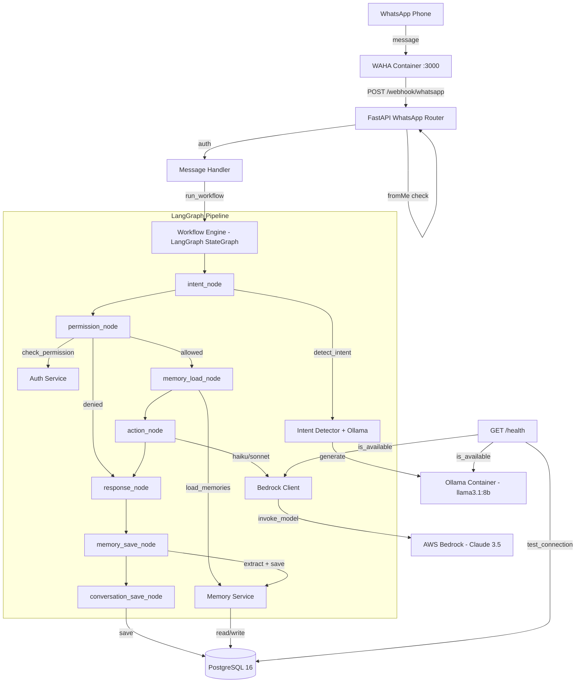
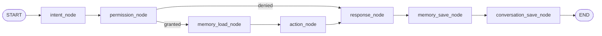

# Design Document: Phase 4B — Bedrock + LangGraph + Memory

## Overview

Phase 4B transforms Fortress from a single-LLM architecture (Ollama-only) into a hybrid AI system. AWS Bedrock (Claude 3.5 Haiku/Sonnet) handles all Hebrew text generation, while the local Ollama model is demoted to English-only intent classification. A LangGraph StateGraph replaces the existing `model_router.py` with a structured, node-based workflow pipeline. A three-tier memory system (short/medium/long/permanent) gives the AI conversational context across sessions.

Key changes:
- New `BedrockClient` service wrapping boto3 `bedrock-runtime` for Claude model invocation
- New `MemoryService` with exclusion-based filtering and tiered expiration
- New `WorkflowEngine` using LangGraph `StateGraph` replacing `model_router.route_message`
- Echo prevention fix: use WAHA `fromMe` field instead of phone comparison
- New `SYSTEM_PHONE` config variable distinct from `ADMIN_PHONE`
- Two new database tables: `memories` and `memory_exclusions`

## Architecture

### High-Level System Diagram



### Container Architecture

The Docker Compose setup remains four containers with one addition to the fortress service configuration:

| Container | Role | Change in 4B |
|-----------|------|-------------|
| `fortress-app` | FastAPI application | + AWS credentials mount, + SYSTEM_PHONE env |
| `fortress-db` | PostgreSQL 16 | + memories, memory_exclusions tables |
| `fortress-ollama` | Ollama llama3.1:8b | No change (demoted to intent-only) |
| `fortress-waha` | WhatsApp Web bridge | No change |

### LangGraph Workflow State

The workflow uses a `TypedDict` state object passed through all nodes:

```python
class WorkflowState(TypedDict):
    db: Session
    member: FamilyMember
    phone: str
    message_text: str
    has_media: bool
    media_file_path: str | None
    intent: str
    permission_granted: bool
    memories: list[Memory]
    response: str
    error: str | None
```

### Node Flow with Conditional Edges



The `permission_node` uses a conditional edge: if permission is denied, it skips `memory_load_node` and `action_node`, jumping directly to `response_node` with the denial message already set.

## Components and Interfaces

### 1. BedrockClient (`src/services/bedrock_client.py`)

Replaces Ollama for all Hebrew text generation. Mirrors the `OllamaClient` interface.

```python
class BedrockClient:
    def __init__(
        self,
        region: str | None = None,
        profile: str | None = None,
    ) -> None: ...

    async def generate(
        self,
        prompt: str,
        system_prompt: str = "",
        model: str = "haiku",  # "haiku" or "sonnet"
    ) -> str: ...

    async def is_available(self) -> tuple[bool, str | None]: ...
```

Implementation details:
- Uses `boto3.Session(profile_name=profile).client("bedrock-runtime", region_name=region)`
- Calls `invoke_model` with the Anthropic Messages API format
- Model mapping: `"haiku"` → `BEDROCK_HAIKU_MODEL`, `"sonnet"` → `BEDROCK_SONNET_MODEL`
- 30-second timeout via `botocore.config.Config(read_timeout=30)`
- Returns `HEBREW_FALLBACK` on any exception (timeout, credentials, throttling)
- `is_available()` attempts a minimal `invoke_model` call or `list_foundation_models` to verify connectivity

### 2. MemoryService (`src/services/memory_service.py`)

Manages the memory lifecycle: extraction, exclusion checking, persistence, loading, and cleanup.

```python
async def save_memory(
    db: Session,
    family_member_id: UUID,
    content: str,
    category: str,
    memory_type: str,
    source: str = "conversation",
    confidence: float = 1.0,
    metadata: dict | None = None,
) -> Memory | None: ...

def load_memories(
    db: Session,
    family_member_id: UUID,
    limit: int = 20,
) -> list[Memory]: ...

def cleanup_expired(db: Session) -> int: ...

async def extract_memories_from_message(
    db: Session,
    family_member_id: UUID,
    message_in: str,
    message_out: str,
    bedrock: BedrockClient,
) -> list[Memory]: ...

def check_exclusion(
    db: Session,
    content: str,
    family_member_id: UUID | None = None,
) -> bool: ...
```

Expiration logic:
- `short` → `now() + 7 days`
- `medium` → `now() + 90 days`
- `long` → `now() + 365 days`
- `permanent` → `None` (never expires)

Exclusion checking:
- `keyword` type: case-insensitive substring match (`pattern.lower() in content.lower()`)
- `regex` type: `re.search(pattern, content)` match
- `category` type: not used for content matching (reserved for manual tagging)
- Global exclusions (`family_member_id IS NULL`) apply to all members
- Member-specific exclusions apply only to that member

`load_memories` updates `last_accessed_at` to `now()` and increments `access_count` for each returned memory, enabling relevance-based ranking.

### 3. WorkflowEngine (`src/services/workflow_engine.py`)

LangGraph StateGraph replacing `model_router.py`.

```python
async def run_workflow(
    db: Session,
    member: FamilyMember,
    phone: str,
    message_text: str,
    has_media: bool = False,
    media_file_path: str | None = None,
) -> str: ...
```

Node implementations:

| Node | Responsibility | LLM Used |
|------|---------------|----------|
| `intent_node` | Calls `detect_intent` with `OllamaClient` | Ollama (local) |
| `permission_node` | Calls `check_permission` from auth service | None |
| `memory_load_node` | Calls `load_memories` from MemoryService | None |
| `action_node` | Dispatches to handler, generates response | Bedrock (haiku/sonnet) |
| `response_node` | Passes through or sets denial message | None |
| `memory_save_node` | Calls `extract_memories_from_message` | Bedrock (haiku) |
| `conversation_save_node` | Saves Conversation record to DB | None |

Model selection in `action_node`:
- `ask_question` intent → Bedrock Sonnet (complex reasoning)
- All other intents → Bedrock Haiku (fast, cost-effective)

Error handling: any node exception is caught at the `run_workflow` level, logged, and the Hebrew fallback message is returned.

### 4. Updated Message Handler (`src/services/message_handler.py`)

Minimal change: replace `from src.services.model_router import route_message` with `from src.services.workflow_engine import run_workflow`, and call `run_workflow` instead of `route_message`.

### 5. Updated WhatsApp Router (`src/routers/whatsapp.py`)

Echo prevention fix:
- Remove: `if phone == ADMIN_PHONE: return {"status": "ignored", "reason": "echo"}`
- Add: `if payload.get("fromMe", False): return {"status": "ignored", "reason": "echo"}`

### 6. Updated Config (`src/config.py`)

New variables:
```python
AWS_REGION: str = os.getenv("AWS_REGION", "us-east-1")
AWS_PROFILE: str = os.getenv("AWS_PROFILE", "fortress")
BEDROCK_HAIKU_MODEL: str = os.getenv("BEDROCK_HAIKU_MODEL", "anthropic.claude-3-5-haiku-20241022-v1:0")
BEDROCK_SONNET_MODEL: str = os.getenv("BEDROCK_SONNET_MODEL", "anthropic.claude-3-5-sonnet-20241022-v2:0")
SYSTEM_PHONE: str = os.getenv("SYSTEM_PHONE", "")
```

### 7. Updated System Prompts (`src/prompts/system_prompts.py`)

Two new prompts added (existing prompts unchanged):

- `MEMORY_EXTRACTOR`: Instructs Claude to extract facts from a conversation exchange and return a JSON array of `{content, memory_type, category, confidence}` objects
- `TASK_EXTRACTOR_BEDROCK`: Hebrew-aware task extraction prompt returning `{title, due_date, category, priority}` JSON

### 8. Updated Health Endpoint (`src/routers/health.py`)

Adds `"bedrock"` and `"bedrock_model"` fields to the health response by calling `BedrockClient.is_available()`.

## Data Models

### Memory Table

```sql
CREATE TABLE memories (
    id UUID PRIMARY KEY DEFAULT gen_random_uuid(),
    family_member_id UUID NOT NULL REFERENCES family_members(id),
    content TEXT NOT NULL,
    category TEXT NOT NULL CHECK (category IN ('preference', 'goal', 'fact', 'habit', 'context')),
    memory_type TEXT NOT NULL CHECK (memory_type IN ('short', 'medium', 'long', 'permanent')),
    expires_at TIMESTAMPTZ,
    source TEXT CHECK (source IN ('conversation', 'document', 'manual', 'system')),
    confidence NUMERIC DEFAULT 1.0,
    last_accessed_at TIMESTAMPTZ,
    access_count INT DEFAULT 0,
    is_active BOOLEAN DEFAULT true,
    metadata JSONB DEFAULT '{}',
    created_at TIMESTAMPTZ DEFAULT now()
);
```

### Memory Exclusions Table

```sql
CREATE TABLE memory_exclusions (
    id UUID PRIMARY KEY DEFAULT gen_random_uuid(),
    pattern TEXT NOT NULL,
    description TEXT,
    exclusion_type TEXT NOT NULL CHECK (exclusion_type IN ('keyword', 'category', 'regex')),
    family_member_id UUID REFERENCES family_members(id),
    is_active BOOLEAN DEFAULT true,
    created_at TIMESTAMPTZ DEFAULT now()
);
```

### SQLAlchemy ORM Models

Added to `src/models/schema.py`:

```python
class Memory(Base):
    __tablename__ = "memories"

    id: Mapped[uuid.UUID] = mapped_column(UUID(as_uuid=True), primary_key=True, server_default=text("gen_random_uuid()"))
    family_member_id: Mapped[uuid.UUID] = mapped_column(UUID(as_uuid=True), ForeignKey("family_members.id"), nullable=False)
    content: Mapped[str] = mapped_column(Text, nullable=False)
    category: Mapped[str] = mapped_column(Text, nullable=False)
    memory_type: Mapped[str] = mapped_column(Text, nullable=False)
    expires_at: Mapped[Optional[datetime]] = mapped_column(DateTime(timezone=True), nullable=True)
    source: Mapped[Optional[str]] = mapped_column(Text, nullable=True)
    confidence: Mapped[Decimal] = mapped_column(Numeric, server_default=text("1.0"))
    last_accessed_at: Mapped[Optional[datetime]] = mapped_column(DateTime(timezone=True), nullable=True)
    access_count: Mapped[int] = mapped_column(Integer, server_default=text("0"))
    is_active: Mapped[bool] = mapped_column(Boolean, server_default=text("true"))
    memory_metadata: Mapped[Optional[dict]] = mapped_column("metadata", JSONB, server_default=text("'{}'"))
    created_at: Mapped[Optional[datetime]] = mapped_column(DateTime(timezone=True), server_default=text("now()"))

    family_member: Mapped["FamilyMember"] = relationship(back_populates="memories")


class MemoryExclusion(Base):
    __tablename__ = "memory_exclusions"

    id: Mapped[uuid.UUID] = mapped_column(UUID(as_uuid=True), primary_key=True, server_default=text("gen_random_uuid()"))
    pattern: Mapped[str] = mapped_column(Text, nullable=False)
    description: Mapped[Optional[str]] = mapped_column(Text, nullable=True)
    exclusion_type: Mapped[str] = mapped_column(Text, nullable=False)
    family_member_id: Mapped[Optional[uuid.UUID]] = mapped_column(UUID(as_uuid=True), ForeignKey("family_members.id"), nullable=True)
    is_active: Mapped[bool] = mapped_column(Boolean, server_default=text("true"))
    created_at: Mapped[Optional[datetime]] = mapped_column(DateTime(timezone=True), server_default=text("now()"))

    family_member: Mapped[Optional["FamilyMember"]] = relationship()
```

FamilyMember gets a new reverse relationship:
```python
memories: Mapped[list["Memory"]] = relationship(back_populates="family_member")
```

### Default Exclusion Patterns

Seeded via migration:

| Pattern | Description | Exclusion Type |
|---------|-------------|----------------|
| `credit card` | Credit card numbers | keyword |
| `כרטיס אשראי` | Credit card (Hebrew) | keyword |
| `password` | Passwords | keyword |
| `סיסמה` | Password (Hebrew) | keyword |
| `PIN` | PIN codes | keyword |
| `קוד סודי` | Secret code (Hebrew) | keyword |
| `תעודת זהות` | ID number (Hebrew) | keyword |
| `access code` | Access codes | keyword |
| `credentials` | Credentials | keyword |
| `secret` | Secrets | keyword |
| `\b\d{4}[\s-]?\d{4}[\s-]?\d{4}[\s-]?\d{4}\b` | Credit card number pattern | regex |
| `\b\d{9}\b` | Israeli ID number pattern | regex |

### Indexes

```sql
CREATE INDEX idx_memories_member ON memories(family_member_id);
CREATE INDEX idx_memories_type ON memories(memory_type);
CREATE INDEX idx_memories_category ON memories(category);
CREATE INDEX idx_memories_expires ON memories(expires_at);
CREATE INDEX idx_memories_active ON memories(is_active);
CREATE INDEX idx_exclusions_active ON memory_exclusions(is_active);
CREATE INDEX idx_exclusions_type ON memory_exclusions(exclusion_type);
```

### Migration File

New file: `fortress/migrations/004_memories.sql`


## Correctness Properties

*A property is a characteristic or behavior that should hold true across all valid executions of a system — essentially, a formal statement about what the system should do. Properties serve as the bridge between human-readable specifications and machine-verifiable correctness guarantees.*

### Property 1: Bedrock error fallback

*For any* exception type raised during a Bedrock `invoke_model` call (timeout, credentials error, throttling, network error, or any other exception), the `BedrockClient.generate` method should return the Hebrew fallback message `"מצטער, לא הצלחתי לעבד את הבקשה. נסה שוב."` and never propagate the exception.

**Validates: Requirements 1.6**

### Property 2: Memory save with correct expiration

*For any* valid memory content string that does not match any active exclusion pattern, and *for any* valid memory_type in `{short, medium, long, permanent}`, calling `save_memory` should return a `Memory` object whose `expires_at` is: `now() + 7 days` for "short", `now() + 90 days` for "medium", `now() + 365 days` for "long", and `None` for "permanent".

**Validates: Requirements 6.1, 6.6**

### Property 3: Exclusion matching rejects content

*For any* memory content string and *for any* active exclusion pattern, if the exclusion_type is "keyword" and the pattern appears as a case-insensitive substring of the content, OR if the exclusion_type is "regex" and `re.search(pattern, content)` matches, then `save_memory` should return `None` and no Memory record should be created.

**Validates: Requirements 6.2, 6.9**

### Property 4: Load memories filtering, ordering, and access tracking

*For any* family member with a set of Memory records (some active, some inactive, some expired, some not), `load_memories` should return only memories where `is_active=True` AND (`expires_at IS NULL` OR `expires_at > now()`), ordered by `last_accessed_at DESC` then `created_at DESC`. Additionally, each returned memory should have its `last_accessed_at` updated to the current timestamp and `access_count` incremented by 1.

**Validates: Requirements 6.3, 6.8**

### Property 5: Cleanup expired removes past-due memories

*For any* set of Memory records in the database, after calling `cleanup_expired`, no Memory record with `expires_at` in the past should remain. All memories with `expires_at IS NULL` or `expires_at` in the future should be unaffected.

**Validates: Requirements 6.4**

### Property 6: CHECK constraints reject invalid values

*For any* string value not in `{short, medium, long, permanent}`, attempting to insert a Memory record with that `memory_type` should fail. *For any* string value not in `{preference, goal, fact, habit, context}`, attempting to insert a Memory record with that `category` should fail.

**Validates: Requirements 4.5, 4.6**

### Property 7: Permission denial returns Hebrew lock message

*For any* family member and *for any* intent that requires permission (list_tasks, create_task, complete_task, upload_document, list_documents), if `check_permission` returns `False`, the workflow should return a response containing "🔒" and should not execute the action handler.

**Validates: Requirements 7.3**

### Property 8: Intent-to-model dispatch

*For any* intent in the set of simple intents `{greeting, list_tasks, create_task, complete_task, upload_document, list_documents, unknown}`, the `action_node` should invoke `BedrockClient.generate` with `model="haiku"`. *For* the `ask_question` intent, the `action_node` should invoke `BedrockClient.generate` with `model="sonnet"`.

**Validates: Requirements 7.5, 7.6, 7.7**

### Property 9: Workflow exception fallback

*For any* exception raised in any node of the LangGraph workflow (intent_node, permission_node, memory_load_node, action_node, response_node, memory_save_node, conversation_save_node), the `run_workflow` function should catch the exception, log it, and return the Hebrew fallback message without propagating the error.

**Validates: Requirements 7.11**

### Property 10: Conversation saved with detected intent

*For any* successfully completed workflow execution, a `Conversation` record should be saved to the database with the `intent` field matching the intent detected by `intent_node`, and with `message_in` and `message_out` matching the input message and generated response.

**Validates: Requirements 7.9**

### Property 11: Message handler auth preservation

*For any* phone number not found in the `family_members` table, `handle_incoming_message` should return a message containing "מספר לא מזוהה". *For any* inactive family member, it should return a message containing "לא פעיל". In neither case should `run_workflow` be called.

**Validates: Requirements 8.2**

### Property 12: Non-echo messages are processed

*For any* WAHA webhook payload where `fromMe` is `false` or absent, and the event type is "message", the webhook handler should proceed to call `handle_incoming_message` and return status "processed".

**Validates: Requirements 3.3**

## Error Handling

### BedrockClient Errors

| Error Type | Handling |
|-----------|----------|
| `botocore.exceptions.ClientError` | Log error, return `HEBREW_FALLBACK` |
| `botocore.exceptions.ReadTimeoutError` | Log timeout, return `HEBREW_FALLBACK` |
| `botocore.exceptions.NoCredentialsError` | Log missing credentials, return `HEBREW_FALLBACK` |
| `botocore.exceptions.EndpointConnectionError` | Log connection failure, return `HEBREW_FALLBACK` |
| Any other exception | Log with `logger.exception`, return `HEBREW_FALLBACK` |

The `BedrockClient` follows the same pattern as the existing `OllamaClient`: never raise, always return a usable string.

### MemoryService Errors

| Error Type | Handling |
|-----------|----------|
| Exclusion match | Return `None` from `save_memory` (not an error, expected behavior) |
| Invalid `re.compile` pattern | Log warning, skip that exclusion rule, continue checking others |
| Database error on save | Log error, return `None` |
| Database error on load | Log error, return empty list |
| LLM extraction returns invalid JSON | Log warning, return empty list (no memories extracted) |

### WorkflowEngine Errors

The `run_workflow` function wraps the entire LangGraph execution in a try/except:

```python
async def run_workflow(...) -> str:
    try:
        result = await graph.ainvoke(initial_state)
        return result["response"]
    except Exception:
        logger.exception("Workflow failed")
        return HEBREW_FALLBACK
```

Individual node errors are caught at the workflow level. This ensures the user always gets a response, even if the memory system or Bedrock is down.

### Graceful Degradation

- If Bedrock is down: workflow catches the error, returns Hebrew fallback
- If Ollama is down: intent detection falls back to keyword matching only (existing behavior)
- If memory service fails: workflow continues without memory context (memories list is empty)
- If conversation save fails: response is still returned to the user (save failure is logged but not propagated)

## Testing Strategy

### Dual Testing Approach

This feature uses both unit tests and property-based tests:

- **Unit tests** (pytest): Verify specific examples, edge cases, integration points, and error conditions. Focus on mocked AWS calls, specific intent routing, and configuration checks.
- **Property-based tests** (Hypothesis, already in requirements.txt): Verify universal properties across randomly generated inputs. Focus on memory service correctness, exclusion matching, expiration logic, and workflow invariants.

### Property-Based Testing Configuration

- Library: **Hypothesis** (version 6.112.0, already a dependency)
- Minimum iterations: **100 per property** (via `@settings(max_examples=100)`)
- Each property test references its design document property via a comment tag
- Tag format: `# Feature: phase4b-bedrock-langgraph-memory, Property {N}: {title}`
- Each correctness property is implemented by a single `@given` test function

### Unit Test Plan

| Test File | Coverage |
|-----------|----------|
| `test_bedrock_client.py` | generate success/timeout/error, is_available, model selector mapping |
| `test_memory_service.py` | save_memory, load_memories, cleanup_expired, extract_memories, check_exclusion |
| `test_workflow_engine.py` | run_workflow for greeting/list_tasks/create_task/permission_denied/error flows |
| `test_message_handler.py` | Updated: delegates to run_workflow instead of route_message |
| `test_health.py` | Updated: includes bedrock status field |
| `test_config.py` | New AWS config variables exist with correct defaults |

### Property Test Plan

| Property | Test Strategy |
|----------|--------------|
| P1: Bedrock error fallback | Generate random exception types, verify fallback returned |
| P2: Memory save with expiration | Generate random memory_type values, verify expires_at offset |
| P3: Exclusion matching | Generate random content + patterns, verify rejection |
| P4: Load memories filtering | Generate random memory sets with mixed active/expired states, verify filtering and ordering |
| P5: Cleanup expired | Generate random memory sets with various expires_at, verify cleanup |
| P6: CHECK constraints | Generate random invalid strings, verify rejection |
| P7: Permission denial | Generate random member/intent combos with denied permission, verify 🔒 response |
| P8: Intent-to-model dispatch | Generate random intents, verify correct model selection |
| P9: Workflow exception fallback | Generate random exceptions in random nodes, verify fallback |
| P10: Conversation saved | Generate random workflow inputs, verify conversation record |
| P11: Auth preservation | Generate random unknown phones and inactive members, verify rejection |
| P12: Non-echo messages | Generate random payloads with fromMe=false/absent, verify processing |

### Mocking Strategy

All tests mock external dependencies:
- **boto3**: `unittest.mock.patch` on `boto3.Session` and the bedrock-runtime client
- **Ollama**: Existing mock pattern (`AsyncMock` on `OllamaClient.generate`)
- **Database**: `MagicMock(spec=Session)` as in existing tests
- **LangGraph**: Test individual nodes in isolation, and the full graph with all dependencies mocked

### Backward Compatibility

The existing 89 tests must continue to pass. The only expected change is in tests that import from `model_router` — specifically `test_model_router.py` tests will need the import path updated if `model_router.py` is kept as a thin wrapper, or the tests will be migrated to test `workflow_engine.py` directly. The `test_message_handler.py` tests will need the mock target updated from `route_message` to `run_workflow`.
