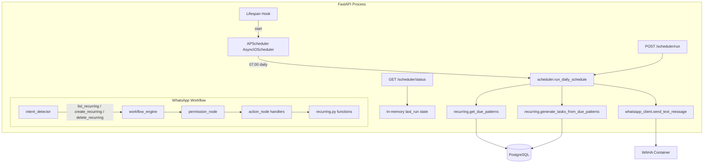

# Design Document: Recurring Scheduler

## Overview

This feature adds an automated daily scheduler to Fortress that generates tasks from due recurring patterns, sends WhatsApp notifications to assigned family members, and provides WhatsApp-based management commands (create, list, delete) for recurring patterns. The scheduler runs daily at 07:00 via APScheduler embedded in the FastAPI process.

The design builds on the existing `recurring.py` service (`get_due_patterns()`, `generate_tasks_from_due_patterns()`) and integrates into the established LangGraph workflow engine, intent detection, and personality template patterns.

### Key Design Decisions

1. **APScheduler embedded in FastAPI** — avoids adding a separate cron container; the `AsyncIOScheduler` runs inside the existing `fortress-app` process, started/stopped via the FastAPI lifespan hook.
2. **Scheduler service as a thin orchestrator** — `scheduler.py` calls existing `recurring.py` functions, then sends WhatsApp notifications. It does not duplicate task-creation logic.
3. **HTTP endpoints for manual trigger and status** — allows operators to invoke the scheduler from scripts or monitoring tools without touching APScheduler internals.
4. **Reuse existing workflow patterns** — recurring management intents (`list_recurring`, `create_recurring`, `delete_recurring`) follow the same intent → permission → action → response flow as existing task intents.

## Architecture



### Integration Points

| Component | Change Type | Description |
|-----------|-------------|-------------|
| `src/services/scheduler.py` | **New** | Orchestrates daily run: get due patterns → generate tasks → send notifications |
| `src/routers/scheduler.py` | **New** | POST `/scheduler/run`, GET `/scheduler/status` |
| `scripts/run_scheduler.sh` | **New** | curl wrapper for manual trigger |
| `src/main.py` | **Modified** | Add APScheduler init in lifespan, register scheduler router |
| `src/services/intent_detector.py` | **Modified** | Add 3 recurring intents + keyword matching |
| `src/services/routing_policy.py` | **Modified** | Add 3 recurring intents to sensitivity map |
| `src/services/workflow_engine.py` | **Modified** | Add 3 handler functions + permission map entries + action handlers |
| `src/services/unified_handler.py` | **Modified** | VALID_INTENTS auto-updated via intent_detector registration |
| `src/prompts/personality.py` | **Modified** | Add 8 recurring templates + `format_recurring_list()` |
| `src/prompts/system_prompts.py` | **Modified** | Update UNIFIED_CLASSIFY_AND_RESPOND with recurring intents |
| `src/config.py` | **Modified** | Add `ADMIN_PHONE` reference (already exists), `SCHEDULER_HOUR` env var |
| `requirements.txt` | **Modified** | Add `apscheduler==3.10.4` |
| `README.md` | **Modified** | Update roadmap to STABLE-5 |

## Components and Interfaces

### 1. Scheduler Service (`src/services/scheduler.py`)

```python
"""Fortress 2.0 scheduler service — daily recurring task generation + notifications."""

import logging
from dataclasses import dataclass, field
from datetime import datetime, timezone

from sqlalchemy.orm import Session

from src.services.recurring import get_due_patterns, generate_tasks_from_due_patterns
from src.services.whatsapp_client import send_text_message
from src.prompts.personality import TEMPLATES
from src.config import ADMIN_PHONE

logger = logging.getLogger(__name__)


@dataclass
class SchedulerResult:
    tasks_created: int = 0
    notifications_sent: int = 0
    task_details: list[dict] = field(default_factory=list)


# In-memory state for /scheduler/status
_last_run: datetime | None = None
_last_run_tasks: int = 0


def get_status() -> dict:
    return {
        "last_run": _last_run.isoformat() if _last_run else None,
        "tasks_created_last_run": _last_run_tasks,
    }


async def run_daily_schedule(db: Session) -> SchedulerResult:
    """Main entry point: generate tasks from due patterns, send notifications."""
    ...
```

**Key behaviors:**
- Calls `get_due_patterns(db)` to check for due patterns
- Calls `generate_tasks_from_due_patterns(db)` to create tasks and advance dates
- For each created task, resolves the assigned member's phone and sends a WhatsApp notification
- Sends an admin summary notification after all tasks are processed
- Logs every step; catches per-notification errors without crashing
- Updates in-memory `_last_run` / `_last_run_tasks` state

### 2. Scheduler Router (`src/routers/scheduler.py`)

```python
router = APIRouter(prefix="/scheduler", tags=["scheduler"])

@router.post("/run")
async def trigger_run(db: Session = Depends(get_db)) -> dict:
    """Trigger a scheduler run. Returns tasks_created and notifications_sent."""

@router.get("/status")
async def get_scheduler_status() -> dict:
    """Return last_run timestamp and tasks_created_last_run."""
```

No authentication — accessible only within the Docker network.

### 3. APScheduler Integration (`src/main.py` lifespan)

```python
from apscheduler.schedulers.asyncio import AsyncIOScheduler
from apscheduler.triggers.cron import CronTrigger

scheduler = AsyncIOScheduler()

@asynccontextmanager
async def lifespan(app: FastAPI):
    # existing DB check...
    scheduler.add_job(
        _scheduled_run,
        CronTrigger(hour=7, minute=0),
        id="daily_recurring",
        replace_existing=True,
    )
    scheduler.start()
    yield
    scheduler.shutdown(wait=False)
```

The `_scheduled_run` function creates a DB session and calls `run_daily_schedule(db)`.

### 4. Intent Detection Extensions

New keywords in `intent_detector.py._match_keywords()`:

| Keywords | Intent |
|----------|--------|
| `"תזכורות"`, `"חוזרות"`, `"recurring"` | `list_recurring` |
| `"תזכורת חדשה:"`, `"recurring:"` | `create_recurring` |
| `"מחק תזכורת"`, `"בטל תזכורת"` | `delete_recurring` |

All three registered in `INTENTS` dict with `model_tier: "local"`.

### 5. Workflow Engine Handlers

Three new handler functions added to `_ACTION_HANDLERS`:

- `_handle_list_recurring(db, member, ...)` → queries active patterns for member, formats with `format_recurring_list()`
- `_handle_create_recurring(db, member, ...)` → parses title + frequency from message, calls `recurring.create_pattern()`, returns `recurring_created` template
- `_handle_delete_recurring(db, member, ...)` → identifies pattern by number or title, calls `recurring.deactivate_pattern()`, returns `recurring_deleted` or `recurring_not_found`

Permission map additions:
```python
"list_recurring": ("tasks", "read"),
"create_recurring": ("tasks", "write"),
"delete_recurring": ("tasks", "write"),
```

### 6. Personality Templates

New entries in `TEMPLATES` dict:

```python
"reminder_new_task": "📋 תזכורת: {title}\n📅 עד {due_date}\nנוצר אוטומטית מתבנית חוזרת.",
"scheduler_summary": "🔄 סיכום יומי: נוצרו {count} משימות מתבניות חוזרות.",
"recurring_list_header": "🔄 התזכורות החוזרות שלך:\n",
"recurring_list_empty": "אין תזכורות חוזרות פעילות 📭",
"recurring_list_item": "{index}. {title} — {frequency} (הבא: {next_due_date})",
"recurring_created": "יצרתי תזכורת חוזרת: {title} ✅\nתדירות: {frequency}\nהבא: {next_due_date}",
"recurring_deleted": "תזכורת חוזרת בוטלה: {title} ✅",
"recurring_not_found": "לא מצאתי את התזכורת הזו 🤷",
```

New function `format_recurring_list(patterns: list) -> str` follows the same pattern as `format_task_list()` and `format_document_list()`.

### 7. System Prompt Update

`UNIFIED_CLASSIFY_AND_RESPOND` updated to include:
- `list_recurring`, `create_recurring`, `delete_recurring` in the intent list
- `recurring_data` JSON format description for `create_recurring` intent


## Data Models

### Existing Models (No Changes)

The `RecurringPattern` and `Task` models already support everything needed:

- `RecurringPattern` has `title`, `frequency`, `next_due_date`, `auto_create_days_before`, `is_active`, `assigned_to`, `category`, `description`
- `Task` has `recurring_pattern_id` FK linking back to the pattern
- `FamilyMember` has `phone` for WhatsApp notifications

### In-Memory Scheduler State

```python
# Module-level state in scheduler.py
_last_run: datetime | None = None
_last_run_tasks: int = 0
```

This is intentionally in-memory (not persisted). The scheduler status endpoint is for operational monitoring only. If the process restarts, `last_run` resets to `None` — acceptable for this use case.

### SchedulerResult Dataclass

```python
@dataclass
class SchedulerResult:
    tasks_created: int = 0
    notifications_sent: int = 0
    task_details: list[dict] = field(default_factory=list)
    # Each dict: {"id": str, "title": str, "due_date": str, "phone": str}
```

### New Config Variable

```python
# src/config.py
SCHEDULER_HOUR: int = int(os.getenv("SCHEDULER_HOUR", "7"))
```

Allows overriding the daily trigger hour via environment variable (default: 7 = 07:00).

### Frequency Parsing for Create Recurring

When a user sends `"תזכורת חדשה: לשלם חשבון חשמל כל חודש"`, the handler parses:
- **title**: extracted from the message text after the prefix
- **frequency**: matched from Hebrew keywords: `"יומי"` → `"daily"`, `"שבועי"` → `"weekly"`, `"חודשי"` / `"כל חודש"` → `"monthly"`, `"שנתי"` → `"yearly"`. Default: `"monthly"`.
- **next_due_date**: calculated as today + one frequency period


## Correctness Properties

*A property is a characteristic or behavior that should hold true across all valid executions of a system — essentially, a formal statement about what the system should do. Properties serve as the bridge between human-readable specifications and machine-verifiable correctness guarantees.*

After analyzing all 11 requirements and their acceptance criteria, the vast majority map to specific example-based tests rather than universal properties. The acceptance criteria describe specific call chains, keyword mappings, template existence, and endpoint behaviors — all of which are best validated with targeted unit tests.

The user has explicitly requested unit tests only (no property-based tests). The following correctness properties are expressed as invariants that the unit tests will verify:

### Property 1: Scheduler run returns correct structure

*For any* invocation of `run_daily_schedule`, the returned `SchedulerResult` SHALL have `tasks_created` equal to the number of tasks actually created, and `notifications_sent` equal to the number of successfully sent WhatsApp messages.

**Validates: Requirements 1.3, 3.5**

### Property 2: Scheduler resilience — single pattern failure does not halt run

*For any* set of due patterns where one pattern's task generation raises an exception, the scheduler SHALL still process all remaining patterns and return results for the successful ones.

**Validates: Requirements 1.6**

### Property 3: Notification resilience — send failure does not halt notifications

*For any* set of created tasks where one notification fails to send, the scheduler SHALL still attempt to send notifications for all remaining tasks and accurately count only successful sends.

**Validates: Requirements 3.4, 3.5**

### Property 4: Intent detection keyword coverage

*For any* message matching the defined keyword patterns (`"תזכורות"`, `"חוזרות"`, `"recurring"`, `"תזכורת חדשה:"`, `"recurring:"`, `"מחק תזכורת"`, `"בטל תזכורת"`), the intent detector SHALL return the corresponding recurring intent (`list_recurring`, `create_recurring`, or `delete_recurring`).

**Validates: Requirements 5.1, 5.2, 5.3**

### Property 5: All recurring templates exist and are non-empty strings

*For any* required recurring template key (`reminder_new_task`, `scheduler_summary`, `recurring_list_header`, `recurring_list_empty`, `recurring_list_item`, `recurring_created`, `recurring_deleted`, `recurring_not_found`), the `TEMPLATES` dict SHALL contain that key mapped to a non-empty string.

**Validates: Requirements 4.1, 4.2, 4.3, 4.4, 4.5, 4.6, 4.7, 4.8**

### Property 6: format_recurring_list output contains all pattern info

*For any* non-empty list of RecurringPattern objects passed to `format_recurring_list`, the output string SHALL contain each pattern's title, frequency, and next_due_date.

**Validates: Requirements 4.9**

### Property 7: Recurring intents registered in all required maps

*For any* recurring intent (`list_recurring`, `create_recurring`, `delete_recurring`), it SHALL be present in `INTENTS`, `VALID_INTENTS`, `SENSITIVITY_MAP` (mapped to `"medium"`), `_PERMISSION_MAP`, and `_ACTION_HANDLERS`.

**Validates: Requirements 5.4, 5.5, 6.5, 6.6, 7.1**

### Property 8: Empty scheduler run returns empty result

*For any* invocation of `run_daily_schedule` when no patterns are due, the result SHALL have `tasks_created == 0`, `notifications_sent == 0`, and an empty `task_details` list.

**Validates: Requirements 1.4**

### Property 9: Delete recurring — not found returns correct template

*For any* delete_recurring request where the target pattern does not exist, the handler SHALL return the `recurring_not_found` template text.

**Validates: Requirements 6.4**

## Error Handling

### Scheduler Service Errors

| Error Scenario | Handling | Recovery |
|----------------|----------|----------|
| Single pattern task generation fails | Log error with pattern ID, skip to next pattern | Other patterns still processed |
| WhatsApp notification fails | Log error with phone number, increment failure count | Other notifications still sent |
| Database connection fails | Exception propagates to caller; APScheduler logs it | Next scheduled run retries |
| Admin summary notification fails | Log error | Non-critical; scheduler run still considered successful |

### Workflow Handler Errors

| Error Scenario | Handling | Recovery |
|----------------|----------|----------|
| Frequency parsing fails | Default to `"monthly"` | User gets confirmation with monthly frequency |
| Pattern not found for delete | Return `recurring_not_found` template | User can retry with correct identifier |
| Permission denied | Return `permission_denied` template (existing behavior) | Standard workflow permission flow |
| create_pattern DB error | Exception caught by workflow engine | Returns `error_fallback` template |

### APScheduler Errors

| Error Scenario | Handling | Recovery |
|----------------|----------|----------|
| Scheduled job raises exception | APScheduler logs it, job remains scheduled | Next trigger at 07:00 retries |
| Scheduler fails to start | Logged as warning in lifespan | Manual trigger via POST still works |

## Testing Strategy

### Approach: Unit Tests Only

Per project requirements, this feature uses unit tests exclusively. No property-based tests. All 254 existing tests must continue to pass.

### Test Files

#### `tests/test_scheduler.py` (New)

Tests for the scheduler service:
- `test_run_no_due_patterns_returns_empty` — verifies empty result when no patterns due
- `test_run_with_due_patterns_creates_tasks` — verifies tasks are created and result populated
- `test_next_due_date_advances_after_creation` — verifies date advancement (delegates to existing recurring.py logic)
- `test_notifications_sent_for_created_tasks` — verifies `send_text_message` called for each task's assigned member
- `test_notification_failure_does_not_crash` — verifies scheduler continues when `send_text_message` raises/returns False
- `test_admin_summary_sent_after_run` — verifies summary notification sent to `ADMIN_PHONE`
- `test_status_updated_after_run` — verifies `get_status()` reflects last run
- `test_status_before_first_run` — verifies `get_status()` returns null/0 initially
- `test_single_pattern_error_continues_others` — verifies resilience when one pattern fails

All tests use `MagicMock` / `AsyncMock` for DB, `whatsapp_client`, and `recurring` module — consistent with existing test patterns in `test_recurring.py` and `test_workflow_engine.py`.

#### `tests/test_recurring_management.py` (New)

Tests for intent detection and workflow handlers:
- `test_list_recurring_intent_hebrew_tizkorot` — `"תזכורות"` → `list_recurring`
- `test_list_recurring_intent_hebrew_chozrot` — `"חוזרות"` → `list_recurring`
- `test_list_recurring_intent_english` — `"recurring"` → `list_recurring`
- `test_create_recurring_intent_hebrew` — `"תזכורת חדשה: ..."` → `create_recurring`
- `test_create_recurring_intent_english` — `"recurring: ..."` → `create_recurring`
- `test_delete_recurring_intent_machak` — `"מחק תזכורת"` → `delete_recurring`
- `test_delete_recurring_intent_batel` — `"בטל תזכורת"` → `delete_recurring`
- `test_list_handler_returns_formatted_patterns` — handler returns formatted list
- `test_list_handler_empty_patterns` — handler returns empty template
- `test_create_handler_creates_pattern` — handler calls `create_pattern` with parsed fields
- `test_delete_handler_deactivates_pattern` — handler calls `deactivate_pattern`
- `test_delete_handler_not_found` — handler returns `recurring_not_found`

#### `tests/test_personality.py` (Extended)

Additional tests in existing file:
- `test_recurring_templates_exist` — all 8 recurring template keys present in `TEMPLATES`
- `test_format_recurring_list_with_patterns` — output contains pattern info
- `test_format_recurring_list_empty` — returns `recurring_list_empty` template

#### `tests/test_routing_policy.py` (Extended)

- `test_recurring_intents_medium_sensitivity` — all 3 recurring intents map to `"medium"`

#### `tests/test_intent_detector.py` (Extended)

- `test_intents_contains_recurring` — INTENTS dict includes the 3 new intents

### Test Conventions

- All tests use `pytest` with `pytest-asyncio` for async tests
- Mock DB sessions via `MagicMock(spec=Session)` from `conftest.py`
- Mock external services (`whatsapp_client`, `recurring`) via `unittest.mock.patch`
- No real database, no real HTTP calls, no real WhatsApp messages
- Test naming: `test_{what}_{scenario}` pattern consistent with existing tests

