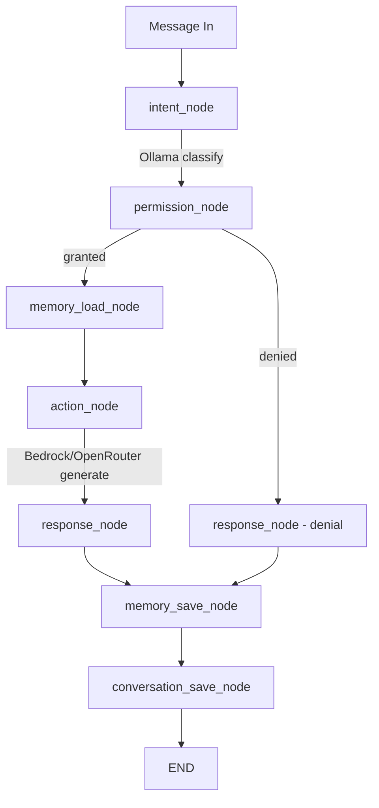
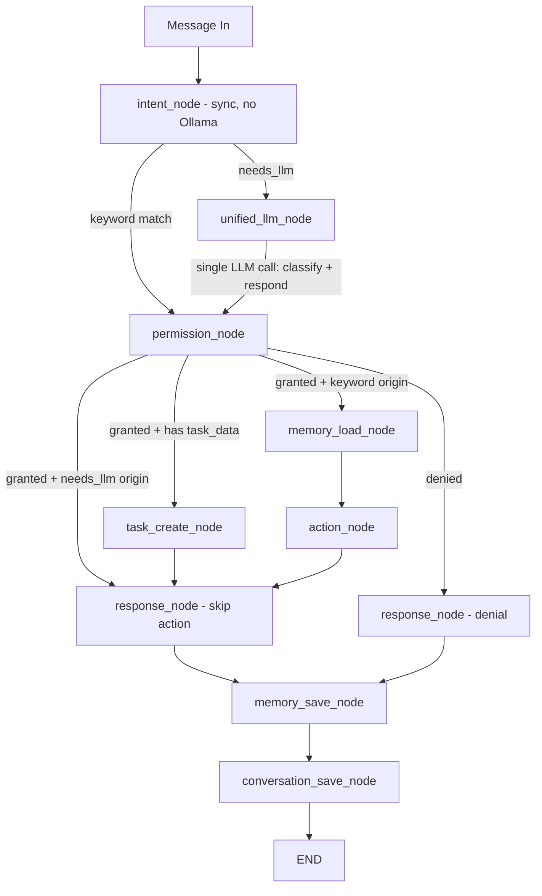

# Design Document: Remove Ollama from Critical Path

## Overview

This design replaces the two-call message flow (Ollama intent classification → LLM response generation) with a single-call flow for non-keyword messages. Today, every message that doesn't match a keyword hits Ollama for intent classification (1-3s latency, 5GB RAM), then hits Bedrock/OpenRouter for response generation. The new flow makes `detect_intent` synchronous and keyword-only: keyword matches route directly to `permission_node` as before, while unmatched messages get a new `"needs_llm"` intent that routes to a `unified_llm_node`. This node sends one LLM call that classifies intent AND generates the response simultaneously, then stores the result in workflow state. Permission checks still happen after classification, and task creation is deferred until after permission is granted.

Ollama is removed only from the intent classification path. It remains as a last-resort generation fallback in `ModelDispatcher`, and the `OllamaClient` class, docker-compose service, and health check are all unchanged.

## Architecture

### Current Flow (2 LLM calls for non-keyword messages)



### New Flow (1 LLM call for non-keyword messages)



Key changes:
1. `intent_node` becomes synchronous — keyword match or `"needs_llm"`, no network calls
2. New `unified_llm_node` handles classification + response in one LLM call
3. After `unified_llm_node`, flow goes to `permission_node` (permission checks still enforced)
4. If permission granted and intent came from unified path, skip `action_node` (response already generated)
5. If permission granted and intent is `create_task` with `task_data` in state, `task_create_node` creates the task before proceeding to `response_node`
6. If permission denied, LLM-generated response is replaced with denial message

## Components and Interfaces

### 1. Modified: `intent_detector.py`

**Before:** `async detect_intent(text, has_media, llm_client) -> str` — async, takes OllamaClient
**After:** `detect_intent(text, has_media) -> str` — sync, no LLM client

```python
def detect_intent(text: str, has_media: bool) -> str:
    """Synchronous intent detection. Keyword match or 'needs_llm'."""
    if has_media:
        return "upload_document"
    keyword_intent = _match_keywords(text)
    if keyword_intent is not None:
        return keyword_intent
    return "needs_llm"
```

- Removes `OllamaClient` import
- Removes `_detect_intent_with_llm()` function
- `_match_keywords()` unchanged
- `INTENTS` dict and `VALID_INTENTS` set unchanged (still useful for validation elsewhere)

### 2. New: `unified_handler.py`

```python
async def handle_with_llm(
    message_text: str,
    member_name: str,
    memories: list,
    dispatcher: ModelDispatcher,
) -> tuple[str, str, dict | None]:
    """Single LLM call: classify intent + generate response.
    
    Returns (intent, response_text, task_details_or_none).
    """
```

- Sends `message_text` with `UNIFIED_CLASSIFY_AND_RESPOND` prompt to `ModelDispatcher`
- Parses JSON response: `{"intent": "...", "response": "...", "task_data": {...}}`
- Validates intent against `VALID_INTENTS`
- On invalid JSON → returns `("unknown", HEBREW_FALLBACK_MSG, None)`
- On invalid intent → defaults to `"unknown"`
- Logs intent, response length, elapsed time

### 3. New: `UNIFIED_CLASSIFY_AND_RESPOND` prompt in `system_prompts.py`

A single prompt that instructs the LLM to:
1. Classify the message into one of the 8 valid intents
2. Generate a Hebrew response appropriate for the intent
3. If intent is `create_task`, extract task details (title, due_date, category, priority)
4. Return structured JSON

### 4. Modified: `workflow_engine.py`

**New nodes:**
- `unified_llm_node` — calls `handle_with_llm()`, sets `intent`, `response`, and optionally `task_data` in state
- `task_create_node` — creates task from `task_data` in state when permission is granted

**Modified nodes:**
- `intent_node` — now synchronous, calls `detect_intent(text, has_media)` without OllamaClient
- `permission_node` — unchanged logic, but now also handles `"needs_llm"` routing (needs_llm maps to None in permission map since the real intent is set by unified_llm_node before reaching permission_node)

**New state fields:**
- `task_data: dict | None` — task details from unified handler, created after permission check
- `from_unified: bool` — flag indicating the message went through unified_llm_node

**Modified graph edges:**
- `intent_node` → conditional: keyword intent → `permission_node`, `"needs_llm"` → `unified_llm_node`
- `unified_llm_node` → `permission_node`
- `permission_node` → conditional: denied → `response_node`, granted + `from_unified` + `task_data` → `task_create_node`, granted + `from_unified` → `response_node`, granted + keyword → `memory_load_node`
- `task_create_node` → `response_node`
- `memory_load_node` → `action_node` → `response_node` (unchanged)

**Removed imports:**
- `OllamaClient` no longer imported in `workflow_engine.py`

### 5. Unchanged: `model_dispatch.py`, `llm_client.py`, `bedrock_client.py`, `openrouter_client.py`

These remain exactly as-is. Ollama stays in the fallback chain.

### 6. Modified: `routing_policy.py`

Add `"needs_llm"` to `SENSITIVITY_MAP` as `"medium"` sensitivity. This is used when `unified_llm_node` dispatches through `ModelDispatcher`. The unified handler uses the `"needs_llm"` intent for routing, which gives it the `openrouter → bedrock → ollama` fallback chain.


## Data Models

### WorkflowState Changes

Two new fields added to the `WorkflowState` TypedDict:

```python
class WorkflowState(TypedDict):
    # ... existing fields ...
    db: Session
    member: FamilyMember
    phone: str
    message_text: str
    has_media: bool
    media_file_path: str | None
    intent: str
    permission_granted: bool
    memories: list[Memory]
    response: str
    error: str | None
    # New fields
    task_data: dict | None       # Task details from unified handler (title, due_date, category, priority)
    from_unified: bool           # True if message went through unified_llm_node
```

### Unified LLM Response Schema

The LLM returns JSON matching this structure:

```json
{
  "intent": "create_task",
  "response": "נוצרה משימה חדשה: לקנות חלב 🛒",
  "task_data": {
    "title": "לקנות חלב",
    "due_date": null,
    "category": "groceries",
    "priority": "normal"
  }
}
```

- `intent` (required): one of the 8 valid intents
- `response` (required): Hebrew response text for WhatsApp
- `task_data` (optional): present only when intent is `create_task`

### Permission Map Update

`_PERMISSION_MAP` does not need a `"needs_llm"` entry because `unified_llm_node` replaces the intent with the actual classified intent before `permission_node` runs. The existing map covers all 8 real intents.

### Routing Policy Update

```python
SENSITIVITY_MAP["needs_llm"] = "medium"
```

This ensures the unified handler's dispatch call gets the `openrouter → bedrock → ollama` fallback chain.


## Correctness Properties

*A property is a characteristic or behavior that should hold true across all valid executions of a system — essentially, a formal statement about what the system should do. Properties serve as the bridge between human-readable specifications and machine-verifiable correctness guarantees.*

> **Note:** Per user constraint, these properties will be validated with unit tests only (no property-based testing). Each property below maps to one or more unit tests.

### Property 1: Synchronous intent detection returns keyword or needs_llm

*For any* input text and has_media flag, `detect_intent(text, has_media)` returns synchronously (is not a coroutine) and returns either a known keyword intent or `"needs_llm"`. It never makes network calls.

**Validates: Requirements 2.1, 2.2, 2.3, 2.4, 2.7**

### Property 2: Ollama is absent from intent detection path

*For any* execution of the intent detection module, the module does not import `OllamaClient`, does not contain `_detect_intent_with_llm`, and makes no reference to Ollama.

**Validates: Requirements 2.5, 2.6, 5.1**

### Property 3: Unified handler returns valid tuple for valid JSON

*For any* valid JSON response from the LLM containing an intent in the valid set and a response string, `handle_with_llm()` returns `(intent, response_text, task_data_or_none)` where intent matches the LLM's intent and response_text matches the LLM's response.

**Validates: Requirements 3.1, 3.3**

### Property 4: Unified handler extracts task_data for create_task

*For any* valid JSON response from the LLM with intent `"create_task"` and a `task_data` object, `handle_with_llm()` returns the task details dict as the third tuple element.

**Validates: Requirements 3.4**

### Property 5: Unified handler falls back gracefully on bad input

*For any* invalid JSON response or an intent not in the valid set, `handle_with_llm()` returns `("unknown", <Hebrew fallback>, None)`.

**Validates: Requirements 3.5, 3.6**

### Property 6: Workflow routes needs_llm to unified_llm_node, keywords to permission_node

*For any* message, if `intent_node` returns `"needs_llm"`, the workflow routes to `unified_llm_node`. If it returns any other intent, the workflow routes directly to `permission_node`.

**Validates: Requirements 4.1, 4.2, 4.3**

### Property 7: Unified_LLM_Node stores task_data without creating the task

*For any* message where the unified handler returns `"create_task"` with task details, the `unified_llm_node` stores `task_data` in workflow state and does NOT call `create_task` on the task service.

**Validates: Requirements 4.4, 4.5**

### Property 8: Task creation occurs only after permission is granted

*For any* workflow execution where `from_unified` is True and `task_data` is present, the task is created via the task service only when `permission_granted` is True. When permission is denied, no task is created.

**Validates: Requirements 4.10, 4.8**

### Property 9: Unified path skips action_node when permission granted

*For any* workflow execution where `from_unified` is True and permission is granted, the workflow proceeds to `response_node` (or `task_create_node` → `response_node`) without invoking `action_node`.

**Validates: Requirements 4.7**

### Property 10: Permission denial replaces unified response

*For any* workflow execution where `from_unified` is True and permission is denied, the LLM-generated response is replaced with the denial message.

**Validates: Requirements 4.8**

### Property 11: OllamaClient not imported in workflow_engine

*For any* execution of the workflow engine module, `OllamaClient` is not imported or instantiated in `intent_node`.

**Validates: Requirements 4.9, 5.2**

### Property 12: Ollama remains in ModelDispatcher fallback chain

*For any* intent sensitivity level, the routing policy continues to include `"ollama"` as a fallback provider in the dispatch chain.

**Validates: Requirements 5.4**


## Error Handling

### Unified Handler Errors

| Error Condition | Handling |
|---|---|
| LLM returns invalid JSON (not parseable) | Return `("unknown", HEBREW_FALLBACK, None)`. Log warning with raw response snippet. |
| LLM returns JSON missing `"intent"` field | Treat as invalid JSON — same fallback. |
| LLM returns JSON missing `"response"` field | Use empty string for response, log warning. |
| LLM returns intent not in valid set | Default intent to `"unknown"`, keep the response text. |
| LLM returns `"create_task"` but no `task_data` | Return `(intent, response, None)` — task_data is optional. |
| ModelDispatcher raises exception | Caught by unified handler, returns fallback tuple. |
| ModelDispatcher returns HEBREW_FALLBACK | Treated as valid response (the fallback message is still valid Hebrew text). |

### Workflow Engine Errors

| Error Condition | Handling |
|---|---|
| `unified_llm_node` raises exception | Caught by LangGraph; `run_workflow` returns `HEBREW_FALLBACK`. |
| `task_create_node` fails to create task | Log error, continue to `response_node` (response was already generated by LLM). |
| `detect_intent` raises exception | Caught by LangGraph; `run_workflow` returns `HEBREW_FALLBACK`. |
| Permission check fails for unified path | Same as existing: response replaced with denial message. |

### Backward Compatibility

- All keyword-matched messages follow the exact same path as before (intent_node → permission_node → memory_load_node → action_node → response_node)
- Only non-keyword messages change path (they previously went through Ollama classification + action_node generation; now they go through unified_llm_node)
- The `run_workflow` public API is unchanged — callers see no difference

## Testing Strategy

### Constraints

- **No property-based tests** — unit tests only (per user requirement)
- **All 130 existing tests must pass** minus the 3 removed Ollama mock tests in `test_intent_detector.py`
- New test modules: `test_unified_handler.py`, `test_workflow_engine.py`

### Test Plan

#### 1. `test_intent_detector.py` — Modified

**Remove** (3 tests):
- `test_llm_fallback_invoked` — tests Ollama LLM fallback (removed)
- `test_llm_failure_returns_unknown` — tests Ollama failure handling (removed)
- `test_llm_invalid_intent_returns_unknown` — tests Ollama invalid intent (removed)

**Modify** (all existing keyword/media tests):
- Remove `llm_client` parameter from all `detect_intent()` calls
- Remove `_mock_llm()` helper
- Change `async` tests to sync tests (remove `@pytest.mark.asyncio`, use plain `def`)

**Add**:
- `test_no_keyword_returns_needs_llm` — non-keyword text returns `"needs_llm"` (Property 1)
- `test_detect_intent_is_sync` — verify `detect_intent` is not a coroutine function (Property 1)
- `test_no_ollama_import` — verify module has no `OllamaClient` reference (Property 2)
- `test_no_llm_fallback_function` — verify `_detect_intent_with_llm` does not exist (Property 2)

#### 2. `test_unified_handler.py` — New

- `test_valid_json_greeting` — valid JSON with greeting intent returns correct tuple (Property 3)
- `test_valid_json_ask_question` — valid JSON with ask_question intent (Property 3)
- `test_create_task_with_task_data` — create_task intent returns task details dict (Property 4)
- `test_create_task_without_task_data` — create_task intent with no task_data returns None (Property 4)
- `test_invalid_json_returns_fallback` — invalid JSON returns ("unknown", fallback, None) (Property 5)
- `test_invalid_intent_defaults_unknown` — unrecognized intent defaults to "unknown" (Property 5)
- `test_dispatcher_called_with_unified_prompt` — verifies dispatcher receives UNIFIED_CLASSIFY_AND_RESPOND (Property 3)
- `test_logging_output` — verifies intent, response length, elapsed time are logged (Req 3.7)

#### 3. `test_workflow_engine.py` — New

- `test_keyword_routes_to_permission_node` — keyword intent skips unified_llm_node (Property 6)
- `test_needs_llm_routes_to_unified_node` — "needs_llm" routes to unified_llm_node (Property 6)
- `test_unified_node_sets_state` — unified_llm_node sets intent, response, from_unified in state (Property 7)
- `test_unified_node_stores_task_data_no_create` — task_data stored, create_task not called (Property 7)
- `test_task_created_after_permission_granted` — task_create_node calls create_task when permitted (Property 8)
- `test_task_not_created_when_denied` — no task creation on permission denial (Property 8)
- `test_unified_path_skips_action_node` — from_unified + granted skips action_node (Property 9)
- `test_denial_replaces_unified_response` — denial message overrides LLM response (Property 10)
- `test_no_ollama_in_workflow_engine` — OllamaClient not imported (Property 11)
- `test_ollama_in_fallback_chain` — routing policy still includes ollama (Property 12)

#### 4. Existing test files — No changes needed

All other test files (`test_auth.py`, `test_health.py`, `test_llm_client.py`, `test_message_handler.py`, `test_model_dispatch.py`, `test_model_router.py`, `test_openrouter_client.py`, `test_phone.py`, `test_recurring.py`, `test_routing_policy.py`, `test_tasks.py`, `test_whatsapp_client.py`) remain unchanged.

### Test Count

- Existing: 130 tests
- Removed: 3 (Ollama LLM fallback tests)
- Added: ~4 (intent_detector) + ~8 (unified_handler) + ~10 (workflow_engine) = ~22 new tests
- Expected total: ~149 tests, all passing

