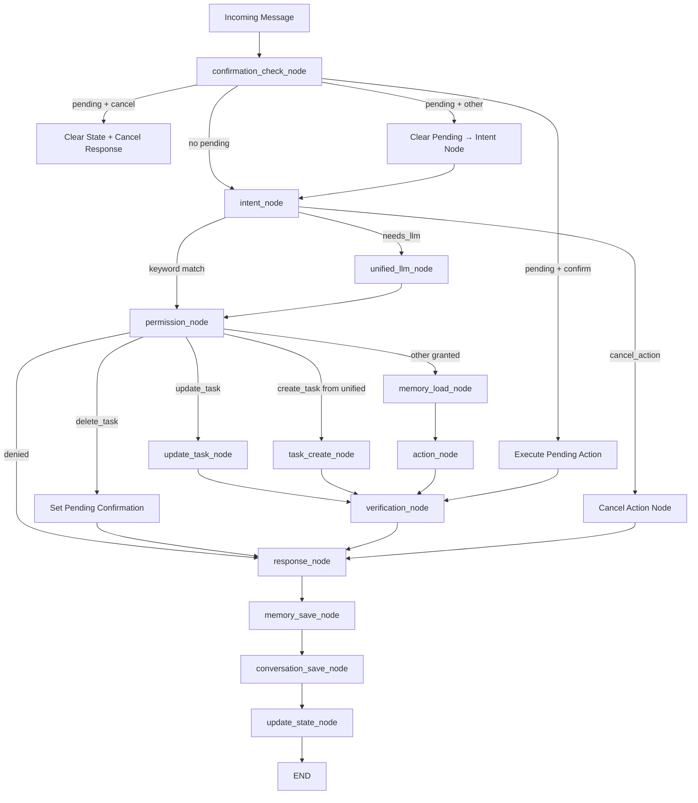

# Design Document: Sprint 1 — State, Time & Verification

## Overview

Sprint 1 adds three foundational capabilities to Fortress:

1. **Conversation State** — A per-member `conversation_state` table + ORM model + service, enabling multi-turn context (last intent, last entity, pending confirmations).
2. **Time Context** — A deterministic `Asia/Jerusalem` time module injected into every LLM prompt, replacing LLM guesswork with accurate date/time.
3. **Action Verification** — Post-action DB queries confirming that creates/deletes/updates actually persisted before the bot claims success.

Additionally: confirmation flows for destructive actions, cancel/negation intent, pronoun/index reference resolution, and an `update_task` intent.

All new code lives inside the existing `fortress/src/` tree. No new external services. No schema-breaking changes to existing tables.

## Architecture



Key changes to the existing LangGraph workflow:
- **New entry node**: `confirmation_check_node` runs before `intent_node` to intercept pending confirmations.
- **New nodes**: `cancel_action_node`, `update_task_node`, `verification_node`, `update_state_node`.
- **Modified routing**: `_permission_router` gains branches for `update_task` and confirmation-pending `delete_task`.
- **Post-action verification**: `verification_node` sits between action nodes and `response_node`.

## Components and Interfaces

### 1. Migration 007 — `migrations/007_conversation_state.sql`

Standard SQL migration following the project pattern (BEGIN/COMMIT, gen_random_uuid, indexes).

```sql
BEGIN;

CREATE TABLE conversation_state (
    id UUID PRIMARY KEY DEFAULT gen_random_uuid(),
    family_member_id UUID NOT NULL REFERENCES family_members(id) UNIQUE,
    last_intent TEXT,
    last_entity_type TEXT,
    last_entity_id UUID,
    last_action TEXT,
    pending_confirmation BOOLEAN DEFAULT false,
    pending_action JSONB,
    context JSONB DEFAULT '{}',
    updated_at TIMESTAMPTZ DEFAULT now(),
    created_at TIMESTAMPTZ DEFAULT now()
);

CREATE INDEX idx_conv_state_member ON conversation_state(family_member_id);

COMMIT;
```

### 2. ConversationState ORM Model — `src/models/schema.py`

New class added to the existing schema file. One-to-one relationship with `FamilyMember` (both sides use `uselist=False`).

```python
class ConversationState(Base):
    __tablename__ = "conversation_state"

    id: Mapped[uuid.UUID] = mapped_column(UUID(as_uuid=True), primary_key=True, server_default=text("gen_random_uuid()"))
    family_member_id: Mapped[uuid.UUID] = mapped_column(UUID(as_uuid=True), ForeignKey("family_members.id"), unique=True, nullable=False)
    last_intent: Mapped[Optional[str]] = mapped_column(Text, nullable=True)
    last_entity_type: Mapped[Optional[str]] = mapped_column(Text, nullable=True)
    last_entity_id: Mapped[Optional[uuid.UUID]] = mapped_column(UUID(as_uuid=True), nullable=True)
    last_action: Mapped[Optional[str]] = mapped_column(Text, nullable=True)
    pending_confirmation: Mapped[bool] = mapped_column(Boolean, server_default=text("false"))
    pending_action: Mapped[Optional[dict]] = mapped_column(JSONB, nullable=True)
    context: Mapped[Optional[dict]] = mapped_column(JSONB, server_default=text("'{}'"))
    updated_at: Mapped[Optional[datetime]] = mapped_column(DateTime(timezone=True), server_default=text("now()"))
    created_at: Mapped[Optional[datetime]] = mapped_column(DateTime(timezone=True), server_default=text("now()"))

    family_member: Mapped["FamilyMember"] = relationship(back_populates="conversation_state", uselist=False)
```

`FamilyMember` gets a new relationship:
```python
conversation_state: Mapped[Optional["ConversationState"]] = relationship(back_populates="family_member", uselist=False)
```

### 3. Conversation State Service — `src/services/conversation_state.py`

Pure functions operating on a SQLAlchemy `Session`. No class — matches the project's existing service pattern (see `tasks.py`, `recurring.py`).

| Function | Signature | Description |
|----------|-----------|-------------|
| `get_state` | `(db: Session, member_id: UUID) -> ConversationState` | Get-or-create. Returns existing row or creates one with defaults. |
| `update_state` | `(db: Session, member_id: UUID, **kwargs) -> ConversationState` | Partial update. Only sets non-None kwargs. Always bumps `updated_at`. |
| `clear_state` | `(db: Session, member_id: UUID) -> ConversationState` | Resets all mutable fields to defaults. |
| `set_pending_confirmation` | `(db: Session, member_id: UUID, action_type: str, action_data: dict) -> ConversationState` | Sets `pending_confirmation=True`, stores `{"action_type": ..., "action_data": ...}` in `pending_action`. |
| `resolve_pending` | `(db: Session, member_id: UUID) -> dict \| None` | Returns `pending_action` dict and clears pending state, or `None` if nothing pending. |

### 4. Time Context Module — `src/utils/time_context.py`

Uses `pytz` with `Asia/Jerusalem` timezone. No class — module-level functions.

| Function | Returns | Description |
|----------|---------|-------------|
| `get_time_context()` | `dict` | Keys: `now`, `today_date`, `today_day_he`, `today_display`, `tomorrow_date`, `tomorrow_display`, `current_time`, `hour` |
| `format_time_for_prompt()` | `str` | Hebrew-formatted string like `"📅 היום: יום שלישי, 15 בינואר 2025 | 🕐 שעה: 14:30"` |
| `_day_name_he(weekday: int)` | `str` | Hebrew day name (0=Monday → "יום שני") |
| `_month_name_he(month: int)` | `str` | Hebrew month name (1 → "ינואר") |

### 5. Prompt Injection — Changes to `unified_handler.py` and `workflow_engine.py`

Both `handle_with_llm` and the workflow action handlers will receive time context and conversation state as additional prompt segments. The prompt assembly order:

```
{PERSONALITY}
{TIME_CONTEXT}        ← format_time_for_prompt()
{STATE_CONTEXT}       ← formatted conversation state summary
{SPECIFIC_PROMPT}
הודעת המשתמש: {message}
```

`handle_with_llm` gains two new parameters: `time_context: str` and `state_context: str`. The workflow engine passes these from the state dict.

### 6. Confirmation Flow — Changes to `workflow_engine.py`

New `confirmation_check_node` is the graph entry point (replaces `intent_node` as entry). Logic:

```python
async def confirmation_check_node(state: WorkflowState) -> dict:
    # 1. Load conversation state
    # 2. If pending_confirmation:
    #    a. "כן" → resolve_pending, execute action, return result
    #    b. "לא" / cancel keywords → resolve_pending (discard), return cancelled msg
    #    c. Other → clear pending, fall through to intent_node
    # 3. If no pending → fall through to intent_node
```

For `delete_task`: instead of immediately deleting, the permission router routes to a new path that calls `set_pending_confirmation` and returns a confirmation prompt.

### 7. Cancel/Negation Intent — Changes to `intent_detector.py`

New keyword block in `_match_keywords`:
```python
# Cancel action
cancel_words = {"עזוב", "תעזוב", "בטל", "תבטל", "לא", "cancel"}
if stripped in cancel_words:
    return "cancel_action"
if stripped.startswith("אל תעשה") or stripped.startswith("אל "):
    return "cancel_action"
```

Add to `INTENTS`: `"cancel_action": {"model_tier": "local"}`
Add to `SENSITIVITY_MAP`: `"cancel_action": "low"`

### 8. Reference Resolution — New helper in `workflow_engine.py`

```python
def resolve_reference(db: Session, member_id: UUID, message: str, conv_state: ConversationState) -> UUID | None:
    # 1. Pronoun check: "אותה", "אותו", "את זה" → conv_state.last_entity_id
    # 2. Index check: "משימה 3" → look up task IDs from conv_state.context["task_ids"][2]
    # 3. Name check: query family_members by name → return member.id or None if ambiguous
```

### 9. Action Verification — New `verification_node` in `workflow_engine.py`

Runs after every action node. Checks the DB to confirm the action persisted:

```python
async def verification_node(state: WorkflowState) -> dict:
    intent = state["intent"]
    if intent == "create_task" and state.get("created_task_id"):
        task = get_task(state["db"], state["created_task_id"])
        if not task:
            return {"response": PERSONALITY_TEMPLATES["verification_failed"]}
    elif intent == "delete_task" and state.get("deleted_task_id"):
        task = get_task(state["db"], state["deleted_task_id"])
        if not task or task.status != "archived":
            return {"response": PERSONALITY_TEMPLATES["verification_failed"]}
    # ... similar for create_recurring
    return {}
```

### 10. Update State Node — New `update_state_node` in `workflow_engine.py`

Runs after `conversation_save_node`, before END. Updates conversation state based on what just happened:

```python
async def update_state_node(state: WorkflowState) -> dict:
    intent = state["intent"]
    member_id = state["member"].id
    db = state["db"]
    
    if intent == "create_task":
        update_state(db, member_id, last_intent="create_task", last_entity_type="task",
                     last_entity_id=state.get("created_task_id"), last_action="created")
    elif intent == "delete_task":
        update_state(db, member_id, last_intent="delete_task", last_entity_type="task",
                     last_entity_id=state.get("deleted_task_id"), last_action="deleted")
    elif intent == "list_tasks":
        task_ids = [str(t.id) for t in state.get("listed_tasks", [])]
        update_state(db, member_id, last_intent="list_tasks", context={"task_ids": task_ids})
    elif intent == "cancel_action":
        clear_state(db, member_id)
    # ... other intents
    return {}
```

### 11. Update Task Intent — Changes across multiple files

- `intent_detector.py`: New keyword block for "תשנה", "תעדכן", "עדכן", "שנה", "update"
- `INTENTS`: `"update_task": {"model_tier": "local"}`
- `SENSITIVITY_MAP`: `"update_task": "medium"`
- `_PERMISSION_MAP`: `"update_task": ("tasks", "write")`
- New `update_task_node` in `workflow_engine.py` that resolves the target task (from state or message), applies field updates, and returns confirmation.
- `UNIFIED_CLASSIFY_AND_RESPOND`: Add `update_task` to the intent list and extraction instructions.

### 12. Personality Template Additions

New entries in `TEMPLATES` dict in `personality.py`:

```python
"confirm_delete": "אתה בטוח שרוצה למחוק את '{title}'? (כן/לא)",
"action_cancelled": "בסדר, הפעולה בוטלה 😊",
"cancelled": "בסדר, עזבתי 😊",
"task_updated": "משימה עודכנה: {title} ✅",
"task_update_which": "איזו משימה לעדכן? 🤔\n{task_list}",
"verification_failed": "משהו השתבש בשמירה 😅 אפשר לנסות שוב?",
```

## Data Models

### ConversationState Table

| Column | Type | Constraints | Default | Description |
|--------|------|-------------|---------|-------------|
| id | UUID | PRIMARY KEY | gen_random_uuid() | Row identifier |
| family_member_id | UUID | NOT NULL, UNIQUE, FK→family_members | — | One row per member |
| last_intent | TEXT | nullable | NULL | Last classified intent |
| last_entity_type | TEXT | nullable | NULL | "task", "recurring", etc. |
| last_entity_id | UUID | nullable | NULL | ID of last referenced entity |
| last_action | TEXT | nullable | NULL | "created", "deleted", "updated" |
| pending_confirmation | BOOLEAN | — | false | Whether awaiting user confirm |
| pending_action | JSONB | nullable | NULL | `{"action_type": "delete_task", "action_data": {"task_id": "...", "title": "..."}}` |
| context | JSONB | — | '{}' | Arbitrary context (e.g. `{"task_ids": [...]}`) |
| updated_at | TIMESTAMPTZ | — | now() | Last modification time |
| created_at | TIMESTAMPTZ | — | now() | Row creation time |

### WorkflowState TypedDict Changes

New keys added to `WorkflowState`:

```python
class WorkflowState(TypedDict):
    # ... existing keys ...
    conv_state: ConversationState | None    # loaded conversation state
    time_context: str                        # formatted time string
    state_context: str                       # formatted state string
    created_task_id: UUID | None             # for verification
    deleted_task_id: UUID | None             # for verification
    listed_tasks: list[Task]                 # for state update
    created_recurring_id: UUID | None        # for verification
```

### Time Context Dictionary

```python
{
    "now": datetime,              # current datetime in Asia/Jerusalem
    "today_date": "2025-01-15",   # ISO date string
    "today_day_he": "יום רביעי",   # Hebrew day name
    "today_display": "15 בינואר 2025",  # Hebrew display date
    "tomorrow_date": "2025-01-16",
    "tomorrow_display": "16 בינואר 2025",
    "current_time": "14:30",
    "hour": 14,
}
```

## Correctness Properties

*Since the user has specified unit tests only (no property-based testing), all acceptance criteria are validated through specific example-based unit tests rather than universally quantified properties. Each test file targets a specific component with concrete inputs and expected outputs.*

All acceptance criteria from Requirements 1–13 are testable as unit test examples. The criteria fall into these categories:

- **Service CRUD operations** (Req 3): get/update/clear/pending — tested with specific member IDs and field values
- **Time context output** (Req 4): tested by mocking `datetime.now()` and verifying output structure and Hebrew strings
- **Prompt injection** (Req 5): tested by capturing the prompt string passed to the dispatcher and asserting it contains time and state segments
- **Confirmation flow** (Req 6): tested by simulating pending state + user replies ("כן", "לא", other)
- **Intent detection** (Req 7, 11): tested by asserting each keyword maps to the correct intent
- **Reference resolution** (Req 8): tested with mock conversation state containing last_entity_id and task_ids
- **Action verification** (Req 9): tested by mocking DB queries to return/not-return expected records
- **State updates** (Req 10): tested by asserting update_state is called with correct arguments after each action

## Error Handling

| Scenario | Handling |
|----------|----------|
| `get_state` DB error | Log exception, re-raise (caller handles) |
| `verification_node` finds missing record | Return `verification_failed` template instead of success message |
| `resolve_reference` finds no match | Return `None`, caller falls back to asking user |
| `resolve_reference` finds multiple name matches | Return clarification prompt listing matches |
| `confirmation_check_node` with expired/corrupt pending_action | Clear pending state, proceed to normal intent flow |
| `format_time_for_prompt` timezone error | Fall back to UTC with a log warning |
| `update_state_node` DB error | Log exception, do not fail the response (state update is best-effort) |
| Pending confirmation + unrelated message | Clear pending state silently, process new message normally |

## Testing Strategy

All testing uses **pytest** with **unittest.mock** for isolation. No property-based testing.

### Test Files

| File | Tests | Requirement |
|------|-------|-------------|
| `test_conversation_state.py` | get_state (create + retrieve), update_state (partial), clear_state, set_pending_confirmation, resolve_pending (with/without pending) | Req 3 |
| `test_time_context.py` | get_time_context keys, format_time_for_prompt non-empty, Hebrew day/month names | Req 4 |
| `test_confirmation_flow.py` | confirm-yes executes, confirm-no cancels, confirm-other clears, delete_task sets pending | Req 6 |
| `test_action_verification.py` | create_task verified, delete_task verified, verification failure returns error | Req 9 |
| `test_reference_resolution.py` | pronoun resolution, index resolution, name resolution, ambiguous name | Req 8 |
| `test_intent_detector.py` (update) | cancel_action keywords, update_task keywords | Req 7, 11 |

### Test Patterns

- **Mock DB**: All tests use `MagicMock(spec=Session)` per existing `conftest.py` pattern
- **Mock time**: Tests for time context use `unittest.mock.patch` on `datetime` to control the clock
- **Async tests**: Workflow node tests use `pytest.mark.asyncio` with `pytest-asyncio`
- **No real DB**: All tests are pure unit tests with mocked sessions
- **Existing tests**: All 318 existing tests must continue to pass unchanged
