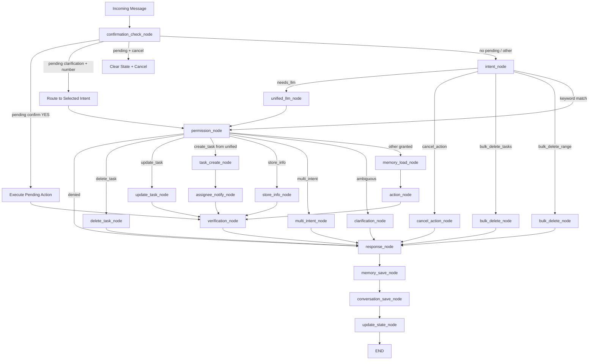

# Design Document: Sprint 2 — Intent + Entity + UX

## Overview

Sprint 2 addresses the remaining ~30% of production bugs in Fortress by overhauling intent classification, adding multi-intent and clarification flows, introducing bulk operations, assignee notifications, smarter duplicate detection, and a `store_info` intent. All changes live within the existing `fortress/src/` tree. No new external services. No schema-breaking changes.

Key changes:
1. **Strict priority-based intent classification** — 4-tier keyword matching replacing the current flat approach
2. **Multi-intent detection** — LLM-driven splitting of compound messages into sub-intents
3. **Clarification flow** — numbered option lists when intent is ambiguous
4. **Bulk operations** — "delete all" and "delete 1-5" range support
5. **Assignee notifications** — WhatsApp messages to task assignees
6. **Task index consistency** — `task_list_order` in conversation state for stable references
7. **Smarter duplicate detection** — substring + normalized Hebrew prefix stripping
8. **store_info intent** — permanent memory storage for factual information
9. **Comprehensive test coverage** — new test files for all Sprint 2 features
10. **README roadmap update** — Sprint 2 row in the version history table

## Architecture



Key changes to the existing LangGraph workflow:
- **Modified `intent_detector.py`**: Complete rewrite of `_match_keywords` with 4-tier priority system
- **New nodes**: `multi_intent_node`, `clarification_node`, `bulk_delete_node`, `store_info_node`, `assignee_notify_node`
- **Modified `confirmation_check_node`**: Handles `type="clarification"` pending actions (number selection)
- **Modified `task_create_node`**: 3-strategy duplicate detection (exact, substring, normalized)
- **Modified `update_state_node`**: Saves `task_list_order` (list of task ID strings) on `list_tasks`
- **Modified `UNIFIED_CLASSIFY_AND_RESPOND`**: Adds `multi_intent`, `ambiguous`, `store_info` intents

## Components and Interfaces

### 1. Strict Priority-Based Intent Classification — `src/services/intent_detector.py`

Complete rewrite of `_match_keywords` with a 4-tier priority system. The `detect_intent` function signature stays the same.

**New INTENTS entries:**
```python
INTENTS: dict[str, dict[str, str]] = {
    # ... existing intents ...
    "multi_intent": {"model_tier": "local"},
    "ambiguous": {"model_tier": "local"},
    "bulk_delete_tasks": {"model_tier": "local"},
    "bulk_delete_range": {"model_tier": "local"},
    "store_info": {"model_tier": "local"},
}
```

**Priority 0 (pre-check):** Messages starting with "אל " or standalone "לא" → `cancel_action`. This runs before all other checks.

**Priority 1 (exact phrases):**
| Phrase | Intent |
|--------|--------|
| `"משימה חדשה:"` (prefix) | `create_task` |
| `"תזכורת חדשה:"` (prefix) | `create_recurring` |
| `"מחק משימה"` (substring) | `delete_task` |
| `"הסר משימה"` (substring) | `delete_task` |
| `"בטל משימה"` (substring) | `delete_task` |
| `"מחק תזכורת"` (substring) | `delete_recurring` |
| `"בטל תזכורת"` (substring) | `delete_recurring` |
| `"סיום משימה"` (substring) | `complete_task` |
| `"באג:"` (prefix) | `report_bug` |
| `"מחק הכל"` / `"נקה הכל"` / `"delete all"` | `bulk_delete_tasks` |
| `"מחק X עד Y"` / `"מחק X-Y"` / `"delete X-Y"` (regex) | `bulk_delete_range` |

**Priority 2 (action verbs — substring match):**
| Verbs | Intent |
|-------|--------|
| `"תשנה"`, `"תעדכן"`, `"עדכן"` | `update_task` |
| `"תמחק"`, `"תמחוק"`, `"מחק"` | `delete_task` |
| `"תיצור"`, `"תוסיף"`, `"הוסף"` | `create_task` |
| `"תסיים"`, `"סיים"`, `"בוצע"` | `complete_task` |

**Priority 3 (standalone keywords — exact match):**
| Keyword | Intent |
|---------|--------|
| `"משימות"`, `"מה המשימות"`, `"tasks"` | `list_tasks` |
| `"מסמכים"`, `"documents"` | `list_documents` |
| `"תזכורות"`, `"חוזרות"`, `"recurring"` | `list_recurring` |
| `"באגים"`, `"רשימת באגים"`, `"bugs"` | `list_bugs` |
| `"שלום"`, `"היי"`, `"בוקר טוב"`, `"hello"` | `greeting` |
| `"באג"`, `"bug"` | `report_bug` |

**Priority 4:** No match → `needs_llm`

**Special case:** `"משימה"` (singular, no action prefix) → `needs_llm`

```python
def _match_keywords(text: str) -> str | None:
    stripped = text.strip()
    lower = stripped.lower()

    # Priority 0: Cancel override
    if stripped.startswith("אל ") or stripped == "לא":
        return "cancel_action"
    cancel_words = {"עזוב", "תעזוב", "בטל", "תבטל", "cancel"}
    if stripped in cancel_words or lower in cancel_words:
        return "cancel_action"

    # Priority 1: Exact phrases
    if stripped.startswith("משימה חדשה:") or lower.startswith("new task:"):
        return "create_task"
    if stripped.startswith("תזכורת חדשה:") or lower.startswith("recurring:"):
        return "create_recurring"
    if "מחק משימה" in stripped or "הסר משימה" in stripped or "בטל משימה" in stripped:
        return "delete_task"
    if "מחק תזכורת" in stripped or "בטל תזכורת" in stripped:
        return "delete_recurring"
    if "סיום משימה" in stripped or lower.startswith("done"):
        return "complete_task"
    if stripped.startswith("באג:") or lower.startswith("bug:"):
        return "report_bug"
    # Bulk operations (Priority 1 — before standalone "מחק")
    if "מחק הכל" in stripped or "נקה הכל" in stripped or "delete all" in lower:
        return "bulk_delete_tasks"
    range_match = re.search(r"מחק\s+(\d+)\s*[-–עד]\s*(\d+)", stripped)
    if range_match is None:
        range_match = re.search(r"delete\s+(\d+)\s*[-–to]\s*(\d+)", lower)
    if range_match:
        return "bulk_delete_range"

    # Priority 2: Action verbs (substring)
    update_verbs = ("תשנה", "תעדכן", "עדכן")
    if any(v in stripped for v in update_verbs) or "update" in lower:
        return "update_task"
    delete_verbs = ("תמחק", "תמחוק")
    if any(v in stripped for v in delete_verbs):
        return "delete_task"
    create_verbs = ("תיצור", "תוסיף", "הוסף")
    if any(v in stripped for v in create_verbs):
        return "create_task"
    complete_verbs = ("תסיים", "סיים", "בוצע")
    if any(v in stripped for v in complete_verbs):
        return "complete_task"

    # Priority 3: Standalone keywords (exact)
    if stripped in ("משימות", "מה המשימות") or lower == "tasks":
        return "list_tasks"
    if "מסמכים" in stripped or lower == "documents":
        return "list_documents"
    if "תזכורות" in stripped or "חוזרות" in stripped or lower == "recurring":
        return "list_recurring"
    if stripped in ("באגים", "רשימת באגים") or lower == "bugs":
        return "list_bugs"
    if stripped in ("שלום", "היי", "בוקר טוב") or lower in ("hello",):
        return "greeting"
    if stripped in ("באג",) or lower in ("bug",):
        return "report_bug"
    if stripped == "מחק" or "delete task" in lower:
        return "delete_task"

    # "משימה" singular → needs_llm (not list_tasks, not create_task)
    # Falls through to return None

    return None
```

### 2. Multi-Intent Detection — `src/services/unified_handler.py` + `src/services/workflow_engine.py`

**Prompt changes** (`UNIFIED_CLASSIFY_AND_RESPOND` in `system_prompts.py`):
Add `multi_intent` and `store_info` to the intent list, plus instructions:
```
"   - multi_intent: ההודעה מכילה מספר בקשות שונות\n"
"   - store_info: המשתמש רוצה לשמור מידע/עובדה\n"
"   - ambiguous: לא ברור מה המשתמש רוצה\n"
...
"אם ההודעה מכילה מספר בקשות שונות, החזר:\n"
'{"intent": "multi_intent", "response": "...", "sub_intents": [{"intent": "...", "task_data": {...}}, ...]}\n'
"אם אתה לא בטוח מה הכוונה, החזר:\n"
'{"intent": "ambiguous", "response": "...", "options": ["create_task", "list_tasks", ...]}\n'
```

**`unified_handler.py` changes:**
In `handle_with_llm`, after parsing the JSON response, if `intent == "multi_intent"`, extract `sub_intents` from the data and pass it through `task_data`:
```python
if intent == "multi_intent":
    sub_intents = data.get("sub_intents", [])
    task_data = {"sub_intents": sub_intents}
```

If `intent == "ambiguous"`, extract `options`:
```python
if intent == "ambiguous":
    options = data.get("options", [])
    task_data = {"options": options}
```

**New `multi_intent_node`** in `workflow_engine.py`:
```python
async def multi_intent_node(state: WorkflowState) -> dict:
    """Process each sub-intent and combine responses."""
    task_data = state.get("task_data") or {}
    sub_intents = task_data.get("sub_intents", [])
    db = state["db"]
    member = state["member"]
    dispatcher = ModelDispatcher()

    responses = []
    for sub in sub_intents:
        sub_intent = sub.get("intent", "unknown")
        handler = _ACTION_HANDLERS.get(sub_intent)
        if handler:
            resp = await handler(db, member, state["message_text"], dispatcher, None, sub_intent)
            responses.append(resp)

    if not responses:
        return {"response": state.get("response", PERSONALITY_TEMPLATES["error_fallback"])}

    combined = PERSONALITY_TEMPLATES["multi_intent_summary"].format(
        responses="\n\n".join(responses)
    )
    return {"response": combined}
```

### 3. Clarification Flow — `src/services/workflow_engine.py`

**New `clarification_node`:**
```python
async def clarification_node(state: WorkflowState) -> dict:
    """Present numbered options and store in conversation state."""
    task_data = state.get("task_data") or {}
    options = task_data.get("options", [])
    db = state["db"]
    member = state["member"]

    if not options:
        return {"response": PERSONALITY_TEMPLATES["cant_understand"].format(name=member.name)}

    option_lines = []
    for i, opt in enumerate(options, 1):
        label = _INTENT_LABELS_HE.get(opt, opt)
        option_lines.append(
            PERSONALITY_TEMPLATES["clarify_option"].format(number=i, label=label)
        )

    set_pending_confirmation(db, member.id, "clarification", {"options": options})

    return {
        "response": PERSONALITY_TEMPLATES["clarify"].format(
            options="\n".join(option_lines)
        )
    }
```

**Hebrew intent labels** (new dict in `workflow_engine.py`):
```python
_INTENT_LABELS_HE: dict[str, str] = {
    "create_task": "ליצור משימה",
    "list_tasks": "להציג משימות",
    "delete_task": "למחוק משימה",
    "complete_task": "לסיים משימה",
    "update_task": "לעדכן משימה",
    "store_info": "לשמור מידע",
    "create_recurring": "ליצור תזכורת חוזרת",
    "ask_question": "לשאול שאלה",
}
```

**Modified `confirmation_check_node`** — add clarification handling:
```python
if action_type == "clarification":
    options = action_data.get("options", [])
    # Try to parse number from message
    num_match = re.search(r"\d+", message)
    if num_match:
        idx = int(num_match.group())
        if 1 <= idx <= len(options):
            selected_intent = options[idx - 1]
            result["intent"] = selected_intent
            return result  # falls through to intent routing
    # Invalid selection — re-present options
    result["response"] = PERSONALITY_TEMPLATES["clarify"].format(
        options="\n".join(
            PERSONALITY_TEMPLATES["clarify_option"].format(number=i, label=_INTENT_LABELS_HE.get(opt, opt))
            for i, opt in enumerate(options, 1)
        )
    )
    return result
```

### 4. Bulk Operations — `src/services/workflow_engine.py`

**New `bulk_delete_node`:**
```python
async def bulk_delete_node(state: WorkflowState) -> dict:
    """Handle bulk_delete_tasks and bulk_delete_range intents."""
    db = state["db"]
    member = state["member"]
    message = state["message_text"].strip()
    intent = state["intent"]

    tasks = list_tasks(db, status="open", assigned_to=member.id)
    if not tasks:
        return {"response": PERSONALITY_TEMPLATES["task_list_empty"]}

    if intent == "bulk_delete_tasks":
        task_lines = "\n".join(f"{i}. {t.title}" for i, t in enumerate(tasks, 1))
        set_pending_confirmation(db, member.id, "bulk_delete", {
            "task_ids": [str(t.id) for t in tasks],
            "titles": [t.title for t in tasks],
        })
        return {"response": PERSONALITY_TEMPLATES["bulk_delete_confirm"].format(
            count=len(tasks), task_list=task_lines
        )}

    # bulk_delete_range
    range_match = re.search(r"(\d+)\s*[-–עד]\s*(\d+)", message)
    if not range_match:
        range_match = re.search(r"(\d+)\s*[-–to]\s*(\d+)", message.lower())
    if not range_match:
        return {"response": PERSONALITY_TEMPLATES["error_fallback"]}

    start_idx = int(range_match.group(1))
    end_idx = int(range_match.group(2))
    if start_idx < 1 or end_idx > len(tasks) or start_idx > end_idx:
        return {"response": PERSONALITY_TEMPLATES["task_not_found"]}

    selected = tasks[start_idx - 1 : end_idx]
    task_lines = "\n".join(f"{i}. {t.title}" for i, t in enumerate(selected, start_idx))
    set_pending_confirmation(db, member.id, "bulk_delete", {
        "task_ids": [str(t.id) for t in selected],
        "titles": [t.title for t in selected],
    })
    return {"response": PERSONALITY_TEMPLATES["bulk_range_confirm"].format(
        start=start_idx, end=end_idx, task_list=task_lines
    )}
```

**Modified `confirmation_check_node`** — add bulk_delete handling:
```python
elif action_type == "bulk_delete":
    task_ids = action_data.get("task_ids", [])
    count = 0
    for tid_str in task_ids:
        try:
            archived = archive_task(db, UUID(tid_str))
            if archived:
                count += 1
        except (ValueError, TypeError):
            pass
    result["response"] = PERSONALITY_TEMPLATES["bulk_deleted"].format(count=count)
    result["intent"] = "bulk_delete_tasks"
    return result
```

**Permission + routing updates:**
- `_PERMISSION_MAP`: `"bulk_delete_tasks": ("tasks", "write")`, `"bulk_delete_range": ("tasks", "write")`
- `_intent_router`: Route `bulk_delete_tasks` and `bulk_delete_range` to `bulk_delete_node`
- `_permission_router`: Route these intents to `bulk_delete_node` after permission check

### 5. Assignee Notifications — `src/services/workflow_engine.py`

**New `assignee_notify_node`** (runs after `task_create_node`, before `verification_node`):
```python
async def assignee_notify_node(state: WorkflowState) -> dict:
    """Send WhatsApp notification to assignee if different from sender."""
    created_id = state.get("created_task_id")
    if not created_id:
        return {}

    db = state["db"]
    member = state["member"]
    task = get_task(db, created_id)
    if not task or not task.assigned_to or task.assigned_to == member.id:
        return {}

    assignee = db.query(FamilyMember).filter(FamilyMember.id == task.assigned_to).first()
    if not assignee:
        logger.warning("assignee_notify: assignee %s not found", task.assigned_to)
        return {}

    notification = PERSONALITY_TEMPLATES["task_assigned_notification"].format(
        title=task.title,
        sender_name=member.name,
    )

    try:
        from src.services.whatsapp_client import send_text_message
        phone = assignee.phone.lstrip("+")
        success = await send_text_message(phone, notification)
        if success:
            logger.info("assignee_notify: sent to %s for task '%s'", assignee.id, task.title)
        else:
            logger.warning("assignee_notify: failed to send to %s for task '%s'", assignee.id, task.title)
    except Exception:
        logger.exception("assignee_notify: error sending to %s", assignee.id)

    return {}
```

The graph edge changes: `task_create_node` → `assignee_notify_node` → `verification_node` (instead of `task_create_node` → `verification_node`).

### 6. Task Index Consistency — `src/services/workflow_engine.py`

**Modified `update_state_node`** — save `task_list_order` instead of `task_ids`:
```python
elif intent == "list_tasks":
    listed = state.get("listed_tasks", [])
    task_ids = [str(t.id) for t in listed]
    update_state(
        db, member.id,
        intent="list_tasks",
        action="listed",
        context={"task_list_order": task_ids},
    )
```

**Modified `resolve_reference`** — use `task_list_order`:
```python
# 2. Index check: look for bare number or "משימה N"
index_match = re.search(r"משימה\s+(\d+)", message)
if index_match is None:
    # Try bare number (e.g., "מחק 2" or just "2")
    bare_match = re.search(r"\b(\d+)\b", message)
    if bare_match:
        index_match = bare_match

if index_match:
    index = int(index_match.group(1) if hasattr(index_match, 'group') else index_match.group(1))
    context = conv_state.context or {}
    task_ids = context.get("task_list_order", context.get("task_ids", []))
    if 1 <= index <= len(task_ids):
        try:
            return UUID(task_ids[index - 1])
        except (ValueError, TypeError):
            pass
```

**Modified `delete_task_node`** — use `task_list_order` from conversation state:
```python
async def delete_task_node(state: WorkflowState) -> dict:
    db = state["db"]
    member = state["member"]
    message = state["message_text"].strip()
    conv_state = state.get("conv_state")

    # Try to resolve via task_list_order first
    task_list_order = None
    if conv_state and conv_state.context:
        task_list_order = conv_state.context.get("task_list_order")

    number = None
    num_match = re.search(r"\d+", message)
    if num_match:
        number = int(num_match.group())

    task = None
    if number is not None and task_list_order:
        if 1 <= number <= len(task_list_order):
            try:
                task = get_task(db, UUID(task_list_order[number - 1]))
            except (ValueError, TypeError):
                pass
    elif number is not None and not task_list_order:
        # No task_list_order — need list first
        return {"response": PERSONALITY_TEMPLATES["need_list_first"]}

    # ... rest of existing logic (title match, etc.)
```

### 7. Smarter Duplicate Detection — `src/services/workflow_engine.py`

**Modified `task_create_node`** — replace the current 5-minute window check with 3-strategy detection:

```python
async def task_create_node(state: WorkflowState) -> dict:
    task_data = state.get("task_data") or {}
    title = task_data.get("title", "").strip()
    if not title:
        return {}

    db = state["db"]
    member = state["member"]

    # Resolve assigned_to (existing logic)
    assigned_to_name = task_data.get("assigned_to")
    assigned_to_id = member.id
    if assigned_to_name and isinstance(assigned_to_name, str):
        resolved = _resolve_member_by_name(db, assigned_to_name)
        if resolved:
            assigned_to_id = resolved

    # 3-strategy duplicate detection on open tasks
    open_tasks = (
        db.query(Task)
        .filter(Task.status == "open", Task.assigned_to == assigned_to_id)
        .all()
    )

    # Strategy 1: Exact title match (case-insensitive)
    for t in open_tasks:
        if t.title.lower() == title.lower():
            return {"response": PERSONALITY_TEMPLATES["task_duplicate"]}

    # Strategy 2: Substring match
    for t in open_tasks:
        if title.lower() in t.title.lower() or t.title.lower() in title.lower():
            set_pending_confirmation(db, member.id, "create_task_similar", {
                "title": title, "similar_title": t.title,
                "assigned_to": str(assigned_to_id),
                "due_date": str(task_data.get("due_date")) if task_data.get("due_date") else None,
                "category": task_data.get("category"),
                "priority": task_data.get("priority", "normal"),
            })
            return {"response": PERSONALITY_TEMPLATES["task_similar_exists"].format(
                title=title, similar_title=t.title
            )}

    # Strategy 3: Normalized match (strip Hebrew prefixes ל/ה)
    def _normalize(s: str) -> str:
        words = s.strip().split()
        normalized = []
        for w in words:
            if len(w) > 1 and w[0] in "לה":
                normalized.append(w[1:])
            else:
                normalized.append(w)
        return " ".join(normalized).lower()

    norm_title = _normalize(title)
    for t in open_tasks:
        if _normalize(t.title) == norm_title:
            set_pending_confirmation(db, member.id, "create_task_similar", {
                "title": title, "similar_title": t.title,
                "assigned_to": str(assigned_to_id),
                "due_date": str(task_data.get("due_date")) if task_data.get("due_date") else None,
                "category": task_data.get("category"),
                "priority": task_data.get("priority", "normal"),
            })
            return {"response": PERSONALITY_TEMPLATES["task_similar_exists"].format(
                title=title, similar_title=t.title
            )}

    # No duplicates — create the task
    task = create_task(
        db, title, member.id,
        assigned_to=assigned_to_id,
        due_date=task_data.get("due_date"),
        category=task_data.get("category"),
        priority=task_data.get("priority", "normal"),
    )
    return {"created_task_id": task.id}
```

**Modified `confirmation_check_node`** — handle `create_task_similar` confirmation:
```python
elif action_type == "create_task_similar":
    # User confirmed — create the task
    task = create_task(
        db, action_data["title"], member.id,
        assigned_to=UUID(action_data["assigned_to"]),
        due_date=action_data.get("due_date"),
        category=action_data.get("category"),
        priority=action_data.get("priority", "normal"),
    )
    result["response"] = format_task_created(action_data["title"], action_data.get("due_date"))
    result["created_task_id"] = task.id
    result["intent"] = "create_task"
    return result
```

### 8. store_info Intent — `src/services/workflow_engine.py`

**New `store_info_node`:**
```python
async def store_info_node(state: WorkflowState) -> dict:
    """Save factual information as a permanent memory."""
    db = state["db"]
    member = state["member"]
    message = state["message_text"].strip()
    response_text = state.get("response", "")

    # Use the LLM response as the content if available, otherwise use the raw message
    content = response_text if response_text and response_text != PERSONALITY_TEMPLATES["error_fallback"] else message

    memory = await save_memory(
        db,
        family_member_id=member.id,
        content=content,
        category="fact",
        memory_type="permanent",
        source="user_input",
        confidence=1.0,
    )

    if memory:
        return {"response": PERSONALITY_TEMPLATES["info_stored"].format(content=content[:100])}
    return {"response": PERSONALITY_TEMPLATES["error_fallback"]}
```

**Routing:** `_permission_router` routes `store_info` to `store_info_node`. `_PERMISSION_MAP`: `"store_info": None` (no permission required).

### 9. Personality Template Additions — `src/prompts/personality.py`

New entries in `TEMPLATES`:
```python
"multi_intent_summary": "ביצעתי כמה דברים:\n\n{responses}",
"clarify": "לא הייתי בטוח מה התכוונת 🤔\nבחר אפשרות:\n{options}",
"clarify_option": "{number}. {label}",
"bulk_delete_confirm": "למחוק את כל {count} המשימות? 😮\n{task_list}\n\n(כן/לא)",
"bulk_deleted": "{count} משימות נמחקו ✅",
"bulk_range_confirm": "למחוק משימות {start}-{end}?\n{task_list}\n\n(כן/לא)",
"task_assigned_notification": "📋 {sender_name} הקצה לך משימה: {title}",
"need_list_first": "שלח 'משימות' קודם כדי לראות את הרשימה, ואז תוכל לבחור לפי מספר 📋",
"task_similar_exists": "כבר יש משימה דומה: '{similar_title}'\nליצור בכל זאת את '{title}'? (כן/לא)",
"info_stored": "שמרתי את המידע ✅\n{content}",
```

### 10. Routing Policy Updates — `src/services/routing_policy.py`

New entries in `SENSITIVITY_MAP`:
```python
"multi_intent": "medium",
"ambiguous": "medium",
"bulk_delete_tasks": "medium",
"bulk_delete_range": "medium",
"store_info": "medium",
```

### 11. Graph Construction Changes — `src/services/workflow_engine.py`

New nodes added to `_build_graph`:
```python
graph.add_node("multi_intent_node", multi_intent_node)
graph.add_node("clarification_node", clarification_node)
graph.add_node("bulk_delete_node", bulk_delete_node)
graph.add_node("store_info_node", store_info_node)
graph.add_node("assignee_notify_node", assignee_notify_node)
```

Modified routing:
- `_intent_router`: Add `bulk_delete_tasks` → `permission_node`, `bulk_delete_range` → `permission_node`
- `_permission_router`: Add branches for `multi_intent` → `multi_intent_node`, `ambiguous` → `clarification_node`, `bulk_delete_tasks`/`bulk_delete_range` → `bulk_delete_node`, `store_info` → `store_info_node`
- Edge: `task_create_node` → `assignee_notify_node` → `verification_node`
- Edges: `multi_intent_node` → `response_node`, `clarification_node` → `response_node`, `bulk_delete_node` → `response_node`, `store_info_node` → `verification_node`

### 12. README Roadmap Update — `README.md`

Add a new row to the roadmap table:
```markdown
| SPRINT-2 — Intent + Entity + UX | ✅ Complete | Priority intent classification, multi-intent, clarification, bulk ops, notifications | 400+ |
```

## Data Models

### WorkflowState TypedDict Changes

No new keys needed — the existing `task_data` dict carries sub-intent and option data. The existing `conv_state`, `created_task_id`, `listed_tasks` keys are reused.

### ConversationState.context Extensions

The `context` JSONB field gains new keys:

| Key | Type | When Set | Description |
|-----|------|----------|-------------|
| `task_list_order` | `list[str]` | After `list_tasks` | Ordered task IDs matching the displayed list |
| (replaces `task_ids`) | | | Backward-compatible — `resolve_reference` checks both keys |

### pending_action Extensions

New `type` values in `pending_action` JSONB:

| Type | Data | Description |
|------|------|-------------|
| `"clarification"` | `{"options": ["create_task", "list_tasks", ...]}` | Numbered intent options |
| `"bulk_delete"` | `{"task_ids": [...], "titles": [...]}` | Tasks to archive |
| `"create_task_similar"` | `{"title": "...", "similar_title": "...", "assigned_to": "...", ...}` | Similar task confirmation |

## Correctness Properties

*A property is a characteristic or behavior that should hold true across all valid executions of a system — essentially, a formal statement about what the system should do. Properties serve as the bridge between human-readable specifications and machine-verifiable correctness guarantees.*

Since the user has specified unit tests only (no property-based testing), all acceptance criteria are validated through specific example-based unit tests. The prework analysis identified the following testable criteria:

**Property Reflection:** After analyzing all 40+ acceptance criteria, the testable ones cluster into these non-redundant groups:

1. **Priority ordering** (Req 1.1–1.7): Priority 0 cancel override always wins; Priority 1 exact phrases beat Priority 2 verbs; Priority 2 verbs beat Priority 3 standalone keywords; "משימה" singular falls through to `needs_llm`. These are tested as ordered examples.

2. **Multi-intent flow** (Req 2.1–2.5): LLM returns `multi_intent` → sub-intents are iterated → responses combined. Tested as integration examples.

3. **Clarification flow** (Req 3.2–3.6): Ambiguous intent → numbered options stored in state → number reply routes to selected intent. Tested as state-machine examples.

4. **Bulk operations** (Req 4.1–4.6): Keyword detection for "מחק הכל" and range patterns; confirmation flow; archival of correct tasks. Tested as examples.

5. **Assignee notifications** (Req 5.1–5.4): Notification sent when assignee ≠ sender; no notification when assignee = sender; graceful failure handling. Tested as mock examples.

6. **Task index consistency** (Req 6.1–6.3): `task_list_order` saved after list; number references resolve via stored order; missing order returns `need_list_first`. Tested as state examples.

7. **Duplicate detection** (Req 7.1–7.3): Exact match → reject; substring match → confirm; normalized match → confirm. Tested as examples with specific Hebrew strings.

8. **store_info** (Req 8.1–8.3): Intent detected → memory saved with `category="fact"`, `memory_type="permanent"`. Tested as mock examples.

### Property 1: Priority 0 cancel override

*For any* message starting with "אל " or equal to "לא", the intent detector shall return `cancel_action` regardless of other keywords present in the message.

**Validates: Requirements 1.6**

### Property 2: Priority ordering is strict

*For any* message matching Priority 1 exact phrases, the intent detector shall return the Priority 1 intent even if the message also contains Priority 2 action verbs or Priority 3 standalone keywords.

**Validates: Requirements 1.1, 1.2**

### Property 3: "משימה" singular falls through

*For any* message that is exactly "משימה" (no prefix, no suffix), the intent detector shall return `needs_llm`.

**Validates: Requirements 1.5**

### Property 4: Multi-intent sub-intent iteration

*For any* multi-intent response from the LLM containing N sub-intents, the workflow engine shall produce a combined response containing output from each sub-intent handler.

**Validates: Requirements 2.4**

### Property 5: Clarification round-trip

*For any* ambiguous intent that presents K numbered options, when the user replies with number M (1 ≤ M ≤ K), the workflow engine shall route to the intent at position M in the options array.

**Validates: Requirements 3.4, 3.6**

### Property 6: Bulk delete archives correct tasks

*For any* bulk delete confirmation (all or range), the workflow engine shall archive exactly the tasks whose IDs were stored in `pending_action.task_ids`.

**Validates: Requirements 4.5, 4.6**

### Property 7: Assignee notification conditional send

*For any* task creation where `assigned_to ≠ sender`, a WhatsApp notification shall be sent to the assignee. *For any* task creation where `assigned_to = sender`, no notification shall be sent.

**Validates: Requirements 5.1, 5.2**

### Property 8: Task index consistency via task_list_order

*For any* `list_tasks` execution, the task IDs shall be saved as `task_list_order` in conversation state. *For any* subsequent number reference, the task at that index in `task_list_order` shall be resolved.

**Validates: Requirements 6.1, 6.2**

### Property 9: Three-strategy duplicate detection

*For any* new task title that exactly matches (case-insensitive) an open task title, creation shall be rejected. *For any* new task title that is a substring of (or contains) an open task title, the user shall be asked for confirmation. *For any* new task title that matches an open task title after stripping Hebrew prefixes ל/ה, the user shall be asked for confirmation.

**Validates: Requirements 7.1, 7.2, 7.3**

### Property 10: store_info saves permanent memory

*For any* `store_info` intent, the workflow engine shall save a Memory record with `category="fact"` and `memory_type="permanent"`.

**Validates: Requirements 8.3**

## Error Handling

| Scenario | Handling |
|----------|----------|
| `multi_intent_node` sub-intent handler not found | Skip that sub-intent, continue with others |
| `multi_intent_node` all sub-intents fail | Return `error_fallback` template |
| `clarification_node` empty options list | Return `cant_understand` template |
| `confirmation_check_node` invalid clarification number | Re-present the options list |
| `bulk_delete_node` no open tasks | Return `task_list_empty` template |
| `bulk_delete_node` invalid range (start > end, out of bounds) | Return `task_not_found` template |
| `assignee_notify_node` WhatsApp send fails | Log warning, continue (no error to sender) |
| `assignee_notify_node` assignee not found in DB | Log warning, continue |
| `task_create_node` duplicate check DB error | Log exception, proceed with creation (fail-open) |
| `store_info_node` memory save excluded by exclusion rules | Return `error_fallback` template |
| `resolve_reference` no `task_list_order` in state | Return `need_list_first` template |
| Range regex parse failure in `bulk_delete_node` | Return `error_fallback` template |

## Testing Strategy

All testing uses **pytest** with **unittest.mock** for isolation. No property-based testing per user request. All 365 existing tests must continue to pass.

### Test Files

| File | Coverage | Requirement |
|------|----------|-------------|
| `test_intent_priority.py` | Priority 0 cancel override, Priority 1 exact phrases, Priority 2 action verbs, Priority 3 standalone keywords, "משימה" → `needs_llm`, priority ordering conflicts, bulk keywords, range patterns | Req 1, Req 4 (keywords) |
| `test_multi_intent.py` | `multi_intent` in INTENTS/VALID_INTENTS, `multi_intent_node` iterates sub-intents, combined response format, empty sub-intents fallback | Req 2 |
| `test_clarification.py` | `ambiguous` in INTENTS/VALID_INTENTS, `clarification_node` presents options, options stored in `pending_action`, number reply routes correctly, invalid number re-presents, `confirmation_check_node` handles `type="clarification"` | Req 3 |
| `test_bulk_operations.py` | `bulk_delete_tasks`/`bulk_delete_range` keyword detection, range parsing, confirmation flow, task archival, empty task list, invalid range | Req 4 |
| `test_assignee_notification.py` | Notification sent when assignee ≠ sender, no notification when assignee = sender, WhatsApp failure logged gracefully, assignee not found handled | Req 5 |
| `test_duplicate_detection.py` | Exact duplicate rejection, substring similarity → confirmation, normalized (prefix-stripped) similarity → confirmation, no match → creation proceeds, confirmation yes → creates task | Req 7 |
| `test_store_info.py` (optional, can be in `test_workflow_engine.py`) | `store_info` in INTENTS, `store_info_node` saves memory with correct category/type, `info_stored` template used | Req 8 |

### Test Patterns

- **Mock DB**: All tests use `MagicMock(spec=Session)` per existing `conftest.py` pattern
- **Async tests**: Workflow node tests use `@pytest.mark.asyncio` with `pytest-asyncio`
- **No real DB**: All tests are pure unit tests with mocked sessions
- **State factory**: Each test file has a `_make_state(**overrides)` helper following the pattern in `test_duplicate_prevention.py`
- **Existing tests**: The refactored `intent_detector.py` must preserve all existing keyword → intent mappings. The existing `test_intent_detector.py` tests serve as regression guards.

### Backward Compatibility

The refactored `_match_keywords` must produce identical results for all inputs currently tested in `test_intent_detector.py`. Specifically:
- `"משימות"` → `list_tasks` (Priority 3, unchanged)
- `"משימה חדשה: ..."` → `create_task` (Priority 1, unchanged)
- `"מחק משימה"` → `delete_task` (Priority 1, unchanged)
- `"מחק"` → `delete_task` (Priority 3, unchanged)
- `"בטל"` → `cancel_action` (Priority 0, unchanged)
- `"לא"` → `cancel_action` (Priority 0, unchanged)
- `"אל תמחק"` → `cancel_action` (Priority 0, unchanged)
- All greeting, document, recurring, bug keywords → unchanged
