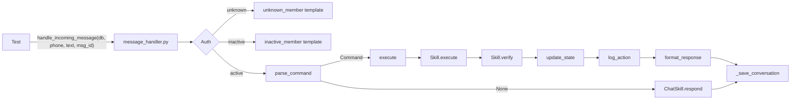

# Design Document — Sprint R3: Wire + Test + Deploy

## Overview

Sprint R3 validates the entire Skills Engine pipeline through end-to-end integration tests, cleans up dead imports, merges to main, and updates documentation. The test suite covers every skill through `handle_incoming_message`, permission enforcement across all three roles, confirmation flows for destructive actions, conversation state consistency across multi-step interactions, conversation persistence, regression edge cases, and personality template consistency.

All 7 new test files use the same pattern: mock the database session and service-layer functions, call `handle_incoming_message` directly, and assert on the response text and side effects (DB calls, state updates, audit logs). No real database or LLM is needed.

The branch `rebuild/skills-engine` is merged to `main` after all R1 + R2 + R3 tests pass.

## Architecture

The test architecture mirrors the production message flow:



Each test mocks the layers below `message_handler`:
- `get_family_member_by_phone` → returns a mock FamilyMember with the desired role
- `check_permission` → returns True/False based on role/resource/action
- Service functions (`tasks.create_task`, `tasks.list_tasks`, etc.) → return mock ORM objects
- `ChatSkill.respond` → returns a canned Hebrew string (no real LLM)
- `documents.process_document` → returns a mock Document (no real file I/O)
- DB session (`mock_db`) → MagicMock with `add`, `commit`, `flush`, `query`, `rollback`

## Components and Interfaces

### Test Files (7 new files)

| File | Requirement | Tests |
|------|-------------|-------|
| `test_e2e_skills.py` | Req 1 | End-to-end skill integration (13 tests) |
| `test_e2e_permissions.py` | Req 2 | Permission enforcement across roles (12 tests) |
| `test_e2e_confirmations.py` | Req 3 | Confirmation flows: confirm/deny/ignore (8 tests) |
| `test_e2e_state.py` | Req 4 | ConversationState consistency (7 tests) |
| `test_e2e_conversations.py` | Req 5 | Conversation persistence (6 tests) |
| `test_e2e_regression.py` | Req 6 | Regression safety and edge cases (9 tests) |
| `test_e2e_personality.py` | Req 7 | Personality template consistency (7 tests) |

### Shared Test Infrastructure

**`conftest.py` additions** — New fixtures added to the existing conftest:

```python
# Role-based member factories
def _make_member(role="parent", name="Test Parent", phone="972501234567"):
    ...

# Permission mock that respects role matrix
def _mock_check_permission(role, resource, action):
    ...

# Pre-configured mock DB with query chain support
@pytest.fixture()
def e2e_db():
    ...
```

### Mock Strategy

| Dependency | Mock Approach | Reason |
|-----------|---------------|--------|
| DB Session | `MagicMock(spec=Session)` | No real PostgreSQL needed |
| `get_family_member_by_phone` | `@patch` returning mock FamilyMember | Control auth layer |
| `check_permission` | `@patch` with role-aware function | Test permission matrix |
| `tasks.*` functions | `@patch` returning mock Task objects | No real DB writes |
| `recurring.*` functions | `@patch` returning mock RecurringPattern | No real DB writes |
| `documents.process_document` | `@patch` returning mock Document | No real file I/O |
| `ChatSkill.respond` | `AsyncMock` returning canned string | No real LLM calls |
| `ModelDispatcher` | Not needed — ChatSkill.respond is mocked | LLM never invoked |
| `_save_conversation` | `@patch` or let it call mock_db | Verify conversation saving |
| `ConversationState` queries | Mock `db.query().filter().first()` chain | Control state reads |

### E2E Test Pattern

Every E2E test follows this structure:

```python
@pytest.mark.asyncio
@patch("src.services.message_handler._save_conversation")
@patch("src.services.message_handler.execute")
@patch("src.services.message_handler.parse_command")
@patch("src.services.message_handler.get_family_member_by_phone")
async def test_something(mock_auth, mock_parse, mock_exec, mock_conv, mock_db):
    # 1. Set up member with desired role
    member = _make_member(role="parent")
    mock_auth.return_value = member

    # 2. Set up parse_command to return the expected Command
    mock_parse.return_value = Command(skill="task", action="create", params={"title": "..."})

    # 3. Set up execute to return the expected Result
    mock_exec.return_value = Result(success=True, message="יצרתי משימה: ... ✅")

    # 4. Call handle_incoming_message
    response = await handle_incoming_message(mock_db, "972501234567", "משימה חדשה: ...", "msg1")

    # 5. Assert on response and side effects
    assert "יצרתי" in response
    mock_exec.assert_called_once()
```

For deeper integration tests (Req 3, 4) that need to test the actual parse → execute → state flow without mocking the middle layers, we patch only the leaf services:

```python
@pytest.mark.asyncio
@patch("src.skills.task_skill.tasks.create_task")
@patch("src.services.auth.check_permission", return_value=True)
@patch("src.services.message_handler.get_family_member_by_phone")
async def test_deep_integration(mock_auth, mock_perm, mock_create, mock_db):
    # parse_command and execute are NOT mocked — real pipeline runs
    ...
```

## Data Models

No new data models. Tests use mock objects matching existing ORM models:

- `FamilyMember` — mock with `id`, `name`, `phone`, `role`, `is_active`
- `Task` — mock with `id`, `title`, `status`, `priority`, `due_date`, `assigned_to`, `created_by`, `created_at`
- `RecurringPattern` — mock with `id`, `title`, `frequency`, `next_due_date`, `is_active`
- `Document` — mock with `id`, `original_filename`, `doc_type`, `created_at`
- `BugReport` — mock with `id`, `description`, `status`, `reported_by`, `created_at`
- `ConversationState` — mock with `family_member_id`, `last_intent`, `last_entity_type`, `last_entity_id`, `pending_confirmation`, `pending_action`, `context`
- `Permission` — mock with `role`, `resource_type`, `can_read`, `can_write`

### Permission Matrix (used by tests)

| Role | tasks.read | tasks.write | documents.read | documents.write | finance.read |
|------|-----------|-------------|----------------|-----------------|-------------|
| parent | ✅ | ✅ | ✅ | ✅ | ✅ |
| child | ✅ | ❌ | ✅ | ❌ | ❌ |
| grandparent | ✅ | ❌ | ✅ | ❌ | ❌ |

## Correctness Properties

*A property is a characteristic or behavior that should hold true across all valid executions of a system — essentially, a formal statement about what the system should do. Properties serve as the bridge between human-readable specifications and machine-verifiable correctness guarantees.*

> **Note:** Per user instruction, this sprint uses unit tests only (no property-based tests). All acceptance criteria are tested as specific examples. The properties below describe the invariants that the unit tests collectively validate.

### Property 1: Auth gate completeness

*For any* incoming message, the message handler shall first authenticate the sender by phone. Unknown phones receive the `unknown_member` template; inactive members receive the `inactive_member` template; only active members proceed to parsing.

**Validates: Requirements 1.12, 1.13**

### Property 2: Skill routing determinism

*For any* message matching a CommandParser pattern, the message handler shall route to the corresponding skill and action without invoking any LLM call. Unmatched messages shall fall back to `ChatSkill.respond`.

**Validates: Requirements 1.1–1.11**

### Property 3: Permission enforcement consistency

*For any* role and resource combination, the permission check shall return the same result regardless of which skill is being invoked. Children and grandparents shall be denied write access to tasks, documents, and finance.

**Validates: Requirements 2.1–2.12**

### Property 4: Confirmation flow integrity

*For any* destructive action requiring confirmation, the system shall set `pending_confirmation=True` and store the action details. A subsequent "כן" shall execute the pending action; "לא" shall clear state without executing; any other message shall clear state and process normally.

**Validates: Requirements 3.1–3.8**

### Property 5: State consistency across operations

*For any* sequence of task operations (create, list, delete, complete), the ConversationState shall accurately reflect the last operation's entity_type, entity_id, and action. The `task_list_order` context shall contain the correct task IDs in display order after every list operation.

**Validates: Requirements 4.1–4.7**

### Property 6: Conversation persistence completeness

*For any* message processed by the message handler, a Conversation record shall be saved with the correct `message_in`, `message_out`, `intent`, and `family_member_id` fields.

**Validates: Requirements 5.1–5.6**

### Property 7: Hebrew-only responses

*For any* skill response (success or error), the message shall use a personality template containing Hebrew text and emojis. No raw English error messages shall be returned to the user.

**Validates: Requirements 7.1–7.7**

## Error Handling

### Test-Level Error Handling

- **Mock setup failures**: Each test explicitly sets up all required mocks. Missing mocks cause `AttributeError` which pytest reports clearly.
- **Async test failures**: All E2E tests use `@pytest.mark.asyncio` since `handle_incoming_message` is async.
- **Import errors from old pipeline**: Tests import only from `src.services.message_handler`, `src.engine.*`, and `src.skills.*`. No imports from old pipeline modules.

### Production Error Paths Tested

| Error Path | Test Location | Expected Behavior |
|-----------|---------------|-------------------|
| Unknown phone | `test_e2e_skills.py` | Returns `unknown_member` template |
| Inactive member | `test_e2e_skills.py` | Returns `inactive_member` template |
| Permission denied | `test_e2e_permissions.py` | Returns `permission_denied` template with 🔒 |
| Verification failure | `test_e2e_personality.py` | Returns `verification_failed` template |
| Skill exception | `test_executor.py` (existing) | Returns `error_fallback` template, calls `db.rollback()` |
| No pending confirmation | `test_e2e_state.py` | Returns "אין פעולה ממתינה" |
| Task not found | `test_task_skill.py` (existing) | Returns `task_not_found` template |
| Need list first | `test_task_skill.py` (existing) | Returns `need_list_first` template |

## Testing Strategy

### Approach: Unit Tests Only

Per project decision, Sprint R3 uses pytest unit tests exclusively. No property-based testing library is used. Each acceptance criterion maps to one or more specific test cases.

### Test Organization

```
fortress/tests/
├── conftest.py                    # Shared fixtures (existing + new E2E helpers)
├── test_e2e_skills.py             # Req 1: 13 tests — full skill integration
├── test_e2e_permissions.py        # Req 2: 12 tests — role-based access
├── test_e2e_confirmations.py      # Req 3: 8 tests — confirm/deny/ignore flows
├── test_e2e_state.py              # Req 4: 7 tests — state consistency
├── test_e2e_conversations.py      # Req 5: 6 tests — conversation persistence
├── test_e2e_regression.py         # Req 6: 9 tests — edge cases and regression
├── test_e2e_personality.py        # Req 7: 7 tests — personality templates
├── test_command_parser.py         # Existing R1 tests (must still pass)
├── test_executor.py               # Existing R1 tests (must still pass)
├── test_message_handler.py        # Existing R1 tests (must still pass)
├── test_task_skill.py             # Existing R2 tests (must still pass)
├── ... (all other existing tests)
```

### Fixture Strategy

New E2E fixtures in `conftest.py`:

1. **`_make_member(role, name, phone)`** — Already exists, reuse for all roles
2. **`_mock_permission_check(role)`** — Returns a function that implements the permission matrix
3. **`mock_task(**overrides)`** — Factory for mock Task objects with sensible defaults
4. **`mock_recurring(**overrides)`** — Factory for mock RecurringPattern objects
5. **`mock_bug(**overrides)`** — Factory for mock BugReport objects
6. **`mock_document(**overrides)`** — Factory for mock Document objects

### Import Cleanup Approach (Req 8)

1. Scan `message_handler.py` for imports of: `workflow_engine`, `unified_handler`, `model_router`, `model_dispatch`, `intent_detector`, `routing_policy`
2. Remove any found (current `message_handler.py` is already clean — verified during research)
3. Scan all files in `src/skills/` and `src/engine/` for the same imports
4. Remove any found
5. Verify old pipeline source files still exist on disk (no deletion)
6. Add a test in `test_e2e_regression.py` that reads the source files and asserts no old pipeline imports exist

### Merge Strategy (Req 9)

1. Run full test suite on `rebuild/skills-engine`: `cd fortress && python -m pytest tests/ -v`
2. All R1 + R2 + R3 tests must pass
3. Switch to main: `git checkout main`
4. Merge: `git merge rebuild/skills-engine` (standard merge, not squash)
5. If conflicts: keep `rebuild/skills-engine` version
6. Run full test suite on main: `cd fortress && python -m pytest tests/ -v`
7. Push: `git push origin main`

### README Update Approach (Req 10)

1. Add row for "R2 — Core Skills Migration" with "✅ Complete" in the roadmap table
2. Add row for "R3 — Wire + Test + Deploy" with "✅ Complete" in the roadmap table
3. Update "Current Version" line to "Phase R3 — Skills Engine"
4. Update test count in status section to reflect final count after R3

### Documentation Update Approach (Req 11)

Add three new sections to `docs/setup.md`:

1. **Skills Engine Architecture** — Describe the `CommandParser → Executor → Skill` pipeline with a simple diagram
2. **Available Skills** — Table listing all 8 skills (system, task, recurring, document, bug, chat, memory, morning) with one-line Hebrew descriptions
3. **How to Add a New Skill** — Step-by-step: create file, extend BaseSkill, implement `name`/`description`/`commands`/`execute`/`verify`/`get_help`, register in `__init__.py`

### Test Execution

```bash
cd fortress
python -m pytest tests/ -v --tb=short
```

Expected: All existing tests (R1 + R2) plus ~62 new R3 tests pass. Target total: ~540 tests.
