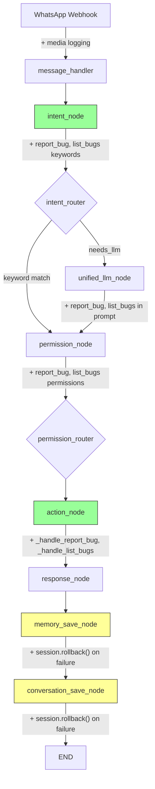

# Design Document: STABLE-6 Bugfixes & Bug Tracker

## Overview

STABLE-6 delivers two complementary workstreams for the Fortress family assistant:

**Part A — Bugfixes & Resilience**: Fixes three production issues discovered in STABLE-5: (1) LLM-returned invalid memory categories causing `IntegrityError` crashes, (2) failed `memory_save_node` leaving the SQLAlchemy session in a `PendingRollbackError` state that crashes `conversation_save_node`, and (3) missing diagnostic logging for photo uploads. All fixes are defensive — they prevent crashes without changing happy-path behavior.

**Part B — Bug Tracker Feature**: A new parents-only WhatsApp feature allowing family members to report bugs ("באג: ...") and list open bugs ("באגים"). This follows the exact same patterns as existing features (tasks, recurring, documents): migration → ORM model → intent keywords → routing policy → personality templates → workflow handlers → unified handler integration.

### Design Decisions

1. **Category validation at `save_memory()` boundary** — Validation happens at the service layer, not the ORM model, because the service is the single entry point for all memory creation. This matches the existing pattern where `create_task()` in `tasks.py` handles business logic.

2. **Session rollback in except blocks** — Both `memory_save_node` and `conversation_save_node` already catch exceptions and log them. Adding `db.rollback()` in the except block ensures the session is usable for the next node. This is the standard SQLAlchemy pattern for recovering from failed transactions.

3. **Bug tracker reuses `("tasks", "write")`/`("tasks", "read")` permissions** — Rather than creating a new `bugs` resource type and seeding new permission rows, we reuse the existing `tasks` permissions. Parents already have `tasks` read+write; children don't. This keeps the migration simple and avoids schema changes to the permissions table.

4. **`format_bug_list()` follows `format_task_list()` pattern** — The existing personality module has a clear pattern: header template + item template + empty template + a `format_*()` function. Bug list formatting follows this exactly.

## Architecture

The changes touch two layers of the existing LangGraph pipeline:



Yellow nodes = bugfix changes (Part A). Green nodes = new feature additions (Part B).

### File Change Map

| File | Change Type | Part |
|------|------------|------|
| `fortress/src/services/memory_service.py` | Modify — add `VALID_CATEGORIES`, `CATEGORY_MAP`, validation in `save_memory()` | A |
| `fortress/src/prompts/system_prompts.py` | Modify — update `MEMORY_EXTRACTOR` prompt | A |
| `fortress/src/services/workflow_engine.py` | Modify — add rollback to `memory_save_node` and `conversation_save_node`, add media logging to `_handle_upload_document`, add `_handle_report_bug` and `_handle_list_bugs` handlers, update `_PERMISSION_MAP` and `_ACTION_HANDLERS` | A+B |
| `fortress/src/routers/whatsapp.py` | Modify — add media diagnostic logging | A |
| `fortress/migrations/006_bug_reports.sql` | New — create `bug_reports` table | B |
| `fortress/src/models/schema.py` | Modify — add `BugReport` model, add `bug_reports` relationship to `FamilyMember` | B |
| `fortress/src/services/intent_detector.py` | Modify — add `report_bug` and `list_bugs` keywords and intents | B |
| `fortress/src/services/routing_policy.py` | Modify — add `report_bug` and `list_bugs` to `SENSITIVITY_MAP` | B |
| `fortress/src/prompts/personality.py` | Modify — add bug tracker templates and `format_bug_list()` | B |
| `fortress/src/services/unified_handler.py` | No direct changes — relies on `VALID_INTENTS` set and `UNIFIED_CLASSIFY_AND_RESPOND` prompt updates | B |

## Components and Interfaces

### Part A: Memory Category Validation

```python
# memory_service.py — new constants
VALID_CATEGORIES: set[str] = {"preference", "goal", "fact", "habit", "context"}
CATEGORY_MAP: dict[str, str] = {"task": "context"}

# save_memory() — validation added before db.add()
async def save_memory(db, family_member_id, content, category, memory_type, ...):
    # ... existing exclusion check ...
    
    # NEW: validate/map category
    if category not in VALID_CATEGORIES:
        mapped = CATEGORY_MAP.get(category)
        if mapped:
            category = mapped
        else:
            logger.warning("Invalid memory category '%s', defaulting to 'context'", category)
            category = "context"
    
    # ... existing Memory creation ...
```

### Part A: Session Rollback in Pipeline Nodes

```python
# workflow_engine.py — memory_save_node
async def memory_save_node(state: WorkflowState) -> dict:
    if state.get("intent") == "greeting":
        return {}
    try:
        bedrock = BedrockClient()
        await extract_memories_from_message(...)
    except Exception:
        logger.exception("memory_save_node failed")
        try:
            state["db"].rollback()
        except Exception:
            logger.exception("memory_save_node: rollback also failed")
    return {}

# workflow_engine.py — conversation_save_node (same pattern)
async def conversation_save_node(state: WorkflowState) -> dict:
    try:
        conv = Conversation(...)
        state["db"].add(conv)
        state["db"].commit()
    except Exception:
        logger.exception("conversation_save_node failed")
        try:
            state["db"].rollback()
        except Exception:
            logger.exception("conversation_save_node: rollback also failed")
    return {}
```

### Part A: Diagnostic Logging

```python
# workflow_engine.py — _handle_upload_document (add at top of function)
logger.info(
    "upload_document: has_media=%s media_file_path=%s member=%s",
    bool(media_file_path), media_file_path, member.name,
)

# routers/whatsapp.py — after has_media check
if has_media:
    media_type = payload.get("type", "unknown")
    mimetype = payload.get("mimetype", "unknown")
    filename = payload.get("filename", "unknown")
    logger.info("Media received: type=%s mimetype=%s filename=%s", media_type, mimetype, filename)
```

### Part B: BugReport ORM Model

```python
# schema.py — new model (follows existing mapped_column pattern)
class BugReport(Base):
    __tablename__ = "bug_reports"

    id: Mapped[uuid.UUID] = mapped_column(UUID(as_uuid=True), primary_key=True, server_default=text("gen_random_uuid()"))
    reported_by: Mapped[uuid.UUID] = mapped_column(UUID(as_uuid=True), ForeignKey("family_members.id"), nullable=False)
    description: Mapped[str] = mapped_column(Text, nullable=False)
    status: Mapped[str] = mapped_column(Text, nullable=False, server_default=text("'open'"))
    priority: Mapped[str] = mapped_column(Text, server_default=text("'normal'"))
    bug_metadata: Mapped[Optional[dict]] = mapped_column("metadata", JSONB, server_default=text("'{}'"))
    created_at: Mapped[Optional[datetime]] = mapped_column(DateTime(timezone=True), server_default=text("now()"))
    resolved_at: Mapped[Optional[datetime]] = mapped_column(DateTime(timezone=True), nullable=True)

    reporter: Mapped["FamilyMember"] = relationship(back_populates="bug_reports")
```

### Part B: Intent Detection Keywords

```python
# intent_detector.py — new keyword matching (added before the return None)
# Report bug (prefix match)
if stripped.startswith("באג:") or lower.startswith("bug:"):
    return "report_bug"
if stripped == "באג" or lower == "bug":
    return "report_bug"

# List bugs
if stripped in ("באגים", "רשימת באגים") or lower == "bugs":
    return "list_bugs"
```

### Part B: Workflow Handlers

```python
# workflow_engine.py — new handlers (follow existing _handle_* pattern)
async def _handle_report_bug(db, member, message_text, dispatcher, media_file_path, intent):
    text = message_text.strip()
    for prefix in ("באג:", "bug:", "באג", "bug"):
        if text.startswith(prefix):
            text = text[len(prefix):].strip()
            break
    description = text or message_text.strip()
    
    bug = BugReport(reported_by=member.id, description=description)
    db.add(bug)
    db.flush()
    return PERSONALITY_TEMPLATES["bug_reported"].format(description=description)

async def _handle_list_bugs(db, member, message_text, dispatcher, media_file_path, intent):
    bugs = db.query(BugReport).filter(BugReport.status == "open").order_by(BugReport.created_at.desc()).all()
    return format_bug_list(bugs)
```

## Data Models

### New Table: `bug_reports`

```sql
CREATE TABLE bug_reports (
    id UUID PRIMARY KEY DEFAULT gen_random_uuid(),
    reported_by UUID NOT NULL REFERENCES family_members(id),
    description TEXT NOT NULL,
    status TEXT NOT NULL DEFAULT 'open' CHECK (status IN ('open', 'fixed', 'wont_fix', 'duplicate')),
    priority TEXT DEFAULT 'normal' CHECK (priority IN ('low', 'normal', 'high', 'critical')),
    metadata JSONB DEFAULT '{}',
    created_at TIMESTAMPTZ DEFAULT now(),
    resolved_at TIMESTAMPTZ
);

CREATE INDEX idx_bug_reports_reported_by ON bug_reports(reported_by);
CREATE INDEX idx_bug_reports_status ON bug_reports(status);
CREATE INDEX idx_bug_reports_created_at ON bug_reports(created_at);
```

### Modified Constants

| Module | Constant | Change |
|--------|----------|--------|
| `memory_service.py` | `VALID_CATEGORIES` | New set: `{"preference", "goal", "fact", "habit", "context"}` |
| `memory_service.py` | `CATEGORY_MAP` | New dict: `{"task": "context"}` |
| `intent_detector.py` | `INTENTS` | Add `"report_bug"` and `"list_bugs"` with `model_tier: "local"` |
| `intent_detector.py` | `VALID_INTENTS` | Automatically updated (derived from `INTENTS.keys()`) |
| `routing_policy.py` | `SENSITIVITY_MAP` | Add `"report_bug": "medium"`, `"list_bugs": "medium"` |
| `workflow_engine.py` | `_PERMISSION_MAP` | Add `"report_bug": ("tasks", "write")`, `"list_bugs": ("tasks", "read")` |
| `workflow_engine.py` | `_ACTION_HANDLERS` | Add `"report_bug"` and `"list_bugs"` entries |
| `personality.py` | `TEMPLATES` | Add `bug_reported`, `bug_list_header`, `bug_list_empty`, `bug_list_item` |


## Correctness Properties

*A property is a characteristic or behavior that should hold true across all valid executions of a system — essentially, a formal statement about what the system should do. Properties serve as the bridge between human-readable specifications and machine-verifiable correctness guarantees.*

> Note: Per project requirements, this release uses unit tests only (no property-based testing). The properties below are expressed as universal statements but will be validated through representative examples and edge cases in unit tests.

### Property 1: Memory category invariant

*For any* category string passed to `save_memory()`, the resulting Memory record's category SHALL always be a member of `VALID_CATEGORIES` (`preference`, `goal`, `fact`, `habit`, `context`). Valid categories pass through unchanged; mapped categories (e.g. `task`) are replaced by their mapped value; all other categories default to `context`.

**Validates: Requirements 1.1, 1.2, 1.3, 1.4, 1.5**

### Property 2: Pipeline crash resilience

*For any* exception raised during `memory_save_node` or `conversation_save_node`, the node SHALL call `session.rollback()`, log the error, and return an empty dict (no `response` key), ensuring the pipeline response is never lost and the session remains usable for subsequent nodes.

**Validates: Requirements 3.1, 3.2, 3.3, 4.1, 4.2, 4.3, 4.4**

### Property 3: Bug list formatting completeness

*For any* list of BugReport objects passed to `format_bug_list()`, the returned string SHALL contain the description of every bug in the list. For an empty list, it SHALL return the `bug_list_empty` template.

**Validates: Requirements 10.5**

### Property 4: Bug tracker intent detection

*For any* message starting with "באג:" or "bug:", `detect_intent()` SHALL return `report_bug`. For messages equal to "באגים", "bugs", or "רשימת באגים", it SHALL return `list_bugs`.

**Validates: Requirements 8.1, 8.2, 8.3**

## Error Handling

### Memory Category Validation Errors
- **Invalid category from LLM**: Mapped via `CATEGORY_MAP` or defaulted to `context`. Warning logged with original value. No exception raised.
- **Rationale**: The LLM is non-deterministic; we cannot guarantee it returns valid categories. Defensive mapping prevents `IntegrityError` from the database CHECK constraint.

### Session Rollback Errors
- **`memory_save_node` failure**: Exception caught, `db.rollback()` called, empty dict returned. If rollback itself fails, that exception is also caught and logged.
- **`conversation_save_node` failure**: Same pattern. Handles both fresh exceptions and `PendingRollbackError` from a prior failed node.
- **Rationale**: The pipeline must always return a response to the user. Losing a memory or conversation record is acceptable; crashing the entire request is not.

### Bug Tracker Errors
- **Empty bug description**: If the user sends just "באג:" with no description, the handler uses the full message text as the description (defensive fallback).
- **Database error during bug creation**: Follows the existing pattern — the outer `run_workflow` try/except returns `error_fallback` template.
- **Permission denied**: Non-parent members get the standard `permission_denied` template, same as tasks.

## Testing Strategy

All tests are unit tests using pytest + unittest.mock, following the existing test patterns in the codebase. No property-based testing library is used for this release.

### Test Organization

| Test File | What It Tests | Estimated New Tests |
|-----------|--------------|-------------------|
| `test_memory_service.py` (new) | `VALID_CATEGORIES` constant, `CATEGORY_MAP` constant, `save_memory()` category validation (valid, mapped, invalid) | ~6 |
| `test_intent_detector.py` (extend) | `report_bug` and `list_bugs` keyword detection, INTENTS dict, VALID_INTENTS set | ~8 |
| `test_routing_policy.py` (extend) | `report_bug` and `list_bugs` sensitivity mapping | ~2 |
| `test_personality.py` (extend) | Bug tracker templates in TEMPLATES dict, `format_bug_list()` with empty/non-empty lists | ~5 |
| `test_workflow_engine.py` (extend) | Session rollback in `memory_save_node` and `conversation_save_node`, `_handle_report_bug`, `_handle_list_bugs`, `_PERMISSION_MAP` and `_ACTION_HANDLERS` entries | ~10 |
| `test_unified_handler.py` (extend) | `report_bug` and `list_bugs` in UNIFIED prompt, valid intent handling | ~2 |
| `test_system_prompts.py` (new) | `MEMORY_EXTRACTOR` prompt contains valid categories and Hebrew instructions | ~3 |

### Test Patterns (matching existing codebase)

- **Mock DB**: `MagicMock(spec=Session)` from conftest
- **Mock FamilyMember**: `_make_family_member()` helper from conftest
- **Async handlers**: `@pytest.mark.asyncio` + `AsyncMock` for dispatcher
- **Log verification**: `caplog` fixture at appropriate log level
- **Structural checks**: Direct assertions on module-level constants (dicts, sets)

### Compatibility Constraint

All 262 existing tests must pass without modification. New tests are additive only. No existing test file signatures, fixtures, or assertions are changed.
