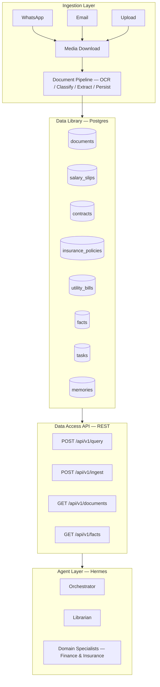

# Architecture Overview

Fortress is structured as three distinct layers: **Ingestion**, **Data Library**, and **Agent Access**. Each layer has a clear responsibility with no bleed-through.

## Layer Diagram




## Core Principle

**Fortress never "thinks" — it stores, catalogs, and serves data. All intelligence lives in the agents.**

## Repo Layout

```
fortress/
├── src/
│   ├── api/                  # Data access API for agents (REST endpoints)
│   ├── services/
│   │   ├── documents.py      # Document ingestion pipeline
│   │   ├── document_processors/  # OCR backends (Google DocAI, Tesseract, Bedrock)
│   │   ├── document_classifier.py
│   │   ├── document_resolver.py
│   │   ├── document_fact_extractor.py
│   │   └── ...
│   ├── models/schema.py      # SQLAlchemy ORM models
│   ├── routers/              # FastAPI route handlers
│   └── config.py
├── migrations/               # SQL migrations (001-017)
├── tests/
├── docker-compose.yml
└── Dockerfile
```

## Document Pipeline

The ingestion pipeline handles:

- Google DocAI OCR (primary, best Hebrew support)
- Tesseract fallback (free, local)
- Bedrock Vision fallback (images)
- PDF batch splitting for large documents (>15 pages)
- Auto-decryption of password-protected PDFs
- Fingerprint-based resolver for known document families
- Keyword + LLM classification (filename-first priority)
- Chunked fact extraction for large documents
- Canonical table persistence (salary_slips, utility_bills, contracts, insurance_policies)
- Duplicate detection
- Auto-tagging and display name generation

## Permission Model

Agents access data through roles with table-level permissions:

| Agent Role | salary_slips | utility_bills | contracts | insurance | documents | tasks |
|---|---|---|---|---|---|---|
| librarian | read | read | read | read | read+write | read+write |
| finance_agent | read | read | read | — | read | read |
| insurance_agent | — | — | read | read | read | read |
| orchestrator | metadata | metadata | metadata | metadata | metadata | read+write |

"metadata" = agent can see document exists (type, date, vendor) but not full content.

## Database Tables

| Table | Purpose | Key Fields |
|-------|---------|------------|
| documents | Raw document catalog | raw_text, doc_type, facts, summary, display_name |
| document_facts | Extracted fact index | fact_key, fact_value, confidence, source_excerpt |
| salary_slips | Payroll data | gross, net, deductions, tax, pension, 18 extended fields |
| utility_bills | Electricity, water, etc. | provider, amount, consumption, period, 13 extended fields |
| contracts | Legal agreements | parties, dates, obligations, penalties, governing law |
| insurance_policies | Insurance coverage | policy number, coverage, premium, deductible, beneficiary |
