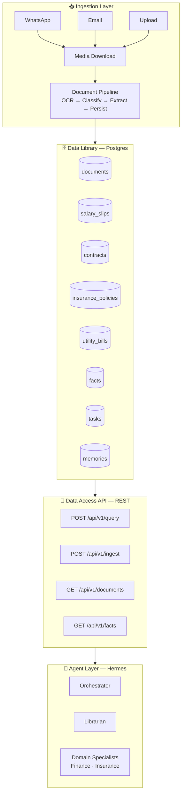

# Fortress — Household Data Library

Fortress is a data platform for household management. It ingests documents from multiple channels (WhatsApp, email, bulk upload), extracts structured data using OCR and LLM pipelines, and serves that data to intelligent agents through a permissioned API.

Think of it as a **municipal library for your household** — documents come in through the intake desk, get cataloged and shelved in the right section, and agents (the librarians and specialists) access the shelves with room-specific keys.

## Architecture




## Key Principle

**Fortress never "thinks" — it stores, catalogs, and serves data. All intelligence lives in the agents.**

## Quick Start

```bash
cd fortress
cp .env.example .env
docker compose up -d
bash scripts/apply_migrations.sh
curl -s http://localhost:8000/health
```

WAHA (WhatsApp) is behind a compose profile — start explicitly when needed:

```bash
docker compose --profile waha up -d
```

## Links

- [Architecture Overview](architecture/overview.md)
- [Setup Guide](setup.md)
- [Feature List](features.md)
- [Backlog](roadmap/backlog.md)
