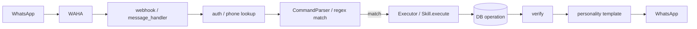
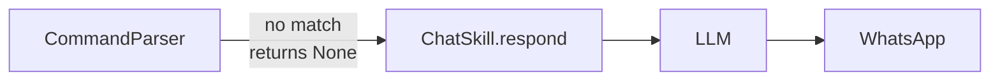

# Fortress — Mac Mini Deployment Guide

## Prerequisites

- Mac Mini M4 with macOS
- Docker Desktop for Mac installed and running
- Git installed
- The Fortress phone (with SIM) nearby for QR scanning
- An AWS account with Bedrock model access enabled

## Quick Setup

```bash
git clone <repo-url>
cd fortress
cp scripts/seed_family.sh.template scripts/seed_family.sh
# Edit seed_family.sh with real phone numbers
./scripts/setup_mac_mini.sh
```

The setup script handles everything: Docker services, database migrations,
seeding, and health checks.

## AWS Bedrock Configuration

Fortress uses AWS Bedrock (Claude 3.5 Haiku and Sonnet) for Hebrew text generation. You need AWS credentials configured on the Mac Mini.

### 1. Create an IAM User

1. Sign in to the [AWS Console](https://console.aws.amazon.com/)
2. Go to **IAM** → **Users** → **Create user**
3. Name: `fortress-bedrock`
4. Attach the `AmazonBedrockFullAccess` managed policy (or a custom policy scoped to `bedrock:InvokeModel`)
5. Create an access key (CLI use case) and save the Access Key ID and Secret Access Key

### 2. Enable Bedrock Model Access

1. Go to **Amazon Bedrock** → **Model access** in the AWS Console (region: `us-east-1`)
2. Request access to:
   - `anthropic.claude-3-5-haiku-20241022-v1:0`
   - `anthropic.claude-3-5-sonnet-20241022-v2:0`
3. Wait for access to be granted (usually immediate for Claude models)

### 3. Configure AWS Credentials

Create the AWS credentials file on the Mac Mini with a `fortress` profile:

```bash
mkdir -p ~/.aws

cat >> ~/.aws/credentials << 'EOF'
[fortress]
aws_access_key_id = YOUR_ACCESS_KEY_ID
aws_secret_access_key = YOUR_SECRET_ACCESS_KEY
EOF

cat >> ~/.aws/config << 'EOF'
[profile fortress]
region = us-east-1
output = json
EOF
```

Replace `YOUR_ACCESS_KEY_ID` and `YOUR_SECRET_ACCESS_KEY` with the values from step 1.

### 4. Verify Bedrock Access

```bash
# Test with the fortress profile
AWS_PROFILE=fortress aws bedrock list-foundation-models --region us-east-1 --query "modelSummaries[?contains(modelId, 'claude')].[modelId]" --output text
```

You should see the Claude model IDs in the output. Docker Compose mounts `~/.aws` as a read-only volume into the fortress container, so no additional container configuration is needed.

## Phone Number Configuration

Fortress uses two distinct phone numbers:

| Variable | Purpose | Example |
|----------|---------|---------|
| `SYSTEM_PHONE` | The bot's own WhatsApp number (the phone running WAHA) | `972501234567` |
| `ADMIN_PHONE` | The human administrator's phone number | `972542364393` |

- **SYSTEM_PHONE** is used to identify the bot's own outgoing messages. Set this to the phone number of the SIM card in the Fortress phone.
- **ADMIN_PHONE** is the family administrator who receives system notifications and has elevated permissions.

Set both in your `.env` file:

```bash
SYSTEM_PHONE=972501234567
ADMIN_PHONE=972542364393
```

## WhatsApp Setup

1. Open http://localhost:3000
2. Click "Start New Session" → session name: `default`
3. Scan QR code with the Fortress phone
4. Session persists across restarts (stored in `waha_sessions` volume)

## Verification

Send a test message from your phone to the Fortress number:

| Message | Expected Response |
|---------|-------------------|
| שלום | Acknowledgment response |
| משימות | Task list or "אין משימות פתוחות" |

### Manual health checks

```bash
# API health (now includes Bedrock status)
curl http://localhost:8000/health

# Expected: {"status":"healthy","database":"connected","ollama":"connected","bedrock":"connected","bedrock_model":"..."}

# WAHA status
curl http://localhost:3000/api/sessions

# Database connectivity
docker compose exec db psql -U fortress -c "SELECT count(*) FROM family_members;"
```

## Troubleshooting

### Bedrock shows disconnected

Check AWS credentials and model access:

```bash
# Verify credentials file exists
cat ~/.aws/credentials | grep fortress

# Test Bedrock access directly
AWS_PROFILE=fortress aws bedrock list-foundation-models --region us-east-1 --output text | head -5

# Check fortress container logs for Bedrock errors
docker compose logs fortress | grep -i bedrock
```

Common issues:
- Missing or incorrect credentials in `~/.aws/credentials`
- Model access not enabled in the Bedrock console
- Wrong region (must match `AWS_REGION` in `.env`, default `us-east-1`)

### WAHA shows disconnected

Restart the session and re-scan the QR code:

1. Open http://localhost:3000
2. Stop the existing session
3. Start a new session and scan QR again

### API returns database disconnected

Check the database container logs:

```bash
docker compose logs db
docker compose restart db
# Wait for healthy, then restart app
docker compose restart fortress
```

### No response on WhatsApp

Check the webhook URL in WAHA config:

```bash
docker compose logs waha
# Verify WHATSAPP_HOOK_URL points to http://fortress-app:8000/webhook/whatsapp
```

## NAS Setup (Optional)

To store documents on a NAS instead of local disk:

1. Mount NAS to `~/fortress_nas`
2. Update `STORAGE_PATH` in `.env` to point to the NAS mount
3. Restart: `docker compose restart fortress`

## Backup

### Database

```bash
docker compose exec db pg_dump -U fortress fortress > backup.sql
```

### Files

Use rsync or Restic to back up `~/fortress_storage/` to Backblaze B2
or another remote target.

Full backup automation coming in a future phase.

## Skills Engine Architecture

The Skills Engine is the core message processing pipeline. It handles 90% of messages deterministically (regex → DB → template) with zero LLM calls. Only unrecognized messages fall back to the LLM.

### Message Flow



### LLM Fallback (only when no regex match)




## Available Skills

| Skill | Commands | Description |
|-------|----------|-------------|
| System | עזרה, ביטול, אישור | פקודות מערכת: עזרה, ביטול פעולה, אישור פעולה |
| Tasks | משימה חדשה, משימות, מחק, סיים, עדכן | ניהול משימות — יצירה, רשימה, מחיקה, השלמה, עדכון |
| Recurring | תזכורת חדשה, תזכורות, מחק תזכורת | ניהול תזכורות חוזרות — יצירה, רשימה, ביטול |
| Documents | מסמכים, שלח תמונה/קובץ | שמירת מסמכים ותמונות |
| Bugs | באג:, באגים | דיווח ומעקב באגים |
| Chat | שלום, שיחה חופשית | שיחה חופשית וברכות |
| Memory | זכרונות | ניהול זיכרונות — שמירה, שליפה, רשימה |
| Morning | בוקר, סיכום, דוח | סיכום בוקר ודוחות |

## How to Add a New Skill

1. Create `src/skills/my_skill.py`
2. Extend `BaseSkill` — implement `name`, `description`, `commands`, `execute`, `verify`, `get_help`
3. Define commands as a list of `(re.Pattern, action_name)` tuples
4. Implement `execute(db, member, command) → Result` with action dispatch
5. Implement `verify(db, result) → bool` to confirm DB state after execution
6. Register in `src/skills/__init__.py`: `registry.register(MySkill())`
7. Add personality templates to `src/prompts/personality.py` if needed
8. Add tests in `tests/test_my_skill.py`
